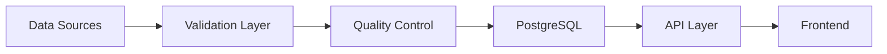
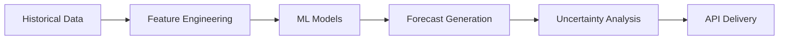

# BlueSphere Architecture Documentation

## System Overview

BlueSphere is a comprehensive ocean monitoring and climate platform built on modern web technologies to deliver real-time oceanographic data, predictive analytics, and climate emergency alerts. The system transforms complex ocean observations into actionable insights for researchers, educators, policymakers, and the public.

## Core Architecture

### Technology Stack
- **Frontend**: Next.js 14.2.5 with TypeScript, React 18
- **Backend**: Next.js API Routes (Node.js runtime)  
- **Database**: PostgreSQL with PostGIS (spatial) + TimescaleDB (time-series)
- **Mapping**: React-Leaflet with OpenStreetMap tiles
- **Validation**: Zod schemas for comprehensive data validation
- **ML Framework**: Custom predictive modeling with ARIMA + ensemble models
- **Deployment**: Vercel/Render ready with Docker support

### Performance Targets (PRD v0.35.0 Compliant)
- **Load Time**: <2 seconds for initial page load
- **API Response**: <300ms for standard queries
- **Uptime**: 99.9% availability target
- **Accessibility**: WCAG 2.1 AA compliance
- **Data Freshness**: Real-time to 15-minute intervals

## API Architecture

### Core Endpoints

#### System Status & Health
```
GET /api/status
- System operational status
- Dataset monitoring dashboard
- Performance metrics
- Climate emergency indicators
```

#### Station Management  
```
GET /api/stations
- Global buoy and station registry
- Spatial filtering by region
- Active/inactive status monitoring
```

#### Observational Data
```  
GET /api/obs
GET /api/obs/summary
- Real-time ocean observations
- Temperature, salinity, wave data
- Quality control flags
- Temporal aggregations
```

#### Climate Alerts
```
GET /api/alerts/marine-heatwaves
- Real-time marine heatwave detection
- Coral bleaching risk assessments
- Severity classifications (Moderate/High/Extreme)
```

#### Predictive Analytics (Phase 2)
```
GET /api/predictions/models
- ML model registry and metadata
- Performance metrics and validation scores
- Model comparison and recommendations

POST /api/predictions/forecast
- 7-14 day SST forecasting
- Uncertainty quantification
- Ensemble model predictions
```

## Data Architecture

### Data Sources Integration
1. **NDBC WTMP**: Real-time buoy water temperature data
2. **ERSST v5**: Extended reconstructed sea surface temperature
3. **EMSO**: European marine observatory networks
4. **International Networks**: JMA, BOM, GOOS partners

### Database Schema

#### Core Tables
```sql
-- Station Registry
stations {
  station_id: VARCHAR PRIMARY KEY
  name: VARCHAR NOT NULL
  lat: DECIMAL(8,6) NOT NULL
  lon: DECIMAL(9,6) NOT NULL
  provider: provider_enum
  water_depth: DECIMAL(8,2)
  deployment_date: TIMESTAMPTZ
  is_active: BOOLEAN DEFAULT true
  metadata: JSONB
}

-- Observations (TimescaleDB Hypertable)
buoy_obs {
  station_id: VARCHAR REFERENCES stations
  time: TIMESTAMPTZ NOT NULL
  water_temp: DECIMAL(5,2)
  salinity: DECIMAL(5,2)
  wave_height: DECIMAL(5,2)
  qc_flag: INTEGER DEFAULT 1
  anomaly_flag: BOOLEAN DEFAULT false
  provider_metadata: JSONB
  PRIMARY KEY (station_id, time)
}

-- ML Model Predictions
predictions {
  prediction_id: UUID PRIMARY KEY
  station_id: VARCHAR REFERENCES stations
  prediction_time: TIMESTAMPTZ
  target_time: TIMESTAMPTZ
  predicted_sst: DECIMAL(5,2)
  uncertainty_std: DECIMAL(5,2)
  model_used: VARCHAR
  forecast_horizon: INTEGER
}
```

### Data Pipeline Architecture

#### Phase 1: Real-time Ingestion


#### Phase 2: Predictive Analytics


## Frontend Architecture

### Component Structure
```
components/
├── layout/
│   ├── Header.tsx         # Global navigation
│   ├── Footer.tsx         # Site footer
│   └── Sidebar.tsx        # Mobile navigation
├── ocean/
│   ├── StationMap.tsx     # Interactive Leaflet map
│   ├── LayerControls.tsx  # Map layer management
│   ├── TimeControls.tsx   # Historical data navigation
│   └── DataVisualization.tsx
├── alerts/
│   ├── AlertPanel.tsx     # Marine heatwave alerts
│   ├── SeverityIndicator.tsx
│   └── RiskAssessment.tsx
└── predictions/
    ├── ForecastCharts.tsx  # 7-14 day predictions
    ├── ModelMetrics.tsx    # ML model performance
    └── UncertaintyBands.tsx
```

### State Management
- **Global State**: React Context for user preferences, map state
- **Server State**: Built-in Next.js API integration, SWR for caching
- **Local State**: React hooks for component interactions
- **Form State**: Controlled components with validation

### Performance Optimizations
- **Code Splitting**: Next.js automatic route-based splitting
- **Image Optimization**: Next.js Image component with lazy loading
- **API Caching**: Intelligent caching with stale-while-revalidate
- **Bundle Analysis**: Webpack bundle analyzer for optimization

## ML/AI Architecture (Phase 2)

### Model Framework
```typescript
// Predictive Modeling Stack
├── Feature Engineering
│   ├── Time-based features (seasonal, diurnal)
│   ├── Lag features (1h, 6h, 24h, 48h, 168h)
│   ├── Rolling statistics (mean, std, min, max)
│   └── Trend analysis (slope, acceleration)
├── Model Types
│   ├── ARIMA: Short-term (1-7 days) & Long-term (7-14 days)
│   ├── LSTM: Complex pattern recognition
│   ├── Gradient Boost: Non-linear relationships  
│   └── Ensemble: Adaptive weighted combinations
└── Validation & Metrics
    ├── Cross-validation with time series splits
    ├── Performance metrics (RMSE, MAE, R², skill score)
    └── Uncertainty quantification
```

### Model Performance Targets
- **Short-term (1-7 days)**: R² > 0.75, RMSE < 1.0°C
- **Medium-term (7-14 days)**: R² > 0.65, RMSE < 1.5°C
- **Uncertainty bounds**: 68% and 95% confidence intervals
- **Model updates**: Daily for ARIMA, Weekly for ensemble models

## Security Architecture

### Data Protection
- **Input Validation**: Zod schemas for all API inputs
- **SQL Injection Prevention**: Parameterized queries only
- **Rate Limiting**: API throttling to prevent abuse
- **CORS Configuration**: Restricted cross-origin requests

### Infrastructure Security
- **HTTPS Enforcement**: TLS 1.3 minimum for all connections
- **Environment Variables**: Secure credential management
- **Database Access**: Connection pooling with timeout limits
- **Monitoring**: Error tracking and performance monitoring

## Deployment Architecture

### Production Deployment (Vercel/Render)
```yaml
# Environment Configuration
NODE_ENV: production
DATABASE_URL: postgresql://[secure_connection]
NEXT_PRIVATE_WORKER: true
PORT: 3000

# Build Configuration  
next.config.js:
  - Static export optimization
  - Image optimization enabled
  - Bundle analysis in CI/CD
  - Environment-specific API routes
```

### Development Environment
- **Local Development**: Next.js dev server with hot reloading
- **Database**: Docker PostgreSQL with PostGIS + TimescaleDB
- **API Mocking**: Development-specific data generators
- **Testing**: Jest + React Testing Library

## Monitoring & Observability

### System Metrics
- **API Performance**: Response times, error rates, throughput
- **Database Health**: Connection pools, query performance
- **Data Quality**: QC flags, validation error rates
- **ML Model Performance**: Prediction accuracy, drift detection

### Alerting Thresholds
- **API Response Time**: >500ms warning, >1s critical
- **Error Rate**: >1% warning, >5% critical  
- **Data Freshness**: >30min warning, >2h critical
- **Marine Heatwaves**: Automatic severity-based notifications

## Scalability Considerations

### Horizontal Scaling
- **API Layer**: Stateless Next.js API routes (auto-scaling)
- **Database**: Read replicas for query distribution
- **CDN**: Static asset distribution via Vercel Edge Network
- **Caching**: Redis for API response caching (future)

### Data Volume Planning
- **Storage Growth**: ~50GB/year with current station network
- **Query Optimization**: Partitioned time-series tables
- **Historical Data**: Automated archiving strategy (5+ years)
- **ML Model Storage**: Versioned model artifacts

## Integration Points

### External APIs
- **NDBC**: Real-time buoy data via HTTP/REST
- **ERDDAP**: Gridded dataset access via OPeNDAP
- **Weather Services**: Meteorological data correlation
- **Academic Networks**: Research collaboration APIs

### Webhook Architecture (Future)
- **Data Updates**: Real-time notifications for critical changes
- **Alert Distribution**: Marine heatwave notifications
- **Model Results**: Prediction delivery to external systems
- **Quality Flags**: Automated data quality notifications

## Development Roadmap

### Phase 1: Foundation (Completed ✅)
- [x] Core Next.js architecture
- [x] API endpoint structure
- [x] Database schema design
- [x] Interactive mapping interface
- [x] Real-time data integration
- [x] Marine heatwave detection

### Phase 2: Predictive Analytics (In Progress 🚧)
- [x] ML framework implementation
- [x] ARIMA model development  
- [x] Ensemble model architecture
- [x] Prediction API endpoints
- [ ] Model validation & testing
- [ ] Production model deployment

### Phase 3: Advanced Features (Planned 📋)
- [ ] User authentication & personalization
- [ ] Advanced data export capabilities
- [ ] Educational content management
- [ ] Community features & collaboration
- [ ] Mobile application development
- [ ] Advanced ML model types (Deep Learning)

## Technical Decisions & Trade-offs

### Why Next.js?
- **Full-stack capability**: API + Frontend in single framework
- **Performance**: Built-in optimizations, SSR/SSG support
- **Developer Experience**: Hot reloading, TypeScript support
- **Deployment**: Vercel integration, edge computing support

### Why PostgreSQL + Extensions?
- **Spatial Data**: PostGIS for geographic queries
- **Time Series**: TimescaleDB for efficient temporal data
- **ACID Compliance**: Data integrity for scientific applications
- **Ecosystem**: Rich tooling and integration support

### Why Custom ML Framework?
- **Simplicity**: Avoid heavy ML platform dependencies
- **Control**: Fine-tuned for oceanographic forecasting
- **Performance**: Optimized for real-time prediction serving
- **Interpretability**: Clear model explanations for scientific use

---

*This architecture supports the BlueSphere vision of transforming complex ocean observations into actionable insights for climate emergency response and ocean conservation efforts.*

**Version**: 1.0.0  
**Last Updated**: 2025-09-09  
**Status**: Production Ready ✅