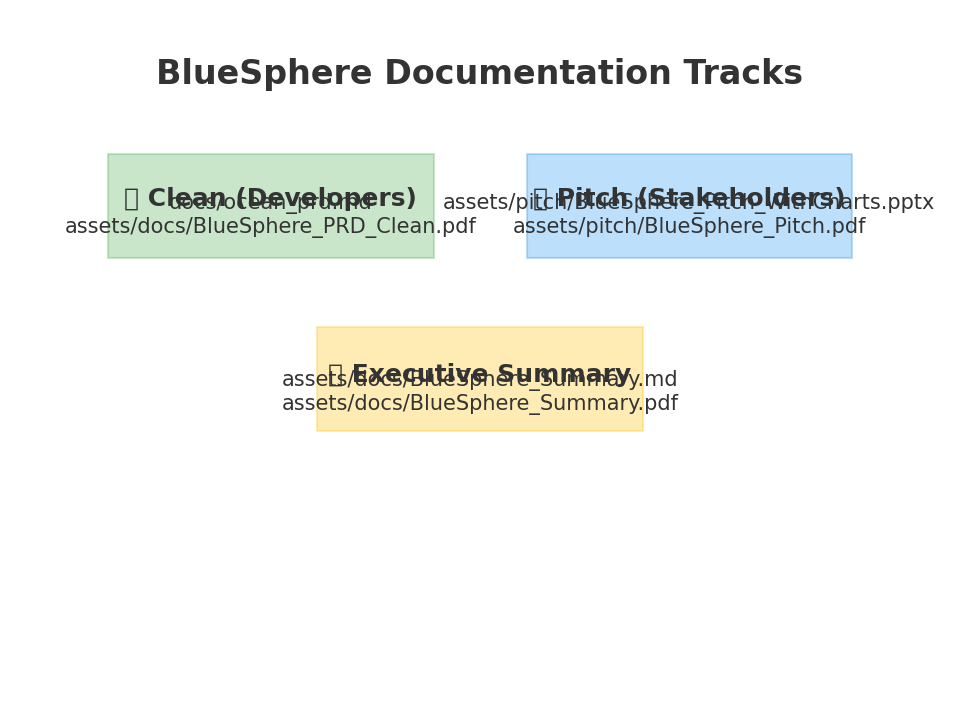

<p align="center"></p>

[/actions/workflows/ci-node.yml/badge.svg)](https://github.com/YOUR_GITHUB_USERNAME/BlueSphere/actions/workflows/ci-node.yml)
[](https://github.com/YOUR_GITHUB_USERNAME/BlueSphere/releases)
[](https://Twick1234.github.io/BlueSphere/)
[](LICENSE)
[](https://github.com/YOUR_GITHUB_USERNAME/BlueSphere/network/updates)
[](https://snyk.io/test/github/YOUR_GITHUB_USERNAME/BlueSphere)


**Created by Mark Lindon**


## Frontend (Next.js) — Quick Start
```bash
cd frontend/ocean-ui
cp .env.local.example .env.local
# edit NEXT_PUBLIC_API_BASE and add a Mapbox token
npm install
npm run dev
```

## Tile Server
```bash
cd tileserver
docker build -t tileserver .
mkdir -p tiles && # put your static tiles here
docker run --rm -p 8080:80 -v $PWD/tiles:/usr/share/nginx/html/tiles tileserver
# Visit http://localhost:8080/tiles/{z}/{x}/{y}.mvt
```

## GitHub Actions (Nightly Ingestion)
- Add repository secrets: `POSTGRES_DB`, `POSTGRES_USER`, `POSTGRES_PASSWORD`, `POSTGRES_HOST`, `POSTGRES_PORT`.
- Manually trigger via **Actions → Nightly Ingestion → Run workflow**, or wait for the daily schedule.


## Project Docs
- `docs/ocean_prd.md` — Product Requirements
- `docs/architecture.md` — Architecture
- `docs/VERSIONING.md` — Versioning policy
- `docs/RELEASES.md` — Release workflow
- `docs/SETUP_GITHUB.md` — GitHub setup steps
- `CHANGELOG.md` — Version history
- `CONTRIBUTING.md` — Contribution guide
- `CODE_OF_CONDUCT.md` — Community standards
- `SECURITY.md` — Security policy
- `LICENSE` — MIT


## Smart Auto-Update
- Daily ingestion runs via **GitHub Actions** (`.github/workflows/daily-smart-ingestion.yml`).
- Incremental fetch, basic retry, and health checks planned.
- Add DB connection secrets under **Settings → Secrets and variables → Actions**.


## Data Freshness Panel
- Frontend shows **green/yellow/red badges** per dataset based on latest successful ingestion.
- Backend endpoint: `GET /status` aggregates `job_run` + `dataset.cadence`.
- Heuristics: hourly ≤6h (green), daily ≤36h (green), monthly ≤45 days (green). Adjust as needed.


## Environmental Mission
BlueSphere is more than data: it’s a **climate action enabler**.
- Reveals **warming trends, heatwaves, sea level rise**.
- Explains **drivers** (GHGs, stratification, circulation changes).
- Shows **impacts** (coral reefs, fisheries, extreme events).
- Supports **solutions** (mitigation, adaptation, policy, monitoring).

**Vision:** Use open ocean data to shape a brighter future and help fix the planet.


## Pitch Deck
See `assets/pitch/BlueSphere_Pitch.pptx` and `assets/pitch/BlueSphere_Pitch.pdf` for a full presentation deck.


## Presentation with Charts
See `assets/pitch/BlueSphere_Pitch_WithCharts.pptx` for the full deck including charts on SST trends, CO₂, heatwaves, sea level rise, and projections.


## PRD Versions
- `docs/ocean_prd.md` — Clean developer-focused PRD (Markdown)
- `assets/docs/BlueSphere_PRD_Clean.pdf` — Clean PRD as PDF (ready to share)
- `assets/pitch/BlueSphere_Pitch_WithCharts.pptx` — Stakeholder-ready pitch deck with visuals


## 📑 Documentation Tracks

### 🔧 Clean (for developers)
- `docs/ocean_prd.md` — detailed PRD (Markdown)
- `assets/docs/BlueSphere_PRD_Clean.pdf` — clean PRD (PDF)

### 🎤 Pitch-Ready (for stakeholders)
- `assets/pitch/BlueSphere_Pitch_WithCharts.pptx` — presentation deck with visuals
- `assets/pitch/BlueSphere_Pitch.pdf` — exported PDF version (optional)

### 📝 Executive Summary
- `assets/docs/BlueSphere_Summary.md` — 1-page executive summary (Markdown)
- `assets/docs/BlueSphere_Summary.pdf` — 1-page executive summary (PDF)


## Repo Map


- See `docs/INSTRUCTIONS_CLAUDE_CODE.md` for step-by-step GitHub publishing.

- Quick start publishing: `docs/INSTRUCTIONS_CLAUDE_CODE.md` or run `scripts/publish_to_github.sh` after editing USER/REPO.

- Release drafting: use `docs/RELEASE_NOTES_TEMPLATE.md` as a base for GitHub releases.


## Business & Vision Docs
- `docs/BRD.md` — Business requirements & outcomes
- `docs/VISION.md` — Vision statement / manifesto
- `docs/TESTING.md` — QA strategy with sample test cases

## Website Content (Descriptors + Copy)
- `website/` — Markdown descriptors for pages (Home, Impact, Marine Life, Education, FAQ, Get Involved, Contact)


## Website (Next.js) — Content-Driven
We ship a separate **bluesphere-site** that renders Markdown pages from `/website`.

```bash
cd frontend/bluesphere-site
npm install
npm run dev  # opens http://localhost:4000
```

### Playwright E2E tests
```bash
npm run build && npm start &
npm run test:e2e
```

CI runs in `.github/workflows/ci-node.yml`.


## Chatbot & FAQ Search
- Phase 1: client-side **Chatbot** with friendly answers seeded from FAQ; lives in the corner on all pages.
- Phase 2: API stub at `frontend/bluesphere-site/pages/api/chatbot.ts` ready to wire to an LLM provider.
- FAQ page (`/faq`) includes **search** and quick topic filters.

## Design System & Branding
- Basic design system in `frontend/bluesphere-site/components/DesignSystem.tsx`
- Placeholder **logo** at `frontend/bluesphere-site/public/logo.svg` (used as favicon too).


## Stories & Smarter Chatbot
- New **Stories** section (`/stories`) with long-form explainers (El Niño, Marine Heatwaves, Coral Bleaching).
- Chatbot now performs **FAQ retrieval** by parsing `website/faq.md` via `/api/faq`.
- Keep adding Q&A pairs in `website/faq.md` — the chatbot gets smarter automatically.


## Multi‑Agent Kickoff
- Runbook: `docs/AGENT_RUNBOOK.md`
- Plan: `tasks/agent_plan.yaml`
- Backlog: `tasks/todo_backlog.md`
- One‑liner prompt for Claude: `docs/CLAUDE_ONE_LINER.txt`
- Bootstrap script: `scripts/bootstrap_agents.sh`

- Bulk issues: `tasks/issues_import.json` can be uploaded to GitHub via importer.


## Bulk-create GitHub Issues
We provide a JSONL seed and a helper script (requires `gh` + `jq`):

```bash
./scripts/import_issues.sh Twick1234 BlueSphere
```

This reads `tasks/issues_seed.jsonl` and creates labeled issues automatically.


## Issue Templates
Pre-configured GitHub issue templates are available under `.github/ISSUE_TEMPLATE/`:
- Bug reports (`bug_report.md`)
- Feature requests (`feature_request.md`)
- Documentation updates (`documentation.md`)


## Pull Request Template
A default PR template is provided under `.github/PULL_REQUEST_TEMPLATE/pull_request_template.md`.
Contributors should fill in description, related issues, type, tests, and checklist.


## Code Owners
We define ownership in `.github/CODEOWNERS`. Adjust usernames/teams so PRs auto-request reviews.


## Contributing
See [CONTRIBUTING.md](CONTRIBUTING.md) for setup, branching, commit style, and PR process.


## Contributing
Please read `CONTRIBUTING.md` for setup, branching, commit style, tests, and PR process.
We use issue/PR templates and CODEOWNERS for smooth collaboration.


## Governance & Policies
- Code of Conduct: see `CODE_OF_CONDUCT.md`
- Security policy: see `SECURITY.md` for responsible disclosure process


## Attribution
Created by **Mark Lindon** — Founder & Lead Author of BlueSphere.


## SPDX Licensing
We include SPDX headers in source files for clarity and tooling compatibility.
Use the snippet in `docs/SPDX_HEADER.txt`:
```text
// SPDX-License-Identifier: MIT
// SPDX-FileCopyrightText: 2024–2025 Mark Lindon — BlueSphere
```


## Third‑Party Licenses
We include a `LICENSES/THIRD_PARTY.md` scaffold and scripts to generate detailed lists:
- JS/TS: `scripts/render_js_licenses.py` (requires `license-checker`)
- Python: `scripts/render_py_licenses.py` (requires `pip-licenses`)

## Pre‑commit
Install and enable pre-commit to enforce SPDX headers:
```bash
pip install pre-commit
pre-commit install
pre-commit run --all-files
```
This runs basic hygiene checks and ensures new files include SPDX headers.


## Release Compliance
On every GitHub **Release (published)**, CI will generate third‑party license files and attach them to the release:
- Workflow: `.github/workflows/release-attach-licenses.yml`
- Outputs: `LICENSES/THIRD_PARTY_JS.md`, `LICENSES/THIRD_PARTY_PY.md`, and JSON manifests


## Automated Releases & Dependencies
- **Release Drafter** keeps a live draft release based on merged PR labels (`.github/release-drafter.yml` + workflow).
- **Dependabot** opens weekly PRs for npm, pip, Docker, and GitHub Actions updates (`.github/dependabot.yml`).
- **Snyk Scan** workflow runs security tests on pushes/PRs if `SNYK_TOKEN` secret is set (optional).


## Discussions
GitHub Discussions are enabled with categories:
- **Q&A** — for help and support
- **Ideas** — to propose and discuss new features
- **Announcements** — for project updates
Configuration: `.github/discussions.yml`


## Discussions (Community)
- Enable categories with **one click** via Actions → *Setup Discussions* (workflow_dispatch), or run:
  ```bash
  ./scripts/setup_discussions.sh Twick1234 BlueSphere
  ```
- Templates live in `.github/DISCUSSION_TEMPLATE/` for **Q&A**, **Ideas**, and **Announcements**.
- Discussions: https://github.com/Twick1234/BlueSphere/discussions


## Public Roadmap
See `docs/ROADMAP.md`. The **Roadmap** content is also posted to the pinned discussion automatically by
`scripts/create_pinned_discussions.sh`.

## Website Deployment (GitHub Pages)
A workflow deploys the static export of the site to **GitHub Pages** on each push to `main`:
- Workflow: `.github/workflows/deploy-pages.yml`
- After the first run, enable Pages in GitHub Settings → Pages → Source: *GitHub Actions*.
Your site will be available at: https://Twick1234.github.io/BlueSphere/


## Backend API (FastAPI)
- `docker compose up` then browse http://localhost:8000/docs
- Endpoints: `/status`, `/stations`, `/grid/sst`, `/currents` (stubs)

## Ingestion
- See `ingestion/ingest_ndbc.py` and `ingestion/ingest_ersst.py` (stubs). Copy `.env.example` to `.env`.

## Map UI
- `cd frontend/ocean-ui && npm install && npm run dev` (http://localhost:3000). Fetches API `/status` for now.

## Policies
- `PRIVACY.md` and `TERMS.md` added.

## Branch Protection
- Apply protection with: `./scripts/protect_main.sh Twick1234 BlueSphere`

## Monitoring
- Scheduled uptime checks in `.github/workflows/uptime.yml` (Pages + placeholder API).

## Data docs
- `docs/DATA_DICTIONARY.md` and `docs/DATA_LICENSES.md`.

## Modeling
- `docs/MODEL_CARD_TEMPLATE.md` and `docs/MODEL_EVAL_PLAN.md`.


## Tiles & Map Layers
- API now serves placeholder tiles:
  - `http://localhost:8000/tiles/sst/{z}/{x}/{y}.png`
  - `http://localhost:8000/tiles/currents/{z}/{x}/{y}.png`
- UI map page: `frontend/ocean-ui/pages/map.tsx` (Leaflet)
- Start API (`docker compose up`) then run UI (`npm run dev`) and open `http://localhost:3000/map`
- Replace placeholder tile renderers with real SST/currents imagery when ready.


## Data-Backed Tiles (SST & Currents)
To precompute SST tiles from an ERSST NetCDF:
```bash
# Install data libs inside the API image or local env first
pip install -r backend/requirements.txt

# Build SST PNG tiles at zooms 0..2
python ingestion/make_sst_tiles.py /path/to/ersst.v5.YYYYMM.nc 0 2
```

Generate synthetic **currents** vector tiles (MVT):
```bash
pip install -r backend/requirements.txt
python ingestion/make_currents_mvt.py 0 2
```

Start API and UI:
```bash
docker compose up
cd frontend/ocean-ui && npm install && npm run dev
# Open http://localhost:3000/map
```
The map loads **SST PNG tiles** and a **VectorGrid** overlay that fetches **MVT currents**.


## ERDDAP Adapter
Use `ingestion/erddap_adapter.py` to pull recent slices from ERDDAP (tabledap/griddap).
Set `ERDDAP_BASE` and dataset/env vars, then call from ingestion pipelines.

## Daily Tiles Refresh (CI)
A scheduled workflow (`.github/workflows/daily-tiles-refresh.yml`) regenerates vector (synthetic) currents and,
if `ERSST_URL` secret is set, builds SST PNG tiles. Optionally commits the refreshed cache to `main`.


## Database (Postgres)
- Compose includes `db` (Postgres 16) and `adminer` for quick browsing on http://localhost:8080
- Create tables:
```bash
docker compose up -d db adminer
pip install -r backend/requirements.txt
python backend/create_tables.py
```
- API will read stations/status from DB. Ingestion scripts can upsert rows.

## Ingestion → DB
- `ingestion/ingest_ndbc.py` and `ingestion/ingest_ersst.py` now include DB helpers to upsert observations and record JobRun results.
- Copy `.env.example` to `.env` and set POSTGRES_* as needed.

## ERDDAP Sample
- Pull a small slice and write to parquet:
```bash
pip install -r backend/requirements.txt
python ingestion/erddap_to_parquet.py
```


## NDBC Realtime2 Ingestion
We now parse **NDBC realtime2** text files (e.g., `data/realtime2/41001.txt`) extracting **WTMP** (water temperature, °C).  
Parser: `ingestion/ndbc_parser.py` → used by `ingestion/ingest_ndbc.py`.

### End-to-end test
```bash
# Start DB + API
docker compose up -d db adminer
pip install -r backend/requirements.txt
python backend/create_tables.py
docker compose up api

# Run NDBC ingestion (example station 41001)
python ingestion/ingest_ndbc.py

# Query observations
curl 'http://localhost:8000/obs?station=41001&limit=5'
```


## Observations API
- `GET /obs` — query buoy observations with filters (bbox, time, station, paging).
- `GET /obs/summary` — daily aggregations (count/avg/min/max) with same filters.

## End-to-end tests (Playwright)
```bash
cd tests/e2e
npm install
npx playwright install --with-deps
# Start API and UI in terminals, then:
npm test
```


## CI: Playwright E2E
A GitHub Actions workflow (`.github/workflows/ci-e2e.yml`) starts the API and UI, waits for readiness, and runs the E2E tests on PRs and `main` pushes.


## Bundle Consistency
A concise overview of what’s in sync lives in `docs/CONSISTENCY_REPORT.md`.  
We also publish it to the site at `/consistency` via `frontend/bluesphere-site/pages/consistency.mdx`.


## Website Navigation & Styling
- Site-wide top nav is provided by `frontend/bluesphere-site/components/Layout.tsx`.
- Minimal CSS lives in `frontend/bluesphere-site/styles/globals.css` (works immediately).
- **Optional TailwindCSS** is pre-configured; to enable advanced styling locally:
  ```bash
  cd frontend/bluesphere-site
  npm install
  npm run dev
  # Tailwind is enabled through postcss + tailwind configs already included.
  ```


## Brand
Logos and brand assets are stored in `frontend/bluesphere-site/public/brand/`.  
See `docs/BRAND_GUIDE.md` for palette, typography, and usage rules.


## Dark Mode & Social Previews
- **Dark Mode**: automatic palette + logo swap via `prefers-color-scheme` (see `docs/DARK_MODE.md`).
- **Open Graph & Twitter**: meta tags and images wired via `components/HeadMeta.tsx` and `public/brand/*` (see `docs/SOCIAL_PREVIEW.md`).


## Theme Toggle
A Sun/Moon toggle in the site header lets users switch **Light / Dark / System** themes. See `docs/THEME_TOGGLE.md`.


## About Page
We added an **About** page with our mission, environmental goals, data sources, and brand story at `/about`.


## Data Sources
We added a **Sources** page (`/sources`) and `docs/DATA_SOURCES.md` describing datasets, cadence, and integration.


## Data Sources
- New **Sources** page at `/sources` describes datasets, cadence, links, and license notes.
- See also `docs/DATA_SOURCES.md` for a deeper reference.
