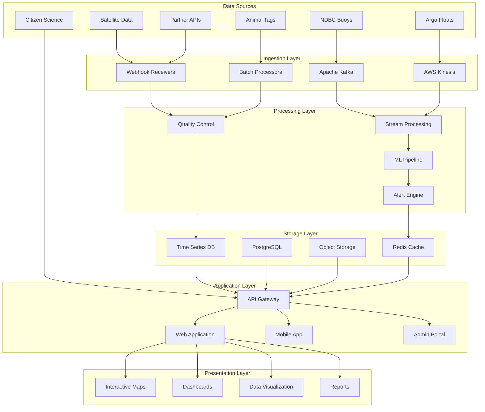
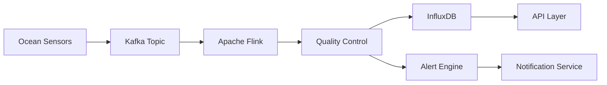
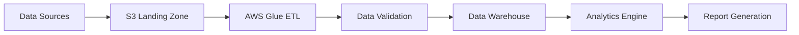
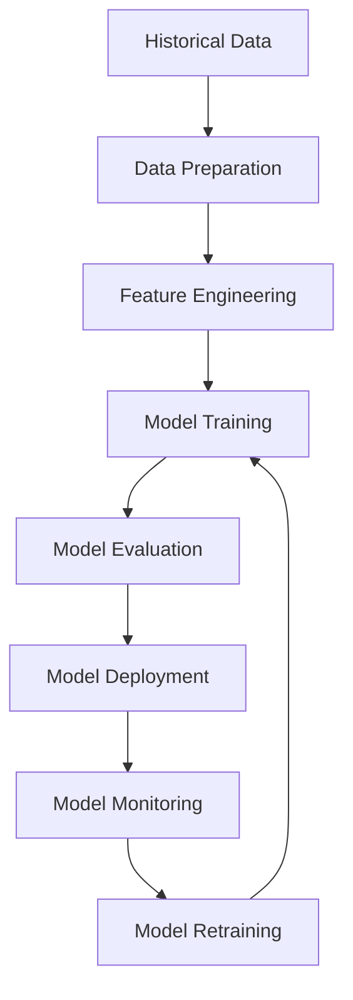

# BlueSphere Solution Architecture Specification

## Document Information
- **Version**: 1.0
- **Date**: January 2025
- **Status**: Active
- **Classification**: Technical Architecture
- **Audience**: Engineering Teams, Technical Stakeholders, Solution Architects

---

## Table of Contents

1. [Executive Summary](#executive-summary)
2. [System Overview](#system-overview)
3. [Architecture Principles](#architecture-principles)
4. [Logical Architecture](#logical-architecture)
5. [Physical Architecture](#physical-architecture)
6. [Data Architecture](#data-architecture)
7. [Security Architecture](#security-architecture)
8. [Integration Architecture](#integration-architecture)
9. [Deployment Architecture](#deployment-architecture)
10. [Performance Architecture](#performance-architecture)
11. [Monitoring & Observability](#monitoring--observability)
12. [Disaster Recovery](#disaster-recovery)
13. [Scalability Strategy](#scalability-strategy)
14. [Technology Stack](#technology-stack)
15. [API Architecture](#api-architecture)
16. [Machine Learning Architecture](#machine-learning-architecture)
17. [Compliance & Governance](#compliance--governance)
18. [Evolution Roadmap](#evolution-roadmap)

---

## Executive Summary

BlueSphere is an advanced ocean monitoring and marine conservation platform that processes real-time data from global ocean sensor networks to provide actionable insights for marine researchers, conservationists, and policy makers.

### Key Architectural Drivers
- **Real-time Processing**: Sub-second latency for critical marine data
- **Global Scale**: Support for 10,000+ simultaneous ocean sensors
- **Research Integration**: Seamless workflow integration with marine research institutions
- **Conservation Impact**: Direct support for marine conservation decision-making
- **Scientific Accuracy**: 99.9% data accuracy with comprehensive validation
- **24/7 Availability**: Continuous ocean monitoring with 99.99% uptime

### Business Capabilities
- Real-time ocean monitoring and visualization
- Predictive analytics for marine ecosystem health
- Marine wildlife tracking and migration analysis
- Climate change impact assessment
- Conservation action planning and coordination
- Research collaboration and data sharing

---

## System Overview

### High-Level Architecture



### Core System Components

#### 1. Data Ingestion Subsystem
- **Real-time Streaming**: Apache Kafka for high-throughput data ingestion
- **Batch Processing**: Scheduled ETL for historical and bulk data
- **API Gateway**: RESTful and GraphQL endpoints for external integrations
- **Webhook Handlers**: Asynchronous data reception from partner systems

#### 2. Data Processing Subsystem
- **Stream Processing**: Apache Flink for real-time data transformation
- **Quality Control**: Automated validation and error detection
- **Machine Learning**: TensorFlow/PyTorch for predictive analytics
- **Alert Engine**: Real-time notification system for critical events

#### 3. Data Storage Subsystem
- **Time Series Database**: InfluxDB for sensor data storage
- **Relational Database**: PostgreSQL for application data
- **Object Storage**: AWS S3 for large files and backups
- **Caching Layer**: Redis for high-performance data access

#### 4. Application Subsystem
- **Web Application**: Next.js with React for responsive UI
- **Mobile Application**: React Native for field researchers
- **API Layer**: Node.js with Express for backend services
- **Authentication**: OAuth 2.0 with role-based access control

---

## Architecture Principles

### 1. Scalability First
- **Horizontal Scaling**: All components designed for horizontal scaling
- **Microservices**: Loosely coupled services with clear boundaries
- **Event-Driven**: Asynchronous communication via message queues
- **Stateless Design**: No server-side session state for easy scaling

### 2. Reliability & Resilience
- **High Availability**: 99.99% uptime with multi-region deployment
- **Fault Tolerance**: Graceful degradation and automatic recovery
- **Circuit Breakers**: Protection against cascade failures
- **Redundancy**: No single points of failure

### 3. Performance Optimization
- **Sub-second Latency**: Real-time data processing under 100ms
- **Efficient Caching**: Multi-layer caching strategy
- **CDN Integration**: Global content delivery for static assets
- **Database Optimization**: Proper indexing and query optimization

### 4. Security by Design
- **Zero Trust**: Verify everything, trust nothing
- **Encryption**: Data encrypted in transit and at rest
- **Access Control**: Fine-grained permissions and authentication
- **Audit Logging**: Comprehensive activity tracking

### 5. Data Quality & Integrity
- **Validation Pipelines**: Multi-stage data quality checks
- **Provenance Tracking**: Complete data lineage and history
- **Backup & Recovery**: Automated backup with point-in-time recovery
- **Data Governance**: Clear ownership and lifecycle management

---

## Logical Architecture

### Service Boundaries

#### Data Services
```typescript
interface DataServices {
  ingestion: {
    streamIngestion: StreamIngestionService;
    batchIngestion: BatchIngestionService;
    webhookReceiver: WebhookReceiverService;
  };
  processing: {
    qualityControl: QualityControlService;
    streamProcessor: StreamProcessingService;
    mlPipeline: MLPipelineService;
    alertEngine: AlertEngineService;
  };
  storage: {
    timeSeriesStore: TimeSeriesStoreService;
    relationStore: RelationalStoreService;
    objectStore: ObjectStoreService;
    cacheStore: CacheStoreService;
  };
}
```

#### Application Services
```typescript
interface ApplicationServices {
  api: {
    gateway: APIGatewayService;
    oceanData: OceanDataService;
    marineLife: MarineLifeService;
    conservation: ConservationService;
    research: ResearchService;
  };
  business: {
    analytics: AnalyticsService;
    reporting: ReportingService;
    collaboration: CollaborationService;
    notification: NotificationService;
  };
  platform: {
    authentication: AuthenticationService;
    authorization: AuthorizationService;
    audit: AuditService;
    configuration: ConfigurationService;
  };
}
```

### Domain Model

#### Core Entities
```typescript
// Ocean Monitoring Domain
interface OceanSensor {
  id: string;
  type: SensorType;
  location: GeographicCoordinate;
  capabilities: SensorCapability[];
  status: SensorStatus;
  lastReading: Timestamp;
}

interface SensorReading {
  sensorId: string;
  timestamp: Timestamp;
  measurements: Measurement[];
  qualityFlags: QualityFlag[];
  metadata: ReadingMetadata;
}

// Marine Life Domain
interface MarineAnimal {
  id: string;
  species: Species;
  trackingDevice: TrackingDevice;
  conservationStatus: ConservationStatus;
  currentLocation: GeographicCoordinate;
  movementHistory: MovementRecord[];
}

// Conservation Domain
interface ConservationArea {
  id: string;
  name: string;
  boundary: GeographicBoundary;
  protectionLevel: ProtectionLevel;
  regulations: Regulation[];
  monitoringSensors: OceanSensor[];
}
```

---

## Physical Architecture

### Cloud Infrastructure

#### Production Environment (AWS)
```yaml
Regions:
  Primary: us-east-1 (Virginia)
  Secondary: eu-west-1 (Ireland)
  Disaster Recovery: us-west-2 (Oregon)

Availability Zones:
  us-east-1a: Primary workloads
  us-east-1b: Secondary workloads
  us-east-1c: Database replicas

Network Architecture:
  VPC: 10.0.0.0/16
  Public Subnets: 10.0.1.0/24, 10.0.2.0/24, 10.0.3.0/24
  Private Subnets: 10.0.4.0/24, 10.0.5.0/24, 10.0.6.0/24
  Database Subnets: 10.0.7.0/24, 10.0.8.0/24, 10.0.9.0/24
```

#### Infrastructure Components
```yaml
Compute:
  EKS Cluster:
    - Node Groups: m5.large (2-10 nodes auto-scaling)
    - Fargate: For event-driven workloads

  EC2 Instances:
    - Bastion Hosts: t3.micro
    - Database Servers: r5.xlarge
    - Processing Servers: c5.2xlarge

Storage:
  EBS Volumes:
    - Application Data: gp3 (encrypted)
    - Database Storage: io2 (high IOPS)

  S3 Buckets:
    - Raw Data: Standard tier
    - Processed Data: Intelligent Tiering
    - Backups: Glacier for long-term retention

Networking:
  Load Balancers:
    - Application LB: For web traffic
    - Network LB: For high-performance APIs

  CDN: CloudFront for global content delivery

  Security:
    - WAF: Web Application Firewall
    - Shield: DDoS protection
    - GuardDuty: Threat detection
```

### Container Architecture

#### Kubernetes Deployment
```yaml
# Ocean Data API Service
apiVersion: apps/v1
kind: Deployment
metadata:
  name: ocean-data-api
spec:
  replicas: 3
  selector:
    matchLabels:
      app: ocean-data-api
  template:
    metadata:
      labels:
        app: ocean-data-api
    spec:
      containers:
      - name: api
        image: bluesphere/ocean-data-api:1.0.0
        ports:
        - containerPort: 3000
        env:
        - name: DATABASE_URL
          valueFrom:
            secretKeyRef:
              name: db-secret
              key: url
        resources:
          requests:
            memory: "256Mi"
            cpu: "250m"
          limits:
            memory: "512Mi"
            cpu: "500m"
        livenessProbe:
          httpGet:
            path: /health
            port: 3000
          initialDelaySeconds: 30
          periodSeconds: 10
        readinessProbe:
          httpGet:
            path: /ready
            port: 3000
          initialDelaySeconds: 5
          periodSeconds: 5
```

---

## Data Architecture

### Data Models

#### Time Series Data Schema
```sql
-- Ocean sensor readings (InfluxDB)
CREATE TABLE sensor_readings (
  time TIMESTAMP NOT NULL,
  sensor_id STRING,
  measurement_type STRING,
  value FLOAT,
  quality_flag STRING,
  location GEOGRAPHY,
  metadata JSONB,
  PRIMARY KEY (time, sensor_id, measurement_type)
);

-- Indexes for performance
CREATE INDEX idx_sensor_readings_sensor_time
ON sensor_readings (sensor_id, time DESC);

CREATE INDEX idx_sensor_readings_location_time
ON sensor_readings USING GIST (location, time);
```

#### Relational Data Schema
```sql
-- PostgreSQL schema for application data
CREATE TABLE sensors (
  id UUID PRIMARY KEY DEFAULT gen_random_uuid(),
  external_id VARCHAR(100) UNIQUE NOT NULL,
  name VARCHAR(255) NOT NULL,
  type sensor_type NOT NULL,
  location GEOGRAPHY(POINT) NOT NULL,
  deployment_date TIMESTAMP WITH TIME ZONE,
  status sensor_status DEFAULT 'active',
  metadata JSONB,
  created_at TIMESTAMP WITH TIME ZONE DEFAULT NOW(),
  updated_at TIMESTAMP WITH TIME ZONE DEFAULT NOW()
);

CREATE TABLE marine_animals (
  id UUID PRIMARY KEY DEFAULT gen_random_uuid(),
  tag_id VARCHAR(100) UNIQUE NOT NULL,
  species VARCHAR(255) NOT NULL,
  common_name VARCHAR(255),
  sex animal_sex,
  estimated_age INTEGER,
  length_cm DECIMAL(6,2),
  weight_kg DECIMAL(8,2),
  tagging_date TIMESTAMP WITH TIME ZONE,
  tagging_location GEOGRAPHY(POINT),
  current_location GEOGRAPHY(POINT),
  last_ping TIMESTAMP WITH TIME ZONE,
  conservation_status conservation_status,
  research_program VARCHAR(255),
  metadata JSONB,
  created_at TIMESTAMP WITH TIME ZONE DEFAULT NOW(),
  updated_at TIMESTAMP WITH TIME ZONE DEFAULT NOW()
);

-- Spatial indexes for location queries
CREATE INDEX idx_sensors_location ON sensors USING GIST (location);
CREATE INDEX idx_animals_current_location ON marine_animals USING GIST (current_location);
CREATE INDEX idx_animals_tagging_location ON marine_animals USING GIST (tagging_location);

-- Performance indexes
CREATE INDEX idx_sensors_type_status ON sensors (type, status);
CREATE INDEX idx_animals_species ON marine_animals (species);
CREATE INDEX idx_animals_last_ping ON marine_animals (last_ping DESC);
```

### Data Flow Architecture

#### Real-time Data Pipeline


#### Batch Data Pipeline


### Data Retention & Archival

#### Retention Policies
```yaml
Hot Storage (< 1 month):
  - Real-time access required
  - Full resolution data
  - SSD storage (InfluxDB)
  - Query latency: < 100ms

Warm Storage (1-12 months):
  - Frequent analysis queries
  - Downsampled data (1-hour intervals)
  - Standard storage (S3)
  - Query latency: < 1 second

Cold Storage (1-7 years):
  - Compliance and research
  - Daily aggregated data
  - Glacier storage
  - Query latency: < 5 minutes

Archive Storage (> 7 years):
  - Legal compliance only
  - Metadata preserved
  - Deep Glacier
  - Retrieval time: 12 hours
```

---

## Security Architecture

### Security Layers

#### Network Security
```yaml
Network Perimeter:
  - AWS WAF with custom rules
  - CloudFront for DDoS protection
  - VPC with private subnets
  - Security Groups (least privilege)
  - NACLs for additional layer

Internal Network:
  - mTLS between services
  - Service mesh (Istio) for encryption
  - Network policies in Kubernetes
  - VPN for admin access
```

#### Application Security
```typescript
// Authentication & Authorization
interface SecurityContext {
  user: {
    id: string;
    email: string;
    roles: Role[];
    permissions: Permission[];
  };
  session: {
    id: string;
    expires: Date;
    mfa: boolean;
  };
  device: {
    fingerprint: string;
    trusted: boolean;
  };
}

// Role-Based Access Control
enum Role {
  MARINE_RESEARCHER = 'marine_researcher',
  CONSERVATION_MANAGER = 'conservation_manager',
  DATA_SCIENTIST = 'data_scientist',
  PLATFORM_ADMIN = 'platform_admin',
  READ_ONLY_USER = 'read_only_user'
}

// Permission Matrix
const PERMISSIONS: Record<Role, Permission[]> = {
  [Role.MARINE_RESEARCHER]: [
    'read:ocean_data',
    'read:marine_animals',
    'create:research_project',
    'export:data'
  ],
  [Role.CONSERVATION_MANAGER]: [
    'read:ocean_data',
    'read:marine_animals',
    'create:conservation_area',
    'manage:alerts',
    'access:real_time_feeds'
  ],
  [Role.DATA_SCIENTIST]: [
    'read:all_data',
    'create:ml_models',
    'execute:analytics_queries',
    'export:bulk_data'
  ],
  [Role.PLATFORM_ADMIN]: [
    'manage:all_resources',
    'access:admin_panel',
    'configure:system_settings'
  ]
};
```

#### Data Security
```yaml
Encryption:
  At Rest:
    - Database: AES-256 encryption
    - File Storage: S3 server-side encryption
    - Backups: Client-side encryption

  In Transit:
    - TLS 1.3 for all API communications
    - mTLS between internal services
    - VPN for administrative access

Data Privacy:
  - PII encryption with separate key management
  - Data anonymization for analytics
  - Audit trails for all data access
  - GDPR compliance for user data

Secrets Management:
  - AWS Secrets Manager for credentials
  - Kubernetes secrets for application config
  - Key rotation every 90 days
  - No hardcoded secrets in code
```

---

## Integration Architecture

### External Integrations

#### Data Source Integrations
```typescript
interface DataSourceIntegration {
  ndbc: {
    endpoint: 'https://www.ndbc.noaa.gov/data/';
    protocol: 'REST API';
    authentication: 'API Key';
    frequency: 'Real-time';
    dataFormat: 'JSON/XML';
  };

  argo: {
    endpoint: 'https://www.ocean-ops.org/api/';
    protocol: 'GraphQL';
    authentication: 'OAuth 2.0';
    frequency: 'Daily batch';
    dataFormat: 'NetCDF';
  };

  satellite: {
    endpoint: 'https://podaac.jpl.nasa.gov/api/';
    protocol: 'OPeNDAP';
    authentication: 'Bearer Token';
    frequency: 'Every 6 hours';
    dataFormat: 'HDF5';
  };
}
```

#### Research Institution APIs
```yaml
Integration Patterns:
  - RESTful APIs for data exchange
  - Webhook notifications for events
  - SFTP for large file transfers
  - Message queues for async processing

Partner Institutions:
  - Woods Hole Oceanographic Institution
  - Scripps Institution of Oceanography
  - NOAA Fisheries
  - Marine Conservation Organizations
  - University Research Programs

Data Sharing Protocols:
  - FAIR data principles (Findable, Accessible, Interoperable, Reusable)
  - Darwin Core standards for biodiversity data
  - CF conventions for climate data
  - OGC standards for geospatial data
```

### API Architecture

#### RESTful API Design
```typescript
// Ocean Data API
interface OceanDataAPI {
  // Sensor endpoints
  'GET /api/v1/sensors': GetSensorsResponse;
  'GET /api/v1/sensors/:id': GetSensorResponse;
  'GET /api/v1/sensors/:id/readings': GetSensorReadingsResponse;

  // Marine life endpoints
  'GET /api/v1/marine-animals': GetMarineAnimalsResponse;
  'GET /api/v1/marine-animals/:id': GetMarineAnimalResponse;
  'GET /api/v1/marine-animals/:id/track': GetAnimalTrackResponse;

  // Conservation endpoints
  'GET /api/v1/conservation-areas': GetConservationAreasResponse;
  'POST /api/v1/conservation-areas': CreateConservationAreaResponse;
  'GET /api/v1/alerts': GetAlertsResponse;

  // Analytics endpoints
  'POST /api/v1/analytics/query': AnalyticsQueryResponse;
  'GET /api/v1/analytics/predictions': GetPredictionsResponse;
}

// GraphQL Schema
const typeDefs = gql`
  type OceanSensor {
    id: ID!
    name: String!
    type: SensorType!
    location: GeographicPoint!
    status: SensorStatus!
    readings(
      startTime: DateTime!
      endTime: DateTime!
      measurementTypes: [String!]
    ): [SensorReading!]!
  }

  type MarineAnimal {
    id: ID!
    species: String!
    currentLocation: GeographicPoint
    track(
      startTime: DateTime
      endTime: DateTime
    ): [LocationPoint!]!
    conservationStatus: ConservationStatus!
  }

  type Query {
    sensors(
      bounds: GeographicBounds
      types: [SensorType!]
      status: SensorStatus
    ): [OceanSensor!]!

    marineAnimals(
      species: [String!]
      bounds: GeographicBounds
      conservationStatus: [ConservationStatus!]
    ): [MarineAnimal!]!

    oceanConditions(
      location: GeographicPoint!
      radius: Float!
    ): OceanConditions!
  }
`;
```

---

## Performance Architecture

### Performance Requirements

#### Latency Targets
```yaml
API Response Times:
  - Real-time data queries: < 100ms (p95)
  - Historical data queries: < 500ms (p95)
  - Complex analytics queries: < 2s (p95)
  - Map rendering: < 200ms (p95)
  - Mobile app responsiveness: < 300ms (p95)

Throughput Targets:
  - API requests: 10,000 RPS
  - Data ingestion: 1M records/second
  - Concurrent users: 50,000
  - Database queries: 100,000 QPS
```

#### Caching Strategy
```typescript
interface CachingLayers {
  browser: {
    strategy: 'HTTP Cache-Control headers';
    duration: '5 minutes for dynamic data, 1 hour for static';
    invalidation: 'Time-based and event-driven';
  };

  cdn: {
    strategy: 'CloudFront edge caching';
    duration: '1 hour for API responses, 24 hours for assets';
    invalidation: 'API-triggered for critical updates';
  };

  application: {
    strategy: 'Redis cluster';
    duration: '15 minutes for frequent queries';
    patterns: [
      'Sensor readings cache',
      'User session cache',
      'Computed analytics cache'
    ];
  };

  database: {
    strategy: 'Query result caching';
    duration: '5 minutes for aggregated data';
    invalidation: 'Write-through cache updates';
  };
}
```

### Optimization Strategies

#### Database Optimization
```sql
-- Partitioning strategy for time-series data
CREATE TABLE sensor_readings_2025_01 PARTITION OF sensor_readings
FOR VALUES FROM ('2025-01-01') TO ('2025-02-01');

-- Materialized views for common aggregations
CREATE MATERIALIZED VIEW daily_ocean_stats AS
SELECT
  DATE(time) as date,
  AVG(temperature) as avg_temp,
  MIN(temperature) as min_temp,
  MAX(temperature) as max_temp,
  COUNT(*) as reading_count
FROM sensor_readings
WHERE measurement_type = 'temperature'
GROUP BY DATE(time);

-- Refresh materialized views hourly
SELECT cron.schedule('refresh-daily-stats', '0 * * * *',
  'REFRESH MATERIALIZED VIEW CONCURRENTLY daily_ocean_stats;');
```

#### Query Optimization
```typescript
// Efficient spatial queries
class SpatialQueryOptimizer {
  async findSensorsInBounds(bounds: GeographicBounds): Promise<Sensor[]> {
    return this.db.query(`
      SELECT * FROM sensors
      WHERE location && ST_MakeEnvelope($1, $2, $3, $4, 4326)
      AND ST_Within(location, ST_MakeEnvelope($1, $2, $3, $4, 4326))
      ORDER BY ST_Distance(location, ST_Point($5, $6))
      LIMIT 1000
    `, [bounds.west, bounds.south, bounds.east, bounds.north,
        bounds.center.lon, bounds.center.lat]);
  }

  async getRecentReadings(sensorId: string, hours: number = 24): Promise<Reading[]> {
    return this.timeSeriesDB.query(`
      SELECT time, value, quality_flag
      FROM sensor_readings
      WHERE sensor_id = $1
        AND time >= NOW() - INTERVAL '${hours} hours'
      ORDER BY time DESC
      LIMIT 10000
    `, [sensorId]);
  }
}
```

---

## Machine Learning Architecture

### ML Pipeline Architecture

#### Model Development Lifecycle


#### ML Models and Use Cases
```typescript
interface MLModels {
  marineHeatwavePrediction: {
    algorithm: 'LSTM Neural Network';
    inputFeatures: [
      'sea_surface_temperature',
      'sea_level_anomaly',
      'wind_speed',
      'ocean_currents',
      'historical_patterns'
    ];
    predictionHorizon: '30 days';
    accuracy: '85% for 7-day forecast';
    updateFrequency: 'Daily';
  };

  animalMigrationPrediction: {
    algorithm: 'Random Forest + LSTM';
    inputFeatures: [
      'current_location',
      'historical_tracks',
      'ocean_temperature',
      'prey_distribution',
      'breeding_season'
    ];
    predictionHorizon: '14 days';
    accuracy: '78% for migration direction';
    updateFrequency: 'Real-time';
  };

  ecosystemHealthScore: {
    algorithm: 'Gradient Boosting';
    inputFeatures: [
      'biodiversity_index',
      'water_quality_metrics',
      'pollution_indicators',
      'temperature_anomalies',
      'ph_levels'
    ];
    output: 'Health score 0-100';
    accuracy: '92% classification accuracy';
    updateFrequency: 'Hourly';
  };
}
```

#### Model Serving Infrastructure
```yaml
Model Serving:
  Platform: TensorFlow Serving + MLflow
  Deployment: Kubernetes with auto-scaling
  A/B Testing: Gradual model rollout
  Monitoring: Model drift detection

Model Store:
  Registry: MLflow Model Registry
  Versioning: Semantic versioning
  Metadata: Performance metrics, lineage
  Artifacts: Model files, preprocessing pipelines

Feature Store:
  Platform: Feast
  Real-time Features: Redis/Kafka
  Batch Features: S3/Parquet
  Feature Monitoring: Data quality checks
```

---

## Monitoring & Observability

### Monitoring Stack

#### Infrastructure Monitoring
```yaml
Metrics Collection:
  - Prometheus for time-series metrics
  - Grafana for visualization
  - Custom dashboards for marine data KPIs
  - AlertManager for notifications

Log Aggregation:
  - ELK Stack (Elasticsearch, Logstash, Kibana)
  - Structured logging with correlation IDs
  - Log retention: 30 days hot, 1 year cold
  - Real-time log streaming for critical errors

Distributed Tracing:
  - Jaeger for request tracing
  - OpenTelemetry instrumentation
  - Performance bottleneck identification
  - Service dependency mapping
```

#### Application Performance Monitoring
```typescript
// Custom metrics for marine data platform
interface MarineMetrics {
  dataIngestion: {
    sensorsOnline: Gauge;
    dataLatency: Histogram;
    dataQualityScore: Gauge;
    ingestionRate: Counter;
  };

  userExperience: {
    apiResponseTime: Histogram;
    mapLoadTime: Histogram;
    searchPerformance: Histogram;
    errorRate: Counter;
  };

  business: {
    activeUsers: Gauge;
    dataExports: Counter;
    alertsTriggered: Counter;
    conservationActions: Counter;
  };
}

// SLA monitoring
const SLA_TARGETS = {
  apiAvailability: 99.9,
  dataFreshness: 300, // seconds
  responseTime: 100,  // milliseconds p95
  errorRate: 0.1     // percentage
};
```

### Alerting Strategy

#### Critical Alerts
```yaml
Data Quality Issues:
  - Sensor offline for > 1 hour
  - Data anomalies detected
  - Quality control failures
  - Missing critical measurements

System Health:
  - Service downtime
  - High error rates (> 1%)
  - Response time degradation
  - Resource exhaustion

Marine Emergencies:
  - Marine heatwave detection
  - Animal distress signals
  - Pollution event alerts
  - Ecosystem health deterioration
```

---

## Disaster Recovery

### Backup Strategy

#### Data Backup Architecture
```yaml
Real-time Data Replication:
  Primary: us-east-1 (InfluxDB cluster)
  Secondary: eu-west-1 (Read replica)
  Backup: us-west-2 (Disaster recovery)

Cross-Region Backup:
  Frequency: Continuous replication
  RPO: < 5 minutes
  RTO: < 30 minutes
  Validation: Daily backup verification

Archive Strategy:
  Daily: Incremental backups to S3
  Weekly: Full database backups
  Monthly: Long-term archive to Glacier
  Yearly: Compliance archive to Deep Glacier
```

#### Recovery Procedures
```typescript
interface DisasterRecoveryPlan {
  scenarios: {
    regionalOutage: {
      triggerConditions: 'Primary region unavailable > 10 minutes';
      recoverySteps: [
        'Activate secondary region',
        'Update DNS routing',
        'Validate data integrity',
        'Resume normal operations'
      ];
      estimatedRTO: '15 minutes';
      estimatedRPO: '2 minutes';
    };

    dataCorruption: {
      triggerConditions: 'Data integrity checks fail';
      recoverySteps: [
        'Identify corruption scope',
        'Restore from last good backup',
        'Replay transaction logs',
        'Validate data consistency'
      ];
      estimatedRTO: '2 hours';
      estimatedRPO: '1 hour';
    };
  };
}
```

---

## Scalability Strategy

### Horizontal Scaling Architecture

#### Auto-scaling Configuration
```yaml
Kubernetes Auto-scaling:
  HPA (Horizontal Pod Autoscaler):
    - CPU threshold: 70%
    - Memory threshold: 80%
    - Custom metrics: API request rate
    - Min replicas: 3
    - Max replicas: 50

  VPA (Vertical Pod Autoscaler):
    - Automatic resource recommendation
    - Right-sizing based on usage patterns
    - Memory and CPU optimization

  Cluster Auto-scaling:
    - Node scaling based on pod demands
    - Multiple instance types for cost optimization
    - Spot instances for batch workloads
```

#### Database Scaling Strategy
```typescript
interface DatabaseScalingStrategy {
  readReplicas: {
    configuration: 'Geographic distribution';
    count: 'Auto-scaling 2-10 replicas';
    routing: 'Application-level read/write splitting';
    lag: '< 100ms replication lag';
  };

  sharding: {
    strategy: 'Geographic sharding by sensor location';
    shardKey: 'location_hash(latitude, longitude)';
    rebalancing: 'Automatic shard rebalancing';
    crossShardQueries: 'Aggregation service for global queries';
  };

  caching: {
    layers: ['Application cache', 'Query cache', 'Connection pool'];
    invalidation: 'Event-driven cache invalidation';
    warming: 'Predictive cache warming';
  };
}
```

---

## Technology Stack

### Core Technologies

#### Frontend Stack
```typescript
interface FrontendStack {
  framework: {
    name: 'Next.js 14';
    language: 'TypeScript';
    features: ['SSR', 'SSG', 'API Routes', 'Image Optimization'];
  };

  ui: {
    library: 'React 18';
    styling: 'Tailwind CSS + styled-jsx';
    components: 'Custom component library';
    icons: 'Heroicons v2';
  };

  mapping: {
    library: 'Leaflet + React Leaflet';
    tileProvider: 'Mapbox GL JS';
    clustering: 'Supercluster';
    performance: 'Canvas rendering for large datasets';
  };

  visualization: {
    charts: 'D3.js + custom components';
    realtime: 'WebSocket + Canvas API';
    3d: 'Three.js for underwater visualizations';
  };

  state: {
    global: 'React Context + useReducer';
    server: 'SWR for data fetching';
    forms: 'React Hook Form';
    routing: 'Next.js router';
  };
}
```

#### Backend Stack
```typescript
interface BackendStack {
  runtime: {
    platform: 'Node.js 20 LTS';
    framework: 'Next.js API Routes + Express.js';
    language: 'TypeScript';
    containerization: 'Docker + Kubernetes';
  };

  databases: {
    timeSeries: {
      primary: 'InfluxDB 2.0';
      clustering: 'InfluxDB Cloud';
      retention: 'Automated data lifecycle';
    };
    relational: {
      primary: 'PostgreSQL 15';
      extensions: ['PostGIS', 'TimescaleDB'];
      clustering: 'Read replicas + connection pooling';
    };
    cache: {
      primary: 'Redis 7';
      clustering: 'Redis Cluster';
      features: ['Pub/Sub', 'Streams', 'JSON'];
    };
    search: {
      engine: 'Elasticsearch 8';
      features: ['Full-text search', 'Geospatial queries'];
    };
  };

  messaging: {
    streaming: 'Apache Kafka';
    queues: 'AWS SQS/SNS';
    realtime: 'WebSocket + Socket.io';
  };

  processing: {
    stream: 'Apache Flink';
    batch: 'AWS Glue + Apache Spark';
    ml: 'TensorFlow Serving + PyTorch';
  };
}
```

#### Infrastructure Stack
```yaml
Cloud Platform: AWS
Container Orchestration: Amazon EKS
Service Mesh: Istio
API Gateway: AWS Application Load Balancer + Kong
CI/CD: GitHub Actions + ArgoCD
Infrastructure as Code: Terraform + Helm
Monitoring: Prometheus + Grafana + Jaeger
Logging: ELK Stack (Elasticsearch, Logstash, Kibana)
Security: AWS Security Services + OPA (Open Policy Agent)
```

---

## Compliance & Governance

### Data Governance Framework

#### Data Classification
```typescript
enum DataClassification {
  PUBLIC = 'Public oceanographic data',
  INTERNAL = 'BlueSphere internal data',
  CONFIDENTIAL = 'Research collaboration data',
  RESTRICTED = 'Sensitive location data (endangered species)'
}

interface DataGovernancePolicy {
  retention: {
    [DataClassification.PUBLIC]: '10 years';
    [DataClassification.INTERNAL]: '7 years';
    [DataClassification.CONFIDENTIAL]: '5 years with partner approval';
    [DataClassification.RESTRICTED]: '3 years with special handling';
  };

  access: {
    [DataClassification.PUBLIC]: 'Open access with attribution';
    [DataClassification.INTERNAL]: 'Employee access only';
    [DataClassification.CONFIDENTIAL]: 'Research partner access';
    [DataClassification.RESTRICTED]: 'Approved researcher access only';
  };

  encryption: {
    [DataClassification.PUBLIC]: 'Standard encryption';
    [DataClassification.INTERNAL]: 'AES-256 encryption';
    [DataClassification.CONFIDENTIAL]: 'End-to-end encryption';
    [DataClassification.RESTRICTED]: 'Hardware security module encryption';
  };
}
```

#### Compliance Requirements
```yaml
Environmental Regulations:
  - NOAA Data Management Standards
  - CITES (Convention on International Trade in Endangered Species)
  - Marine Mammal Protection Act compliance
  - International Whaling Commission data sharing protocols

Data Protection:
  - GDPR (General Data Protection Regulation)
  - CCPA (California Consumer Privacy Act)
  - SOC 2 Type II compliance
  - ISO 27001 information security standards

Research Ethics:
  - Institutional Review Board (IRB) approval processes
  - Animal research ethics compliance
  - Open science and FAIR data principles
  - Research data management plans
```

---

## Evolution Roadmap

### Short-term Enhancements (3-6 months)

#### Performance Optimization
```yaml
Q1 2025:
  - Implement advanced caching layer
  - Optimize database queries and indexes
  - Deploy CDN for global content delivery
  - Add real-time data compression

Q2 2025:
  - Machine learning model improvements
  - Enhanced mobile application performance
  - API rate limiting and optimization
  - Advanced monitoring and alerting
```

### Medium-term Developments (6-18 months)

#### Platform Expansion
```yaml
Q3-Q4 2025:
  - AI-powered predictive analytics platform
  - Global research collaboration network
  - Advanced 3D ocean visualization
  - Citizen science mobile application

Q1-Q2 2026:
  - Blockchain-based data provenance
  - Advanced anomaly detection systems
  - Multi-language platform support
  - Enhanced API ecosystem
```

### Long-term Vision (2-5 years)

#### Next-Generation Platform
```yaml
2026-2030:
  - Autonomous ocean monitoring network
  - Digital twin of global ocean systems
  - Real-time ecosystem simulation
  - AI-driven conservation recommendations
  - Quantum computing for climate modeling
  - Augmented reality field research tools
```

---

## Appendices

### A. Glossary of Terms

**NDBC**: National Data Buoy Center - Primary source of US ocean buoy data
**Argo**: Global ocean observing system for temperature and salinity
**FAIR**: Findable, Accessible, Interoperable, Reusable data principles
**QC**: Quality Control - Automated data validation processes
**mTLS**: Mutual Transport Layer Security - Bidirectional authentication

### B. Reference Standards

- **ISO 27001**: Information Security Management Systems
- **SOC 2**: Service Organization Control 2 for data handling
- **CF Conventions**: Climate and Forecast metadata conventions
- **OGC**: Open Geospatial Consortium standards
- **Darwin Core**: Biodiversity informatics standard

### C. Contact Information

- **Architecture Review Board**: architecture@bluesphere.org
- **Security Team**: security@bluesphere.org
- **Data Governance**: data-governance@bluesphere.org
- **Emergency Response**: emergency@bluesphere.org

---

*This document is living and will be updated as the BlueSphere platform evolves. All changes require Architecture Review Board approval.*

**Document Version**: 1.0
**Last Updated**: January 2025
**Next Review**: March 2025