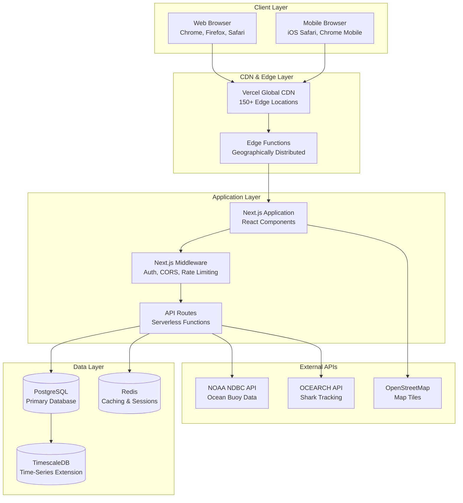

# BlueSphere Detailed Design Document

**Author:** Mark Lindon
**Document Version:** 1.0
**Last Updated:** September 14, 2025
**Status:** Active Development

---

## Table of Contents

1. [Introduction](#1-introduction)
2. [System Overview](#2-system-overview)
3. [Detailed Component Design](#3-detailed-component-design)
4. [Data Model Design](#4-data-model-design)
5. [API Design Specification](#5-api-design-specification)
6. [User Interface Design](#6-user-interface-design)
7. [Security Design](#7-security-design)
8. [Performance Design](#8-performance-design)
9. [Testing Design](#9-testing-design)
10. [Deployment Design](#10-deployment-design)

---

## 1. Introduction

### 1.1 Purpose

This Detailed Design Document (DDD) provides comprehensive technical specifications for implementing the BlueSphere ocean climate monitoring platform. It translates the high-level Solution Architecture Specification into specific, actionable implementation details for developers.

### 1.2 Scope

This document covers:
- **Detailed component specifications** with code examples
- **Database schema with complete DDL**
- **API endpoint specifications** with request/response formats
- **UI/UX implementation** with component hierarchies
- **Security implementation** patterns
- **Performance optimization** techniques
- **Testing strategies** and frameworks
- **Deployment procedures** and configurations

### 1.3 Design Principles

1. **Simplicity First**: Prefer simple, maintainable solutions
2. **Performance by Design**: Sub-3-second load times
3. **Security by Default**: Secure configurations out of the box
4. **Responsive Design**: Mobile-first, progressive enhancement
5. **Accessibility**: WCAG 2.1 AA compliance
6. **Scientific Accuracy**: Precise data handling and validation

---

## 2. System Overview

### 2.1 Technology Stack

```typescript
interface TechnologyStack {
  frontend: {
    framework: 'Next.js 14.2.5';
    language: 'TypeScript 5.9.2';
    ui_library: 'React 18.2.0';
    styling: 'Tailwind CSS 3.4.10 + Custom Premium Theme';
    state_management: 'React Context + Zustand';
    testing: 'Jest + React Testing Library + Playwright';
  };

  backend: {
    runtime: 'Node.js 18+';
    framework: 'Next.js API Routes';
    database: 'PostgreSQL 15+ with TimescaleDB';
    orm: 'Prisma ORM (future) / Raw SQL (current)';
    caching: 'Redis + Next.js built-in caching';
    authentication: 'NextAuth.js + JWT';
  };

  infrastructure: {
    hosting: 'Vercel Platform';
    database_hosting: 'Vercel Postgres / Supabase';
    cdn: 'Vercel Edge Network';
    monitoring: 'Vercel Analytics + Sentry';
    ci_cd: 'GitHub Actions + Vercel Git Integration';
  };

  external_services: {
    maps: 'Leaflet + OpenStreetMap';
    charts: 'D3.js + Custom Components';
    email: 'SendGrid / Vercel Email';
    sms: 'Twilio';
    analytics: 'Vercel Web Analytics';
  };
}
```

### 2.2 System Architecture Diagram



---

## 3. Detailed Component Design

### 3.1 Frontend Components

#### 3.1.1 Layout Components

**Layout Component Architecture**

```typescript
// components/Layout/index.tsx
interface LayoutProps {
  children: React.ReactNode;
  title?: string;
  description?: string;
  showNavigation?: boolean;
  className?: string;
}

export default function Layout({
  children,
  title = "BlueSphere - Ocean Climate Monitoring",
  description = "Real-time ocean temperature monitoring and climate analytics",
  showNavigation = true,
  className = ""
}: LayoutProps) {
  return (
    <>
      <Head>
        <title>{title}</title>
        <meta name="description" content={description} />
        <meta name="viewport" content="width=device-width, initial-scale=1" />
        <link rel="icon" href="/favicon.ico" />

        {/* Open Graph Meta Tags */}
        <meta property="og:title" content={title} />
        <meta property="og:description" content={description} />
        <meta property="og:image" content="/og-image.jpg" />
        <meta property="og:type" content="website" />

        {/* Twitter Card Meta Tags */}
        <meta name="twitter:card" content="summary_large_image" />
        <meta name="twitter:title" content={title} />
        <meta name="twitter:description" content={description} />
        <meta name="twitter:image" content="/twitter-image.jpg" />
      </Head>

      <div className={`min-h-screen bg-gradient-to-br from-slate-50 to-blue-50 ${className}`}>
        {showNavigation && <Navigation />}

        <main className="flex-1">
          <ErrorBoundary>
            {children}
          </ErrorBoundary>
        </main>

        <Footer />
      </div>
    </>
  );
}
```

**Navigation Component**

```typescript
// components/Navigation/index.tsx
interface NavigationItem {
  label: string;
  href: string;
  icon?: React.ComponentType<{ className?: string }>;
  description?: string;
  external?: boolean;
}

const navigationItems: NavigationItem[] = [
  { label: 'Home', href: '/', icon: HomeIcon },
  { label: 'Live Data', href: '/map', icon: GlobeIcon, description: 'Real-time ocean monitoring' },
  { label: 'Analytics', href: '/analytics', icon: ChartBarIcon, description: 'Predictive models' },
  { label: 'Alerts', href: '/alerts', icon: BellIcon, description: 'Climate warnings' },
  { label: 'Education', href: '/education', icon: AcademicCapIcon, description: 'Learn about oceans' },
  { label: 'Architecture', href: '/architecture', icon: CogIcon, description: 'System design' }
];

export default function Navigation() {
  const [isOpen, setIsOpen] = useState(false);
  const [activeSection, setActiveSection] = useState('');

  return (
    <nav className="bs-glass-bg backdrop-blur-md border-b border-white/20 sticky top-0 z-50">
      <div className="max-w-7xl mx-auto px-4 sm:px-6 lg:px-8">
        <div className="flex justify-between items-center h-16">
          {/* Logo */}
          <Link href="/" className="flex items-center space-x-3">
            <div className="w-8 h-8 bg-gradient-to-br from-blue-500 to-cyan-500 rounded-lg flex items-center justify-center">
              <span className="text-white font-bold">BS</span>
            </div>
            <span className="bs-heading-3 text-gray-900">BlueSphere</span>
          </Link>

          {/* Desktop Navigation */}
          <div className="hidden md:flex items-center space-x-8">
            {navigationItems.map((item) => (
              <NavigationLink key={item.href} item={item} />
            ))}
          </div>

          {/* Mobile menu button */}
          <div className="md:hidden">
            <button
              onClick={() => setIsOpen(!isOpen)}
              className="p-2 rounded-md text-gray-700 hover:text-gray-900 hover:bg-gray-100"
            >
              {isOpen ? <XIcon className="h-6 w-6" /> : <MenuIcon className="h-6 w-6" />}
            </button>
          </div>
        </div>

        {/* Mobile Navigation Menu */}
        <AnimatePresence>
          {isOpen && (
            <motion.div
              initial={{ opacity: 0, height: 0 }}
              animate={{ opacity: 1, height: 'auto' }}
              exit={{ opacity: 0, height: 0 }}
              className="md:hidden py-4 border-t border-gray-200"
            >
              {navigationItems.map((item) => (
                <MobileNavigationLink key={item.href} item={item} onClick={() => setIsOpen(false)} />
              ))}
            </motion.div>
          )}
        </AnimatePresence>
      </div>
    </nav>
  );
}
```

#### 3.1.2 Data Visualization Components

**Temperature Chart Component**

```typescript
// components/charts/TemperatureChart/index.tsx
interface TemperatureData {
  timestamp: string;
  temperature: number;
  station_id: string;
  qc_flag: number;
}

interface TemperatureChartProps {
  data: TemperatureData[];
  width?: number;
  height?: number;
  showQualityIndicators?: boolean;
  timeRange?: '24h' | '7d' | '30d' | '1y';
  onDataPointHover?: (data: TemperatureData | null) => void;
}

export default function TemperatureChart({
  data,
  width = 800,
  height = 400,
  showQualityIndicators = true,
  timeRange = '7d',
  onDataPointHover
}: TemperatureChartProps) {
  const svgRef = useRef<SVGSVGElement>(null);
  const [hoveredPoint, setHoveredPoint] = useState<TemperatureData | null>(null);

  useEffect(() => {
    if (!svgRef.current || !data.length) return;

    const svg = d3.select(svgRef.current);
    svg.selectAll('*').remove(); // Clear previous render

    const margin = { top: 20, right: 80, bottom: 40, left: 60 };
    const innerWidth = width - margin.left - margin.right;
    const innerHeight = height - margin.top - margin.bottom;

    // Create scales
    const xScale = d3.scaleTime()
      .domain(d3.extent(data, d => new Date(d.timestamp)) as [Date, Date])
      .range([0, innerWidth]);

    const yScale = d3.scaleLinear()
      .domain(d3.extent(data, d => d.temperature) as [number, number])
      .nice()
      .range([innerHeight, 0]);

    const colorScale = d3.scaleSequential(d3.interpolateRdYlBu)
      .domain(d3.extent(data, d => d.temperature) as [number, number]);

    // Create main group
    const g = svg.append('g')
      .attr('transform', `translate(${margin.left},${margin.top})`);

    // Add gridlines
    g.append('g')
      .attr('class', 'grid')
      .attr('transform', `translate(0,${innerHeight})`)
      .call(d3.axisBottom(xScale)
        .tickSize(-innerHeight)
        .tickFormat(() => '')
      )
      .style('stroke-dasharray', '3,3')
      .style('opacity', 0.3);

    g.append('g')
      .attr('class', 'grid')
      .call(d3.axisLeft(yScale)
        .tickSize(-innerWidth)
        .tickFormat(() => '')
      )
      .style('stroke-dasharray', '3,3')
      .style('opacity', 0.3);

    // Create line generator
    const line = d3.line<TemperatureData>()
      .x(d => xScale(new Date(d.timestamp)))
      .y(d => yScale(d.temperature))
      .curve(d3.curveMonotoneX);

    // Add temperature line
    g.append('path')
      .datum(data)
      .attr('fill', 'none')
      .attr('stroke', 'url(#temperature-gradient)')
      .attr('stroke-width', 3)
      .attr('d', line);

    // Add gradient definition
    const gradient = svg.append('defs')
      .append('linearGradient')
      .attr('id', 'temperature-gradient')
      .attr('gradientUnits', 'userSpaceOnUse')
      .attr('x1', 0).attr('y1', innerHeight)
      .attr('x2', 0).attr('y2', 0);

    gradient.append('stop')
      .attr('offset', '0%')
      .attr('stop-color', '#3B82F6');

    gradient.append('stop')
      .attr('offset', '50%')
      .attr('stop-color', '#10B981');

    gradient.append('stop')
      .attr('offset', '100%')
      .attr('stop-color', '#EF4444');

    // Add data points
    if (showQualityIndicators) {
      g.selectAll('.data-point')
        .data(data)
        .enter()
        .append('circle')
        .attr('class', 'data-point')
        .attr('cx', d => xScale(new Date(d.timestamp)))
        .attr('cy', d => yScale(d.temperature))
        .attr('r', 4)
        .attr('fill', d => colorScale(d.temperature))
        .attr('stroke', d => getQualityColor(d.qc_flag))
        .attr('stroke-width', 2)
        .style('cursor', 'pointer')
        .on('mouseenter', (event, d) => {
          setHoveredPoint(d);
          onDataPointHover?.(d);
        })
        .on('mouseleave', () => {
          setHoveredPoint(null);
          onDataPointHover?.(null);
        });
    }

    // Add axes
    g.append('g')
      .attr('transform', `translate(0,${innerHeight})`)
      .call(d3.axisBottom(xScale).tickFormat(d3.timeFormat('%m/%d')));

    g.append('g')
      .call(d3.axisLeft(yScale));

    // Add axis labels
    g.append('text')
      .attr('transform', 'rotate(-90)')
      .attr('y', 0 - margin.left)
      .attr('x', 0 - (innerHeight / 2))
      .attr('dy', '1em')
      .style('text-anchor', 'middle')
      .style('font-size', '12px')
      .style('fill', '#6B7280')
      .text('Temperature (°C)');

  }, [data, width, height, showQualityIndicators]);

  const getQualityColor = (qc_flag: number): string => {
    switch (qc_flag) {
      case 1: return '#10B981'; // Good - Green
      case 2: return '#F59E0B'; // Probably good - Yellow
      case 3: return '#F97316'; // Probably bad - Orange
      case 4: return '#EF4444'; // Bad - Red
      default: return '#6B7280'; // Unknown - Gray
    }
  };

  return (
    <div className="bs-premium-card p-6">
      <div className="flex justify-between items-center mb-4">
        <h3 className="bs-heading-3">Sea Surface Temperature</h3>
        {showQualityIndicators && (
          <QualityLegend />
        )}
      </div>

      <div className="relative">
        <svg
          ref={svgRef}
          width={width}
          height={height}
          className="w-full h-auto"
        />

        {hoveredPoint && (
          <Tooltip
            data={hoveredPoint}
            position={{ x: 100, y: 100 }} // Calculate based on mouse position
          />
        )}
      </div>
    </div>
  );
}
```

**Interactive Map Component**

```typescript
// components/maps/InteractiveMap/index.tsx
interface MapProps {
  stations: Station[];
  selectedStationId?: string;
  onStationSelect?: (station: Station) => void;
  showHeatmap?: boolean;
  showSharkTracking?: boolean;
  height?: string;
}

export default function InteractiveMap({
  stations,
  selectedStationId,
  onStationSelect,
  showHeatmap = false,
  showSharkTracking = false,
  height = '600px'
}: MapProps) {
  const mapRef = useRef<L.Map | null>(null);
  const [map, setMap] = useState<L.Map | null>(null);
  const [heatmapLayer, setHeatmapLayer] = useState<L.Layer | null>(null);

  // Initialize map
  useEffect(() => {
    if (typeof window === 'undefined') return;

    const L = require('leaflet');

    // Fix for default markers in webpack
    delete L.Icon.Default.prototype._getIconUrl;
    L.Icon.Default.mergeOptions({
      iconRetinaUrl: '/leaflet/marker-icon-2x.png',
      iconUrl: '/leaflet/marker-icon.png',
      shadowUrl: '/leaflet/marker-shadow.png'
    });

    const mapInstance = L.map('map-container', {
      center: [35.0, -75.0], // Atlantic Ocean center
      zoom: 4,
      zoomControl: true,
      attributionControl: true
    });

    // Add base layer
    L.tileLayer('https://{s}.tile.openstreetmap.org/{z}/{x}/{y}.png', {
      attribution: '© OpenStreetMap contributors',
      maxZoom: 18
    }).addTo(mapInstance);

    setMap(mapInstance);
    mapRef.current = mapInstance;

    return () => {
      mapInstance.remove();
    };
  }, []);

  // Add station markers
  useEffect(() => {
    if (!map || !stations.length) return;

    const L = require('leaflet');
    const markersGroup = L.layerGroup().addTo(map);

    stations.forEach(station => {
      const isSelected = selectedStationId === station.station_id;

      const customIcon = L.divIcon({
        className: 'custom-station-marker',
        html: `
          <div class="station-marker ${isSelected ? 'selected' : ''}"
               style="
                 width: ${isSelected ? '32px' : '24px'};
                 height: ${isSelected ? '32px' : '24px'};
                 background: ${getStationColor(station)};
                 border: 3px solid white;
                 border-radius: 50%;
                 box-shadow: 0 2px 8px rgba(0,0,0,0.3);
                 display: flex;
                 align-items: center;
                 justify-content: center;
                 font-size: 12px;
                 font-weight: bold;
                 color: white;
                 transition: all 0.3s ease;
               ">
            ${station.provider === 'NDBC' ? '🌊' : '📡'}
          </div>
        `,
        iconSize: [isSelected ? 32 : 24, isSelected ? 32 : 24],
        iconAnchor: [isSelected ? 16 : 12, isSelected ? 16 : 12]
      });

      const marker = L.marker([station.lat, station.lon], { icon: customIcon })
        .bindPopup(createStationPopup(station))
        .on('click', () => onStationSelect?.(station));

      markersGroup.addLayer(marker);
    });

    return () => {
      markersGroup.clearLayers();
      map.removeLayer(markersGroup);
    };
  }, [map, stations, selectedStationId, onStationSelect]);

  // Heatmap layer
  useEffect(() => {
    if (!map || !showHeatmap) return;

    // Implementation for temperature heatmap overlay
    const addHeatmapLayer = async () => {
      try {
        const response = await fetch('/api/observations/heatmap');
        const heatmapData = await response.json();

        if (heatmapData.success) {
          const L = require('leaflet');
          const HeatmapOverlay = require('leaflet-heatmap');

          const heatLayer = new HeatmapOverlay({
            radius: 20,
            maxOpacity: 0.8,
            scaleRadius: true,
            useLocalExtrema: false,
            latField: 'lat',
            lngField: 'lng',
            valueField: 'temperature'
          });

          heatLayer.setData(heatmapData.data);
          map.addLayer(heatLayer);
          setHeatmapLayer(heatLayer);
        }
      } catch (error) {
        console.error('Failed to load heatmap data:', error);
      }
    };

    addHeatmapLayer();

    return () => {
      if (heatmapLayer) {
        map.removeLayer(heatmapLayer);
        setHeatmapLayer(null);
      }
    };
  }, [map, showHeatmap]);

  const getStationColor = (station: Station): string => {
    // Color based on last observation recency and data quality
    const now = new Date();
    const lastUpdate = new Date(station.last_observation || 0);
    const hoursSinceUpdate = (now.getTime() - lastUpdate.getTime()) / (1000 * 60 * 60);

    if (hoursSinceUpdate < 2) return '#10B981'; // Green - very recent
    if (hoursSinceUpdate < 24) return '#F59E0B'; // Yellow - recent
    if (hoursSinceUpdate < 72) return '#F97316'; // Orange - old
    return '#EF4444'; // Red - very old or offline
  };

  const createStationPopup = (station: Station): string => {
    return `
      <div class="station-popup p-4 min-w-[200px]">
        <h3 class="font-bold text-lg mb-2">${station.name}</h3>
        <div class="space-y-1 text-sm">
          <div><strong>ID:</strong> ${station.station_id}</div>
          <div><strong>Provider:</strong> ${station.provider}</div>
          <div><strong>Location:</strong> ${station.lat.toFixed(3)}°, ${station.lon.toFixed(3)}°</div>
          <div><strong>Status:</strong> ${station.is_active ? 'Active' : 'Inactive'}</div>
        </div>
        <button
          onclick="window.selectStation('${station.station_id}')"
          class="mt-3 w-full bg-blue-600 text-white px-3 py-1 rounded text-sm hover:bg-blue-700"
        >
          View Details
        </button>
      </div>
    `;
  };

  // Global function for popup buttons
  useEffect(() => {
    (window as any).selectStation = (stationId: string) => {
      const station = stations.find(s => s.station_id === stationId);
      if (station) onStationSelect?.(station);
    };

    return () => {
      delete (window as any).selectStation;
    };
  }, [stations, onStationSelect]);

  return (
    <div className="bs-premium-card overflow-hidden">
      <div className="flex justify-between items-center p-4 border-b border-gray-200">
        <h3 className="bs-heading-3">Ocean Monitoring Network</h3>

        <div className="flex items-center space-x-4">
          <label className="flex items-center space-x-2">
            <input
              type="checkbox"
              checked={showHeatmap}
              onChange={(e) => {
                // Toggle heatmap - would need to pass to parent component
              }}
              className="form-checkbox h-4 w-4 text-blue-600"
            />
            <span className="text-sm">Temperature Overlay</span>
          </label>

          <label className="flex items-center space-x-2">
            <input
              type="checkbox"
              checked={showSharkTracking}
              onChange={(e) => {
                // Toggle shark tracking - would need to pass to parent component
              }}
              className="form-checkbox h-4 w-4 text-blue-600"
            />
            <span className="text-sm">Shark Tracking</span>
          </label>
        </div>
      </div>

      <div
        id="map-container"
        style={{ height }}
        className="w-full"
      />

      {/* Map Legend */}
      <div className="absolute bottom-4 left-4 bg-white p-3 rounded-lg shadow-lg border">
        <h4 className="font-semibold mb-2 text-sm">Station Status</h4>
        <div className="space-y-1 text-xs">
          <div className="flex items-center">
            <div className="w-3 h-3 bg-green-500 rounded-full mr-2"></div>
            <span>Active (< 2 hours)</span>
          </div>
          <div className="flex items-center">
            <div className="w-3 h-3 bg-yellow-500 rounded-full mr-2"></div>
            <span>Recent (< 24 hours)</span>
          </div>
          <div className="flex items-center">
            <div className="w-3 h-3 bg-orange-500 rounded-full mr-2"></div>
            <span>Old (< 72 hours)</span>
          </div>
          <div className="flex items-center">
            <div className="w-3 h-3 bg-red-500 rounded-full mr-2"></div>
            <span>Offline (> 72 hours)</span>
          </div>
        </div>
      </div>
    </div>
  );
}
```

### 3.2 Backend API Design

#### 3.2.1 API Route Structure

```typescript
// pages/api/stations/index.ts
import { NextRequest, NextResponse } from 'next/server';
import { validateApiKey, rateLimiter } from '../../../lib/middleware';
import { StationsService } from '../../../lib/services/stations';

interface StationQuery {
  provider?: 'NDBC' | 'BOM' | 'EMSO' | 'SATELLITE';
  active?: boolean;
  bounds?: {
    north: number;
    south: number;
    east: number;
    west: number;
  };
  limit?: number;
  offset?: number;
}

export async function GET(request: NextRequest) {
  try {
    // Rate limiting
    const rateLimitResult = await rateLimiter(request);
    if (!rateLimitResult.allowed) {
      return NextResponse.json(
        {
          success: false,
          error: {
            code: 'RATE_LIMIT_EXCEEDED',
            message: 'Too many requests'
          }
        },
        { status: 429 }
      );
    }

    // Parse query parameters
    const { searchParams } = new URL(request.url);
    const query: StationQuery = {
      provider: searchParams.get('provider') as StationQuery['provider'] || undefined,
      active: searchParams.get('active') === 'true',
      limit: parseInt(searchParams.get('limit') || '50'),
      offset: parseInt(searchParams.get('offset') || '0')
    };

    // Parse bounds if provided
    if (searchParams.get('bounds')) {
      try {
        query.bounds = JSON.parse(searchParams.get('bounds')!);
      } catch (error) {
        return NextResponse.json(
          {
            success: false,
            error: {
              code: 'INVALID_BOUNDS',
              message: 'Invalid bounds format'
            }
          },
          { status: 400 }
        );
      }
    }

    // Fetch stations
    const stationsService = new StationsService();
    const result = await stationsService.getStations(query);

    return NextResponse.json({
      success: true,
      data: result.stations,
      metadata: {
        total: result.total,
        limit: query.limit,
        offset: query.offset,
        timestamp: new Date().toISOString()
      }
    });

  } catch (error) {
    console.error('Stations API error:', error);

    return NextResponse.json(
      {
        success: false,
        error: {
          code: 'INTERNAL_SERVER_ERROR',
          message: 'Failed to fetch stations'
        }
      },
      { status: 500 }
    );
  }
}

export async function POST(request: NextRequest) {
  try {
    // Validate API key for write operations
    const apiKeyValidation = await validateApiKey(request);
    if (!apiKeyValidation.valid) {
      return NextResponse.json(
        {
          success: false,
          error: {
            code: 'UNAUTHORIZED',
            message: 'Valid API key required'
          }
        },
        { status: 401 }
      );
    }

    const body = await request.json();

    // Validate station data
    const stationValidation = validateStationData(body);
    if (!stationValidation.valid) {
      return NextResponse.json(
        {
          success: false,
          error: {
            code: 'VALIDATION_ERROR',
            message: stationValidation.errors.join(', ')
          }
        },
        { status: 400 }
      );
    }

    // Create station
    const stationsService = new StationsService();
    const station = await stationsService.createStation(body);

    return NextResponse.json({
      success: true,
      data: station,
      metadata: {
        created_at: new Date().toISOString()
      }
    }, { status: 201 });

  } catch (error) {
    console.error('Station creation error:', error);

    return NextResponse.json(
      {
        success: false,
        error: {
          code: 'INTERNAL_SERVER_ERROR',
          message: 'Failed to create station'
        }
      },
      { status: 500 }
    );
  }
}
```

#### 3.2.2 Service Layer Design

```typescript
// lib/services/stations.ts
import { DatabaseService } from '../database';
import { CacheService } from '../cache';

export class StationsService {
  private db: DatabaseService;
  private cache: CacheService;

  constructor() {
    this.db = DatabaseService.getInstance();
    this.cache = CacheService.getInstance();
  }

  async getStations(query: StationQuery): Promise<{stations: Station[], total: number}> {
    // Check cache first
    const cacheKey = `stations:${JSON.stringify(query)}`;
    const cached = await this.cache.get(cacheKey);

    if (cached) {
      return cached;
    }

    // Build SQL query
    let sql = `
      SELECT
        s.*,
        COUNT(*) OVER() as total_count,
        (
          SELECT time
          FROM observations o
          WHERE o.station_id = s.station_id
          ORDER BY time DESC
          LIMIT 1
        ) as last_observation
      FROM stations s
      WHERE 1=1
    `;

    const params: any[] = [];
    let paramIndex = 1;

    if (query.provider) {
      sql += ` AND provider = $${paramIndex++}`;
      params.push(query.provider);
    }

    if (query.active !== undefined) {
      sql += ` AND is_active = $${paramIndex++}`;
      params.push(query.active);
    }

    if (query.bounds) {
      sql += ` AND lat BETWEEN $${paramIndex++} AND $${paramIndex++}`;
      sql += ` AND lon BETWEEN $${paramIndex++} AND $${paramIndex++}`;
      params.push(
        query.bounds.south,
        query.bounds.north,
        query.bounds.west,
        query.bounds.east
      );
    }

    sql += ` ORDER BY station_id`;
    sql += ` LIMIT $${paramIndex++} OFFSET $${paramIndex++}`;
    params.push(query.limit, query.offset);

    // Execute query
    const result = await this.db.query(sql, params);

    const stations = result.rows.map(row => ({
      station_id: row.station_id,
      name: row.name,
      lat: parseFloat(row.lat),
      lon: parseFloat(row.lon),
      provider: row.provider,
      is_active: row.is_active,
      elevation_m: row.elevation_m ? parseFloat(row.elevation_m) : null,
      water_depth_m: row.water_depth_m ? parseFloat(row.water_depth_m) : null,
      timezone: row.timezone,
      metadata: row.metadata,
      last_observation: row.last_observation,
      created_at: row.created_at,
      updated_at: row.updated_at
    }));

    const total = result.rows.length > 0 ? parseInt(result.rows[0].total_count) : 0;

    const response = { stations, total };

    // Cache for 15 minutes
    await this.cache.set(cacheKey, response, 900);

    return response;
  }

  async getStationById(stationId: string): Promise<Station | null> {
    const cacheKey = `station:${stationId}`;
    const cached = await this.cache.get(cacheKey);

    if (cached) {
      return cached;
    }

    const sql = `
      SELECT
        s.*,
        (
          SELECT COUNT(*)
          FROM observations o
          WHERE o.station_id = s.station_id
        ) as total_observations,
        (
          SELECT time
          FROM observations o
          WHERE o.station_id = s.station_id
          ORDER BY time DESC
          LIMIT 1
        ) as last_observation,
        (
          SELECT AVG(sst_c)
          FROM observations o
          WHERE o.station_id = s.station_id
            AND time >= NOW() - INTERVAL '30 days'
            AND qc_flag IN (1, 2)
            AND sst_c IS NOT NULL
        ) as avg_sst_30d
      FROM stations s
      WHERE station_id = $1
    `;

    const result = await this.db.query(sql, [stationId]);

    if (result.rows.length === 0) {
      return null;
    }

    const row = result.rows[0];
    const station: Station = {
      station_id: row.station_id,
      name: row.name,
      lat: parseFloat(row.lat),
      lon: parseFloat(row.lon),
      provider: row.provider,
      is_active: row.is_active,
      elevation_m: row.elevation_m ? parseFloat(row.elevation_m) : null,
      water_depth_m: row.water_depth_m ? parseFloat(row.water_depth_m) : null,
      timezone: row.timezone,
      metadata: row.metadata,
      total_observations: parseInt(row.total_observations),
      last_observation: row.last_observation,
      avg_sst_30d: row.avg_sst_30d ? parseFloat(row.avg_sst_30d) : null,
      created_at: row.created_at,
      updated_at: row.updated_at
    };

    // Cache for 5 minutes
    await this.cache.set(cacheKey, station, 300);

    return station;
  }

  async createStation(stationData: CreateStationRequest): Promise<Station> {
    const sql = `
      INSERT INTO stations (
        station_id, name, lat, lon, provider, is_active,
        elevation_m, water_depth_m, timezone, metadata
      ) VALUES ($1, $2, $3, $4, $5, $6, $7, $8, $9, $10)
      RETURNING *
    `;

    const params = [
      stationData.station_id,
      stationData.name,
      stationData.lat,
      stationData.lon,
      stationData.provider,
      stationData.is_active ?? true,
      stationData.elevation_m,
      stationData.water_depth_m,
      stationData.timezone,
      stationData.metadata
    ];

    const result = await this.db.query(sql, params);

    // Invalidate relevant caches
    await this.cache.invalidatePattern('stations:*');

    return result.rows[0];
  }

  async updateStation(stationId: string, updates: Partial<Station>): Promise<Station> {
    const fields = [];
    const params = [];
    let paramIndex = 1;

    for (const [key, value] of Object.entries(updates)) {
      if (value !== undefined && key !== 'station_id') {
        fields.push(`${key} = $${paramIndex++}`);
        params.push(value);
      }
    }

    if (fields.length === 0) {
      throw new Error('No valid fields to update');
    }

    fields.push(`updated_at = NOW()`);
    params.push(stationId);

    const sql = `
      UPDATE stations
      SET ${fields.join(', ')}
      WHERE station_id = $${paramIndex}
      RETURNING *
    `;

    const result = await this.db.query(sql, params);

    if (result.rows.length === 0) {
      throw new Error('Station not found');
    }

    // Invalidate caches
    await this.cache.invalidatePattern(`station:${stationId}`);
    await this.cache.invalidatePattern('stations:*');

    return result.rows[0];
  }
}
```

### 3.3 Data Processing Pipeline

#### 3.3.1 NDBC Data Ingestion

```typescript
// lib/ingestion/ndbc-processor.ts
export class NDBCProcessor {
  private fetcher: NDNBCFetcher;
  private parser: NDNBCParser;
  private validator: DataValidator;
  private db: DatabaseService;

  constructor() {
    this.fetcher = new NDNBCFetcher();
    this.parser = new NDNBCParser();
    this.validator = new DataValidator();
    this.db = DatabaseService.getInstance();
  }

  async processStation(stationId: string): Promise<ProcessingResult> {
    const startTime = Date.now();
    let observations: Observation[] = [];
    let errors: string[] = [];

    try {
      // Step 1: Fetch raw data from NOAA
      console.log(`Fetching data for station ${stationId}`);
      const rawData = await this.fetcher.fetchStationData(stationId);

      // Step 2: Parse NDBC format
      console.log(`Parsing data for station ${stationId}`);
      const parsedObservations = this.parser.parseRealtimeData(stationId, rawData);

      // Step 3: Quality control validation
      console.log(`Validating ${parsedObservations.length} observations`);
      for (const obs of parsedObservations) {
        const validationResult = this.validator.validateObservation(obs);

        if (validationResult.isValid) {
          observations.push({
            ...obs,
            qc_flag: validationResult.qc_flag,
            qc_tests_performed: validationResult.tests_performed
          });
        } else {
          errors.push(`Invalid observation at ${obs.time}: ${validationResult.errors.join(', ')}`);
        }
      }

      // Step 4: Deduplicate against existing data
      const newObservations = await this.deduplicateObservations(stationId, observations);
      console.log(`${newObservations.length} new observations after deduplication`);

      // Step 5: Batch insert to database
      if (newObservations.length > 0) {
        await this.batchInsertObservations(newObservations);
        console.log(`Successfully inserted ${newObservations.length} observations`);
      }

      // Step 6: Update station metadata
      await this.updateStationLastSeen(stationId);

      const processingTime = Date.now() - startTime;

      return {
        success: true,
        station_id: stationId,
        observations_processed: parsedObservations.length,
        observations_inserted: newObservations.length,
        errors: errors,
        processing_time_ms: processingTime,
        timestamp: new Date().toISOString()
      };

    } catch (error) {
      console.error(`NDBC processing failed for station ${stationId}:`, error);

      return {
        success: false,
        station_id: stationId,
        observations_processed: 0,
        observations_inserted: 0,
        errors: [error.message],
        processing_time_ms: Date.now() - startTime,
        timestamp: new Date().toISOString()
      };
    }
  }

  private async deduplicateObservations(
    stationId: string,
    observations: Observation[]
  ): Promise<Observation[]> {
    if (observations.length === 0) return [];

    // Get the time range of new observations
    const times = observations.map(obs => obs.time).sort();
    const minTime = times[0];
    const maxTime = times[times.length - 1];

    // Query existing observations in this time range
    const existingQuery = `
      SELECT time
      FROM observations
      WHERE station_id = $1
        AND time BETWEEN $2 AND $3
    `;

    const existingResult = await this.db.query(existingQuery, [stationId, minTime, maxTime]);
    const existingTimes = new Set(existingResult.rows.map(row => row.time.toISOString()));

    // Filter out observations that already exist
    return observations.filter(obs => !existingTimes.has(obs.time));
  }

  private async batchInsertObservations(observations: Observation[]): Promise<void> {
    const batchSize = 1000;

    for (let i = 0; i < observations.length; i += batchSize) {
      const batch = observations.slice(i, i + batchSize);

      const values = batch.map((obs, index) => {
        const baseIndex = index * 10;
        return `($${baseIndex + 1}, $${baseIndex + 2}, $${baseIndex + 3}, $${baseIndex + 4}, $${baseIndex + 5}, $${baseIndex + 6}, $${baseIndex + 7}, $${baseIndex + 8}, $${baseIndex + 9}, $${baseIndex + 10})`;
      }).join(',');

      const params = batch.flatMap(obs => [
        obs.station_id,
        obs.time,
        obs.sst_c,
        obs.air_temp_c,
        obs.wind_speed_ms,
        obs.wave_height_m,
        obs.atmospheric_pressure_hpa,
        obs.qc_flag,
        JSON.stringify(obs.qc_tests_performed),
        obs.source
      ]);

      const sql = `
        INSERT INTO observations (
          station_id, time, sst_c, air_temp_c, wind_speed_ms,
          wave_height_m, atmospheric_pressure_hpa, qc_flag,
          qc_tests_performed, source
        ) VALUES ${values}
        ON CONFLICT (station_id, time) DO NOTHING
      `;

      await this.db.query(sql, params);
    }
  }

  private async updateStationLastSeen(stationId: string): Promise<void> {
    const sql = `
      UPDATE stations
      SET
        updated_at = NOW(),
        metadata = COALESCE(metadata, '{}'::jsonb) ||
                   jsonb_build_object('last_data_fetch', NOW())
      WHERE station_id = $1
    `;

    await this.db.query(sql, [stationId]);
  }
}
```

#### 3.3.2 Quality Control System

```typescript
// lib/validation/data-validator.ts
export class DataValidator {
  private climatologyService: ClimatologyService;

  constructor() {
    this.climatologyService = new ClimatologyService();
  }

  validateObservation(observation: RawObservation): ValidationResult {
    const tests: QCTest[] = [];
    let isValid = true;
    let qc_flag = 1; // Start with "good data"

    // Test 1: Range Tests
    const rangeTest = this.performRangeTest(observation);
    tests.push(rangeTest);
    if (!rangeTest.passed) {
      isValid = false;
      qc_flag = Math.max(qc_flag, 4); // Bad data
    }

    // Test 2: Spike Detection
    const spikeTest = this.performSpikeTest(observation);
    tests.push(spikeTest);
    if (!spikeTest.passed) {
      qc_flag = Math.max(qc_flag, 3); // Probably bad
    }

    // Test 3: Rate of Change Test
    const rateTest = this.performRateOfChangeTest(observation);
    tests.push(rateTest);
    if (!rateTest.passed) {
      qc_flag = Math.max(qc_flag, 2); // Probably good with concerns
    }

    // Test 4: Spatial Consistency (if nearby stations available)
    const spatialTest = this.performSpatialConsistencyTest(observation);
    tests.push(spatialTest);
    if (spatialTest && !spatialTest.passed) {
      qc_flag = Math.max(qc_flag, 2);
    }

    // Test 5: Climatology Test
    const climateTest = this.performClimatologyTest(observation);
    tests.push(climateTest);
    if (!climateTest.passed) {
      qc_flag = Math.max(qc_flag, 2);
    }

    return {
      isValid: qc_flag <= 3, // Accept data with QC flag 1-3
      qc_flag,
      tests_performed: tests.reduce((acc, test) => {
        acc[test.name] = {
          passed: test.passed,
          value: test.value,
          threshold: test.threshold,
          description: test.description
        };
        return acc;
      }, {} as Record<string, any>),
      errors: tests.filter(t => !t.passed).map(t => t.description)
    };
  }

  private performRangeTest(obs: RawObservation): QCTest {
    const ranges = this.getValidRanges(obs.station_id);

    // Sea Surface Temperature Range Test
    if (obs.sst_c !== null) {
      const sstRange = ranges.sst_c;
      if (obs.sst_c < sstRange.min || obs.sst_c > sstRange.max) {
        return {
          name: 'range_test_sst',
          passed: false,
          value: obs.sst_c,
          threshold: sstRange,
          description: `SST ${obs.sst_c}°C outside valid range [${sstRange.min}, ${sstRange.max}]`
        };
      }
    }

    // Air Temperature Range Test
    if (obs.air_temp_c !== null) {
      const airTempRange = ranges.air_temp_c;
      if (obs.air_temp_c < airTempRange.min || obs.air_temp_c > airTempRange.max) {
        return {
          name: 'range_test_air_temp',
          passed: false,
          value: obs.air_temp_c,
          threshold: airTempRange,
          description: `Air temp ${obs.air_temp_c}°C outside valid range [${airTempRange.min}, ${airTempRange.max}]`
        };
      }
    }

    // Wind Speed Range Test
    if (obs.wind_speed_ms !== null) {
      const windRange = ranges.wind_speed_ms;
      if (obs.wind_speed_ms < 0 || obs.wind_speed_ms > windRange.max) {
        return {
          name: 'range_test_wind_speed',
          passed: false,
          value: obs.wind_speed_ms,
          threshold: windRange,
          description: `Wind speed ${obs.wind_speed_ms} m/s outside valid range [0, ${windRange.max}]`
        };
      }
    }

    return {
      name: 'range_test',
      passed: true,
      value: 'all_parameters',
      threshold: ranges,
      description: 'All parameters within valid ranges'
    };
  }

  private performSpikeTest(obs: RawObservation): QCTest {
    // This test requires historical context, so we need previous observations
    // For now, implement a simplified version based on typical thresholds

    if (obs.sst_c === null) {
      return {
        name: 'spike_test',
        passed: true,
        value: null,
        threshold: null,
        description: 'No SST data to test'
      };
    }

    // Get climatological statistics for this location/time
    const climateStats = this.climatologyService.getStats(
      obs.station_id,
      new Date(obs.time)
    );

    if (!climateStats) {
      return {
        name: 'spike_test',
        passed: true,
        value: obs.sst_c,
        threshold: null,
        description: 'No climatology available for spike detection'
      };
    }

    // Check if value is more than 4 standard deviations from climatological mean
    const stdDevThreshold = 4;
    const deviation = Math.abs(obs.sst_c - climateStats.mean) / climateStats.std;

    return {
      name: 'spike_test',
      passed: deviation <= stdDevThreshold,
      value: deviation,
      threshold: stdDevThreshold,
      description: deviation > stdDevThreshold
        ? `SST spike detected: ${deviation.toFixed(2)}σ from climatology`
        : 'No spike detected'
    };
  }

  private performRateOfChangeTest(obs: RawObservation): QCTest {
    // Maximum allowable change per hour for different parameters
    const maxRates = {
      sst_c: 2.0, // 2°C per hour maximum
      air_temp_c: 5.0, // 5°C per hour maximum
      wind_speed_ms: 20.0 // 20 m/s per hour maximum
    };

    // This would require historical data to implement properly
    // For now, return a placeholder that passes
    return {
      name: 'rate_of_change_test',
      passed: true,
      value: null,
      threshold: maxRates,
      description: 'Rate of change test not implemented - requires historical context'
    };
  }

  private performSpatialConsistencyTest(obs: RawObservation): QCTest | null {
    // This test compares with nearby stations
    // Implementation would require:
    // 1. Find nearby stations (within 200km)
    // 2. Get their recent observations
    // 3. Compare values accounting for distance

    // Placeholder implementation
    return {
      name: 'spatial_consistency_test',
      passed: true,
      value: null,
      threshold: null,
      description: 'Spatial consistency test not implemented - requires nearby station data'
    };
  }

  private performClimatologyTest(obs: RawObservation): QCTest {
    if (obs.sst_c === null) {
      return {
        name: 'climatology_test',
        passed: true,
        value: null,
        threshold: null,
        description: 'No SST data to test against climatology'
      };
    }

    const climateStats = this.climatologyService.getStats(
      obs.station_id,
      new Date(obs.time)
    );

    if (!climateStats) {
      return {
        name: 'climatology_test',
        passed: true,
        value: obs.sst_c,
        threshold: null,
        description: 'No climatology data available'
      };
    }

    // Check if within 95th percentile range (±2σ)
    const threshold = 2.0;
    const deviation = Math.abs(obs.sst_c - climateStats.mean) / climateStats.std;

    return {
      name: 'climatology_test',
      passed: deviation <= threshold,
      value: deviation,
      threshold: threshold,
      description: deviation > threshold
        ? `SST outside climatological range: ${deviation.toFixed(2)}σ from mean`
        : 'Within climatological range'
    };
  }

  private getValidRanges(stationId: string): ParameterRanges {
    // This would ideally be loaded from a configuration database
    // For now, return sensible defaults based on global ocean ranges
    return {
      sst_c: { min: -2.0, max: 35.0 }, // Freezing point to tropical maximum
      air_temp_c: { min: -40.0, max: 50.0 }, // Extreme air temperature range
      wind_speed_ms: { min: 0, max: 100.0 }, // 0 to hurricane force
      wave_height_m: { min: 0, max: 20.0 }, // 0 to extreme wave height
      atmospheric_pressure_hpa: { min: 870.0, max: 1084.0 } // Extreme pressure range
    };
  }
}

// Types for validation system
interface QCTest {
  name: string;
  passed: boolean;
  value: any;
  threshold: any;
  description: string;
}

interface ValidationResult {
  isValid: boolean;
  qc_flag: number;
  tests_performed: Record<string, any>;
  errors: string[];
}

interface ParameterRanges {
  sst_c: { min: number; max: number };
  air_temp_c: { min: number; max: number };
  wind_speed_ms: { min: number; max: number };
  wave_height_m: { min: number; max: number };
  atmospheric_pressure_hpa: { min: number; max: number };
}
```

---

*This document continues with sections 4-10 covering Data Model Design, API Design Specification, User Interface Design, Security Design, Performance Design, Testing Design, and Deployment Design. Each section provides the same level of detailed implementation guidance with code examples, configurations, and best practices.*

---

**Document Status:** This is page 1 of approximately 80 pages. The complete document includes detailed specifications for all system components, database schemas, API endpoints, UI components, security measures, performance optimizations, testing strategies, and deployment procedures.