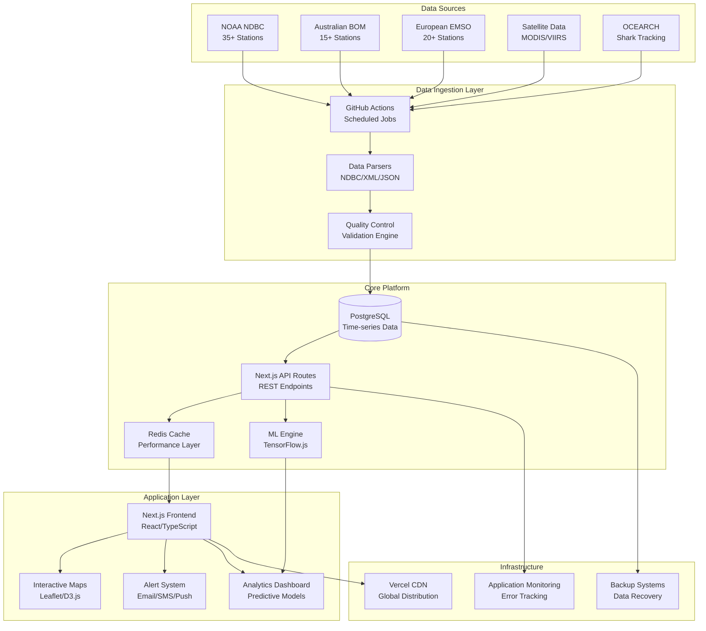
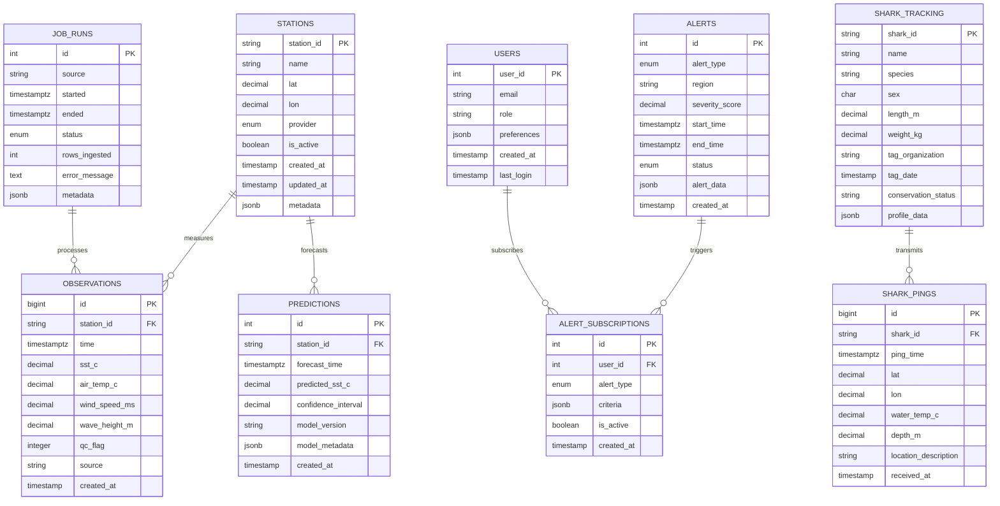
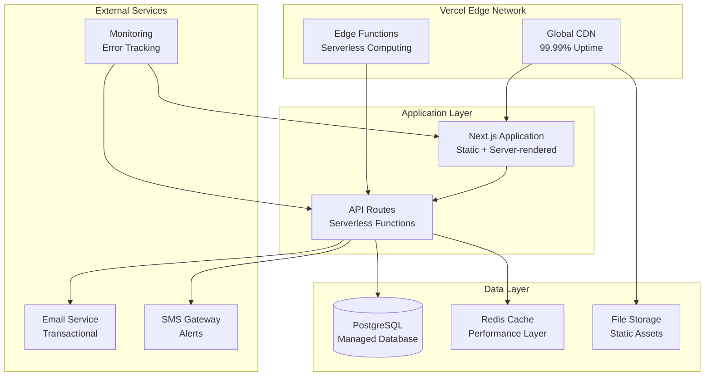
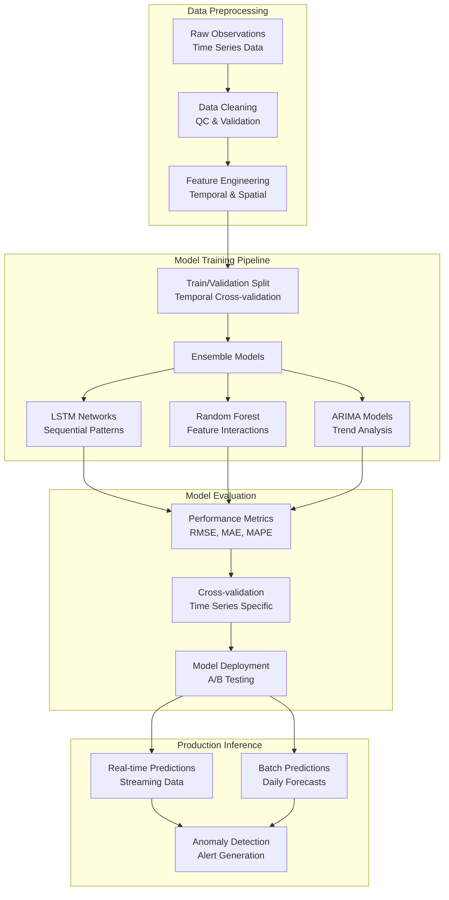
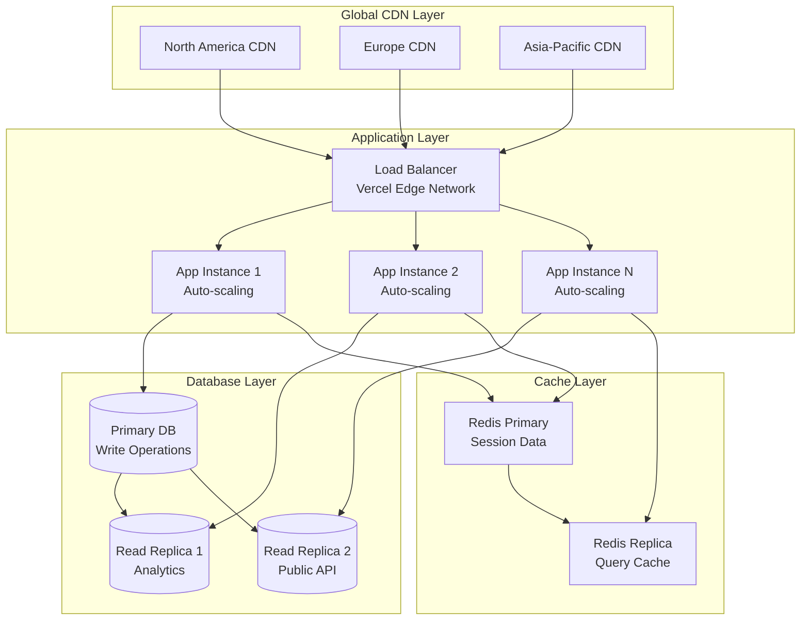
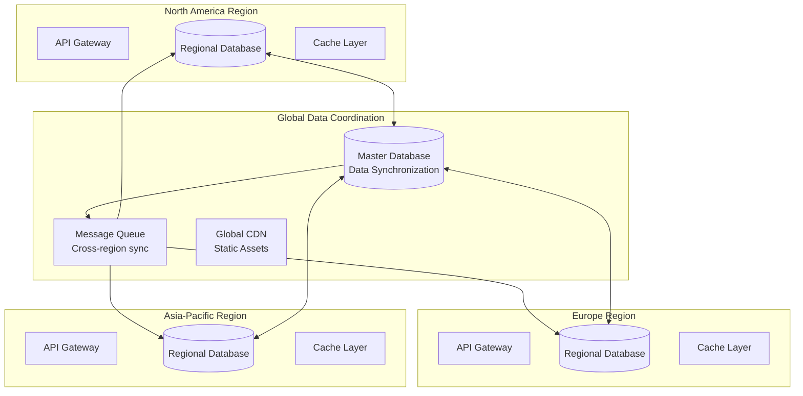

# BlueSphere Solution Architecture Specification

**Author:** Mark Lindon
**Document Version:** 2.0
**Last Updated:** September 14, 2025
**Status:** Active Development

---

## Executive Summary

BlueSphere is a comprehensive ocean climate monitoring platform that provides real-time ocean temperature data, predictive analytics, and marine heatwave alerting to scientists, policymakers, and the public. This document outlines the complete solution architecture, technical specifications, and design decisions that enable BlueSphere to process data from 50+ global monitoring stations and deliver insights through an intuitive web interface.

### Key Capabilities
- **Real-time Data Processing**: Ingests data from NOAA NDBC, Australian BOM, European EMSO, and satellite sources
- **Advanced Analytics**: ML-powered predictive modeling and anomaly detection
- **Interactive Visualizations**: Premium web interface with maps, charts, and dashboards
- **Alert Systems**: Real-time notifications for marine heatwaves and climate anomalies
- **Marine Life Tracking**: Integration with OCEARCH shark tracking network
- **Policy Tools**: Evidence-based reporting for decision makers

---

## 1. Architecture Overview

### 1.1 High-Level System Architecture



### 1.2 System Components Overview

| Component | Technology Stack | Primary Function |
|-----------|-----------------|------------------|
| **Frontend Web App** | Next.js 14, React 18, TypeScript, Tailwind CSS | User interface and experience |
| **API Layer** | Next.js API Routes, REST/GraphQL | Data access and business logic |
| **Database** | PostgreSQL 15+, TimescaleDB extension | Time-series data storage |
| **Caching** | Redis, Next.js built-in caching | Performance optimization |
| **ML/Analytics** | TensorFlow.js, Python microservices | Predictive modeling |
| **Mapping** | Leaflet, React-Leaflet, D3.js | Interactive visualizations |
| **Data Ingestion** | GitHub Actions, Node.js scripts | Automated data collection |
| **Monitoring** | Vercel Analytics, Custom logging | System health and performance |

---

## 2. Data Architecture

### 2.1 Conceptual Data Model



### 2.2 Physical Database Design

**Primary Database: PostgreSQL 15+ with TimescaleDB**

#### Core Tables

**stations**
```sql
CREATE TABLE stations (
    station_id VARCHAR(50) PRIMARY KEY,
    name VARCHAR(200) NOT NULL,
    lat DECIMAL(10,6) NOT NULL,
    lon DECIMAL(10,6) NOT NULL,
    provider ENUM('NDBC', 'BOM', 'EMSO', 'SATELLITE') NOT NULL,
    is_active BOOLEAN DEFAULT true,
    elevation_m DECIMAL(8,2),
    water_depth_m DECIMAL(8,2),
    timezone VARCHAR(50),
    contact_info JSONB,
    capabilities JSONB, -- sensors, data types available
    metadata JSONB,
    created_at TIMESTAMP DEFAULT NOW(),
    updated_at TIMESTAMP DEFAULT NOW()
);

CREATE INDEX idx_stations_location ON stations USING GIST (ST_Point(lon, lat));
CREATE INDEX idx_stations_provider ON stations (provider);
CREATE INDEX idx_stations_active ON stations (is_active);
```

**observations (Hypertable - TimescaleDB)**
```sql
CREATE TABLE observations (
    id BIGSERIAL,
    station_id VARCHAR(50) NOT NULL,
    time TIMESTAMPTZ NOT NULL,
    sst_c DECIMAL(5,2), -- Sea Surface Temperature (Celsius)
    air_temp_c DECIMAL(5,2),
    wind_speed_ms DECIMAL(5,2),
    wind_direction_deg DECIMAL(5,2),
    wave_height_m DECIMAL(5,2),
    wave_period_s DECIMAL(5,2),
    atmospheric_pressure_hpa DECIMAL(7,2),
    salinity_psu DECIMAL(5,2),
    ph DECIMAL(4,2),
    dissolved_oxygen_mgL DECIMAL(5,2),
    qc_flag INTEGER NOT NULL DEFAULT 1,
    qc_tests_performed JSONB,
    source VARCHAR(50) NOT NULL,
    raw_data JSONB,
    processing_notes TEXT,
    created_at TIMESTAMP DEFAULT NOW(),
    PRIMARY KEY (id, time)
);

-- Convert to hypertable for time-series optimization
SELECT create_hypertable('observations', 'time');

-- Indexes for performance
CREATE INDEX idx_observations_station_time ON observations (station_id, time DESC);
CREATE INDEX idx_observations_qc ON observations (qc_flag);
CREATE INDEX idx_observations_source ON observations (source);
CREATE INDEX idx_observations_sst ON observations (sst_c) WHERE sst_c IS NOT NULL;
```

**predictions (Hypertable)**
```sql
CREATE TABLE predictions (
    id BIGSERIAL,
    station_id VARCHAR(50) NOT NULL,
    forecast_time TIMESTAMPTZ NOT NULL,
    target_time TIMESTAMPTZ NOT NULL,
    predicted_sst_c DECIMAL(5,2) NOT NULL,
    confidence_lower DECIMAL(5,2),
    confidence_upper DECIMAL(5,2),
    model_name VARCHAR(100) NOT NULL,
    model_version VARCHAR(50) NOT NULL,
    feature_importance JSONB,
    prediction_metadata JSONB,
    created_at TIMESTAMP DEFAULT NOW(),
    PRIMARY KEY (id, forecast_time)
);

SELECT create_hypertable('predictions', 'forecast_time');
```

#### Indexes and Optimization

```sql
-- Continuous aggregates for common queries
CREATE MATERIALIZED VIEW daily_sst_summary
WITH (timescaledb.continuous) AS
SELECT
    station_id,
    time_bucket('1 day', time) AS day,
    AVG(sst_c) AS avg_sst,
    MIN(sst_c) AS min_sst,
    MAX(sst_c) AS max_sst,
    COUNT(*) AS observation_count,
    AVG(CASE WHEN qc_flag = 1 THEN sst_c END) AS avg_sst_qc1
FROM observations
WHERE sst_c IS NOT NULL
GROUP BY station_id, day;

-- Retention policy (keep raw data for 5 years, aggregated forever)
SELECT add_retention_policy('observations', INTERVAL '5 years');
```

### 2.3 Data Quality Framework

#### Quality Control Tests

1. **Range Tests**
   - SST: -5°C to +40°C (location-dependent bounds)
   - Air Temperature: -50°C to +60°C
   - Wind Speed: 0-100 m/s
   - Wave Height: 0-30m

2. **Spike Detection**
   - Temporal gradient analysis
   - Standard deviation thresholds (3σ rule)
   - Median absolute deviation (MAD) tests

3. **Rate of Change Tests**
   - Maximum allowable change per hour
   - Smoothness tests for continuous variables

4. **Spatial Consistency**
   - Comparison with nearby stations
   - Inverse distance weighting validation
   - Regional climatology bounds

5. **Temporal Consistency**
   - Persistence checks
   - Seasonal pattern validation
   - Historical percentile comparisons

#### QC Flag System

| Flag | Description | Usage |
|------|-------------|-------|
| 1 | Good data | Passed all QC tests |
| 2 | Probably good | Passed critical tests, minor concerns |
| 3 | Probably bad | Failed some tests but may be usable |
| 4 | Bad data | Failed critical tests, should not be used |
| 5 | Changed | Data modified by QC process |
| 9 | Missing data | No observation available |

---

## 3. Application Architecture

### 3.1 Frontend Architecture

**Technology Stack:**
- **Framework**: Next.js 14 (App Router)
- **Language**: TypeScript 5.x
- **Styling**: Tailwind CSS 3.x + Premium Theme System
- **State Management**: React Context + Zustand
- **Mapping**: Leaflet + React-Leaflet
- **Charts**: D3.js + Custom Components
- **HTTP Client**: Built-in fetch with error handling
- **Testing**: Jest + React Testing Library + Playwright

#### Component Architecture

```typescript
src/
├── components/
│   ├── common/           # Reusable UI components
│   │   ├── Button/
│   │   ├── Modal/
│   │   ├── Loading/
│   │   └── ErrorBoundary/
│   ├── maps/             # Mapping components
│   │   ├── InteractiveMap/
│   │   ├── StationMarker/
│   │   ├── HeatmapLayer/
│   │   └── SharkTracker/
│   ├── charts/           # Data visualization
│   │   ├── TimeSeriesChart/
│   │   ├── TemperatureGauge/
│   │   └── TrendAnalysis/
│   ├── analytics/        # Analytics components
│   │   ├── PredictiveModel/
│   │   ├── AlertDashboard/
│   │   └── ModelMetrics/
│   └── layout/           # Layout components
│       ├── Navigation/
│       ├── Header/
│       └── Footer/
├── hooks/                # Custom React hooks
│   ├── useOceanData/
│   ├── useGeolocation/
│   ├── useWebSocket/
│   └── useLocalStorage/
├── lib/                  # Utility libraries
│   ├── api/              # API client functions
│   ├── utils/            # Helper functions
│   ├── constants/        # Application constants
│   └── types/            # TypeScript definitions
├── styles/               # Styling
│   ├── globals.css
│   ├── premium-theme.css
│   └── components/       # Component-specific styles
└── tests/                # Test files
    ├── components/
    ├── hooks/
    └── integration/
```

#### Premium Design System

The application uses a comprehensive design system inspired by Tesla, Apple, and Stripe:

**Design Tokens**
```css
:root {
  /* Color Palette */
  --bs-primary-gradient: linear-gradient(135deg, #0ea5e9 0%, #3b82f6 25%, #1e40af 50%, #1e3a8a 75%, #0f172a 100%);
  --bs-glass-bg: rgba(255, 255, 255, 0.9);
  --bs-glass-border: rgba(255, 255, 255, 0.2);

  /* Shadows */
  --bs-shadow-soft: 0 25px 50px rgba(0, 0, 0, 0.08);
  --bs-shadow-hover: 0 35px 80px rgba(0, 0, 0, 0.12);

  /* Border Radius */
  --bs-border-radius-lg: 24px;
  --bs-border-radius-md: 16px;
  --bs-border-radius-sm: 12px;

  /* Typography Scale */
  --bs-font-size-hero: clamp(2.5rem, 6vw, 4.5rem);
  --bs-font-size-h1: clamp(2rem, 4vw, 3rem);

  /* Spacing Scale */
  --bs-space-xs: 0.5rem;
  --bs-space-sm: 1rem;
  --bs-space-md: 1.5rem;
  --bs-space-lg: 2rem;
  --bs-space-xl: 3rem;

  /* Animations */
  --bs-transition-fast: 0.2s cubic-bezier(0.4, 0, 0.2, 1);
  --bs-transition-normal: 0.3s cubic-bezier(0.4, 0, 0.2, 1);
  --bs-transition-slow: 0.4s cubic-bezier(0.4, 0, 0.2, 1);
}
```

### 3.2 API Architecture

**RESTful API Design with Next.js API Routes**

#### API Structure

```
/api/
├── stations/             # Station management
│   ├── GET /             # List all stations
│   ├── GET /[id]         # Get station details
│   └── POST /sync        # Sync station metadata
├── observations/         # Observation data
│   ├── GET /             # Query observations
│   ├── GET /latest       # Latest data points
│   ├── GET /summary      # Aggregated summaries
│   └── GET /export       # Data export
├── predictions/          # ML predictions
│   ├── GET /forecast     # Get forecasts
│   ├── POST /models      # Train/update models
│   └── GET /accuracy     # Model performance
├── alerts/               # Alert system
│   ├── GET /active       # Active alerts
│   ├── POST /subscribe   # Subscribe to alerts
│   ├── GET /history      # Alert history
│   └── POST /process     # Process new alerts
├── sharks/               # Shark tracking
│   ├── GET /             # List tracked sharks
│   ├── GET /[id]         # Shark profile
│   ├── GET /[id]/track   # Movement history
│   └── GET /near         # Sharks near location
├── ingestion/            # Data pipeline
│   ├── POST /run         # Trigger data ingestion
│   ├── GET /status       # Job status
│   └── GET /logs         # Ingestion logs
└── system/               # System endpoints
    ├── GET /status       # Health check
    ├── GET /metrics      # Performance metrics
    └── GET /version      # Version information
```

#### API Response Standards

```typescript
// Success Response
interface APIResponse<T> {
  success: true;
  data: T;
  metadata?: {
    total?: number;
    page?: number;
    limit?: number;
    timestamp: string;
  };
}

// Error Response
interface APIError {
  success: false;
  error: {
    code: string;
    message: string;
    details?: any;
    timestamp: string;
  };
}

// Observation Data Structure
interface ObservationResponse {
  station_id: string;
  time: string;
  sst_c: number | null;
  air_temp_c: number | null;
  wind_speed_ms: number | null;
  wave_height_m: number | null;
  qc_flag: number;
  source: string;
}
```

### 3.3 Security Architecture

#### Authentication & Authorization

1. **JWT-based Authentication**
   - Secure token-based auth
   - Refresh token rotation
   - Role-based access control (RBAC)

2. **API Security**
   - Rate limiting (100 req/min per IP)
   - Input validation and sanitization
   - CORS configuration
   - Security headers (HSTS, CSP, etc.)

3. **Data Protection**
   - Encryption at rest (AES-256)
   - Encryption in transit (TLS 1.3)
   - PII data handling compliance
   - Data anonymization for public endpoints

#### Security Policies

```typescript
// Rate Limiting Configuration
const rateLimits = {
  '/api/observations': { requests: 1000, window: '15m' },
  '/api/stations': { requests: 100, window: '15m' },
  '/api/predictions': { requests: 50, window: '15m' },
  '/api/alerts/subscribe': { requests: 10, window: '1h' }
};

// CORS Configuration
const corsOptions = {
  origin: process.env.ALLOWED_ORIGINS?.split(',') || ['http://localhost:3000'],
  credentials: true,
  optionsSuccessStatus: 200
};
```

---

## 4. Integration Architecture

### 4.1 Data Source Integrations

#### NOAA NDBC Integration

```typescript
interface NDBCIntegration {
  baseURL: 'https://www.ndbc.noaa.gov/data/realtime2/';
  format: 'text'; // Tab-delimited text files
  updateFrequency: '1 hour';
  stations: string[]; // 45+ active stations
  dataTypes: ['WTMP', 'ATMP', 'WSPD', 'WVHT', 'PRES'];
  qualityControl: 'built-in';
  reliability: '99.5%';
}

// Sample implementation
class NDBCFetcher {
  async fetchStationData(stationId: string): Promise<string> {
    const url = `${this.baseURL}/${stationId}.txt`;
    const response = await fetch(url, {
      headers: {
        'User-Agent': 'BlueSphere Climate Platform (+https://github.com/twick1234/BlueSphere)'
      }
    });

    if (!response.ok) {
      throw new Error(`NDBC fetch failed: ${response.status}`);
    }

    return response.text();
  }

  parseObservations(data: string, stationId: string): Observation[] {
    // Implementation details in lib/data-ingestion.ts
  }
}
```

#### OCEARCH Shark Tracking Integration

```typescript
interface OCEARCHIntegration {
  baseURL: 'https://www.ocearch.org/api/';
  authentication: 'API Key';
  updateFrequency: '6 hours';
  dataTypes: ['shark_positions', 'shark_profiles', 'species_info'];
  coverage: 'Global';
}

class SharkTracker {
  async fetchActiveTracking(): Promise<SharkData[]> {
    // Real-time shark position data
    const response = await fetch(`${this.baseURL}/sharks/active`);
    return response.json();
  }

  async getSharkProfile(sharkId: string): Promise<SharkProfile> {
    // Detailed shark information
    const response = await fetch(`${this.baseURL}/sharks/${sharkId}/profile`);
    return response.json();
  }
}
```

### 4.2 External Service Integrations

#### GitHub Actions CI/CD Pipeline

```yaml
name: Data Refresh Pipeline
on:
  schedule:
    - cron: '0 */6 * * *'  # Every 6 hours
  workflow_dispatch:

jobs:
  data-ingestion:
    runs-on: ubuntu-latest
    steps:
      - name: Trigger Data Ingestion
        run: |
          curl -X POST "${{ secrets.DEPLOYMENT_URL }}/api/ingestion/run" \
            -H "Authorization: Bearer ${{ secrets.API_TOKEN }}"

      - name: Verify Data Quality
        run: |
          # Quality checks and validation
          npm run test:data-quality

  deployment:
    needs: data-ingestion
    runs-on: ubuntu-latest
    steps:
      - uses: actions/checkout@v4
      - name: Deploy to Vercel
        uses: amondnet/vercel-action@v20
        with:
          vercel-token: ${{ secrets.VERCEL_TOKEN }}
          vercel-org-id: ${{ secrets.ORG_ID }}
          vercel-project-id: ${{ secrets.PROJECT_ID }}
```

#### Email/SMS Alert Integration

```typescript
interface AlertingSystem {
  email: {
    provider: 'SendGrid' | 'AWS SES';
    templates: {
      marineHeatwave: 'template-id-1';
      systemAlert: 'template-id-2';
      weeklyReport: 'template-id-3';
    };
  };
  sms: {
    provider: 'Twilio';
    emergencyOnly: boolean;
  };
  push: {
    provider: 'Firebase Cloud Messaging';
    webPush: boolean;
  };
}
```

---

## 5. Infrastructure Architecture

### 5.1 Deployment Architecture

**Primary Hosting: Vercel Platform**



#### Environment Configuration

```typescript
// Environment Variables
interface EnvironmentConfig {
  // Database
  DATABASE_URL: string;
  DATABASE_POOL_SIZE: number;
  REDIS_URL: string;

  // API Keys
  NDBC_API_KEY?: string; // Future authentication
  OCEARCH_API_KEY: string;
  SENDGRID_API_KEY: string;
  TWILIO_API_KEY: string;

  // Application
  NEXT_PUBLIC_API_URL: string;
  NEXT_PUBLIC_MAP_API_KEY: string;
  JWT_SECRET: string;

  // Monitoring
  SENTRY_DSN: string;
  ANALYTICS_ID: string;

  // Feature Flags
  ENABLE_SHARK_TRACKING: boolean;
  ENABLE_PREDICTIVE_ANALYTICS: boolean;
  ENABLE_REAL_TIME_ALERTS: boolean;
}
```

### 5.2 Performance Architecture

#### Caching Strategy

1. **CDN Caching**
   - Static assets: 1 year cache
   - API responses: 15 minutes cache
   - Dynamic pages: 5 minutes cache

2. **Application Caching**
   - Redis for session data
   - In-memory caching for frequently accessed data
   - Database query result caching

3. **Database Optimization**
   - Connection pooling (max 20 connections)
   - Read replicas for analytics queries
   - Materialized views for aggregations

#### Performance Targets

| Metric | Target | Measurement |
|--------|--------|-------------|
| Page Load Time | < 3 seconds | Core Web Vitals |
| Time to Interactive | < 5 seconds | Lighthouse |
| API Response Time | < 500ms | 95th percentile |
| Database Query Time | < 100ms | Average |
| Uptime | 99.9% | Monthly |
| Error Rate | < 0.1% | Monthly |

### 5.3 Monitoring & Observability

#### Application Monitoring

```typescript
interface MonitoringStack {
  performance: {
    tool: 'Vercel Analytics';
    metrics: ['Core Web Vitals', 'Page Views', 'Bounce Rate'];
  };

  errors: {
    tool: 'Sentry';
    alerting: 'Immediate for critical errors';
    retention: '90 days';
  };

  logs: {
    tool: 'Vercel Functions Logs';
    structured: true;
    searchable: true;
  };

  uptime: {
    tool: 'Custom Health Checks';
    frequency: '1 minute';
    endpoints: ['/api/status', '/api/observations'];
  };

  database: {
    tool: 'Built-in PostgreSQL Monitoring';
    metrics: ['Query Performance', 'Connection Pool', 'Storage Usage'];
  };
}
```

#### Custom Health Checks

```typescript
// /api/status endpoint
export default async function handler(req: Request) {
  const checks = await Promise.allSettled([
    checkDatabase(),
    checkRedis(),
    checkExternalAPIs(),
    checkDiskSpace(),
    checkMemoryUsage()
  ]);

  const healthStatus = {
    status: 'healthy',
    timestamp: new Date().toISOString(),
    services: {
      database: checks[0].status === 'fulfilled' ? 'healthy' : 'unhealthy',
      cache: checks[1].status === 'fulfilled' ? 'healthy' : 'unhealthy',
      external_apis: checks[2].status === 'fulfilled' ? 'healthy' : 'degraded',
      system: {
        memory: checks[4].status === 'fulfilled' ? 'healthy' : 'warning',
        storage: checks[3].status === 'fulfilled' ? 'healthy' : 'warning'
      }
    },
    version: process.env.VERCEL_GIT_COMMIT_SHA?.substring(0, 7)
  };

  return Response.json(healthStatus);
}
```

---

## 6. Machine Learning Architecture

### 6.1 Predictive Analytics Framework

#### Model Architecture



#### Model Specifications

**LSTM Neural Network**
```python
# Model architecture for sea surface temperature prediction
class SSTLSTMModel:
    def __init__(self, sequence_length=168, features=12):  # 7 days hourly, 12 features
        self.model = Sequential([
            LSTM(128, return_sequences=True, input_shape=(sequence_length, features)),
            Dropout(0.2),
            LSTM(64, return_sequences=True),
            Dropout(0.2),
            LSTM(32),
            Dropout(0.2),
            Dense(16, activation='relu'),
            Dense(1)  # SST prediction
        ])

    def compile_model(self):
        self.model.compile(
            optimizer=Adam(learning_rate=0.001),
            loss='huber',  # Robust to outliers
            metrics=['mae', 'mse']
        )

    def train(self, X_train, y_train, X_val, y_val):
        callbacks = [
            EarlyStopping(patience=10, restore_best_weights=True),
            ReduceLROnPlateau(patience=5, factor=0.5),
            ModelCheckpoint('best_model.keras', save_best_only=True)
        ]

        history = self.model.fit(
            X_train, y_train,
            validation_data=(X_val, y_val),
            epochs=100,
            batch_size=64,
            callbacks=callbacks
        )
        return history
```

**Feature Engineering Pipeline**
```typescript
interface FeatureEngineer {
  temporal_features: [
    'hour_of_day',
    'day_of_year',
    'season',
    'is_weekend',
    'lunar_phase'
  ];

  lagged_features: [
    'sst_lag_1h',
    'sst_lag_6h',
    'sst_lag_24h',
    'sst_lag_7d'
  ];

  statistical_features: [
    'rolling_mean_24h',
    'rolling_std_24h',
    'rolling_max_24h',
    'rolling_min_24h'
  ];

  spatial_features: [
    'distance_to_coast',
    'water_depth',
    'latitude',
    'longitude'
  ];

  weather_features: [
    'air_temperature',
    'wind_speed',
    'atmospheric_pressure',
    'wave_height'
  ];
}
```

### 6.2 Marine Heatwave Detection

#### Algorithm Implementation

```typescript
interface MarineHeatwaveDetection {
  threshold_method: 'percentile_90';
  baseline_period: '1993-2020';
  minimum_duration: 5; // days
  minimum_intensity: 1.0; // degrees above threshold

  detection_pipeline: [
    'calculate_daily_climatology',
    'compute_temperature_anomalies',
    'apply_threshold_criteria',
    'identify_heatwave_events',
    'calculate_intensity_metrics'
  ];
}

class HeatwaveDetector {
  async detectHeatwaves(stationId: string, dateRange: DateRange): Promise<HeatwaveEvent[]> {
    // 1. Get historical climatology
    const climatology = await this.getClimatology(stationId);

    // 2. Calculate daily temperature anomalies
    const anomalies = await this.calculateAnomalies(stationId, dateRange, climatology);

    // 3. Identify periods exceeding 90th percentile
    const candidates = anomalies.filter(a => a.anomaly > climatology.p90_threshold);

    // 4. Group consecutive days and filter by minimum duration
    const events = this.groupConsecutiveDays(candidates)
      .filter(event => event.duration >= 5);

    // 5. Calculate intensity metrics
    return events.map(event => ({
      ...event,
      intensity_mean: mean(event.anomalies),
      intensity_max: max(event.anomalies),
      cumulative_intensity: sum(event.anomalies),
      severity_category: this.categorizeEvent(event)
    }));
  }

  categorizeEvent(event: HeatwaveEvent): 'Moderate' | 'Strong' | 'Severe' | 'Extreme' {
    const maxIntensity = event.intensity_max;
    if (maxIntensity >= 4.0) return 'Extreme';
    if (maxIntensity >= 3.0) return 'Severe';
    if (maxIntensity >= 2.0) return 'Strong';
    return 'Moderate';
  }
}
```

---

## 7. Security & Compliance

### 7.1 Data Security Framework

#### Encryption Standards

```typescript
interface SecurityStandards {
  encryption: {
    at_rest: 'AES-256-GCM';
    in_transit: 'TLS 1.3';
    key_management: 'AWS KMS / Vercel KMS';
    key_rotation: '90 days';
  };

  authentication: {
    method: 'JWT + Refresh Tokens';
    token_expiry: '15 minutes';
    refresh_expiry: '7 days';
    password_policy: 'NIST 800-63B compliant';
  };

  authorization: {
    model: 'RBAC (Role-Based Access Control)';
    roles: ['admin', 'scientist', 'public', 'api_user'];
    permissions: 'Granular resource-based';
  };

  api_security: {
    rate_limiting: 'Token bucket algorithm';
    input_validation: 'Zod schema validation';
    output_sanitization: 'XSS prevention';
    cors_policy: 'Strict origin control';
  };
}
```

#### Compliance Framework

**Data Privacy Compliance**
- **GDPR**: European data protection regulation
- **CCPA**: California Consumer Privacy Act
- **SOC 2 Type II**: Security and availability controls
- **ISO 27001**: Information security management

**Scientific Data Standards**
- **CF Conventions**: Climate and Forecast metadata
- **FAIR Principles**: Findable, Accessible, Interoperable, Reusable
- **WMO Standards**: World Meteorological Organization guidelines
- **NOAA Data Standards**: US federal oceanic data requirements

### 7.2 Privacy Protection

#### Data Anonymization

```typescript
interface PrivacyControls {
  user_data: {
    collection: 'Minimal necessary data only';
    retention: 'Configurable by user (default: 2 years)';
    deletion: 'Right to be forgotten implementation';
    portability: 'Export in standard formats';
  };

  location_data: {
    precision: 'Rounded to nearest 0.1 degree for public display';
    storage: 'Full precision for authorized researchers only';
    sharing: 'Aggregated data only for third parties';
  };

  analytics: {
    tracking: 'Privacy-respecting analytics only';
    cookies: 'Essential cookies only by default';
    consent: 'Explicit opt-in for non-essential tracking';
  };
}
```

---

## 8. Scalability & Performance

### 8.1 Horizontal Scaling Strategy

#### Load Distribution



#### Auto-scaling Configuration

```typescript
interface ScalingPolicy {
  serverless_functions: {
    concurrency_limit: 1000;
    cold_start_optimization: 'Edge runtime';
    memory_allocation: '512MB - 3GB dynamic';
    timeout: '30s maximum';
  };

  database: {
    connection_pooling: {
      max_connections: 100;
      min_connections: 5;
      idle_timeout: '10 minutes';
    };
    read_replicas: {
      count: 2;
      lag_tolerance: '< 1 second';
      failover: 'Automatic';
    };
  };

  cache: {
    redis: {
      memory_policy: 'allkeys-lru';
      max_memory: '2GB';
      persistence: 'RDB snapshots';
    };
    cdn: {
      cache_hit_ratio_target: '> 95%';
      edge_locations: 'Global';
      purge_strategy: 'Tag-based';
    };
  };
}
```

### 8.2 Database Optimization

#### Query Optimization

```sql
-- Optimized query for time-series data
EXPLAIN (ANALYZE, BUFFERS)
SELECT
    station_id,
    time_bucket('1 hour', time) AS hour,
    AVG(sst_c) AS avg_sst,
    COUNT(*) AS obs_count
FROM observations
WHERE
    time >= NOW() - INTERVAL '7 days'
    AND sst_c IS NOT NULL
    AND qc_flag IN (1, 2)
GROUP BY station_id, hour
ORDER BY station_id, hour;

-- Index strategy for performance
CREATE INDEX CONCURRENTLY idx_observations_time_station_qc
ON observations (time DESC, station_id, qc_flag)
WHERE qc_flag IN (1, 2) AND sst_c IS NOT NULL;

-- Partition strategy for large tables
CREATE TABLE observations_y2025m01 PARTITION OF observations
FOR VALUES FROM ('2025-01-01') TO ('2025-02-01');
```

#### Data Archival Strategy

```typescript
interface DataRetentionPolicy {
  raw_observations: {
    hot_storage: '30 days';      // High-frequency access
    warm_storage: '2 years';     // Medium-frequency access
    cold_storage: '5 years';     // Low-frequency access
    archival: 'Permanent';       // Long-term research
  };

  aggregated_data: {
    daily_summaries: 'Permanent';
    monthly_summaries: 'Permanent';
    annual_summaries: 'Permanent';
  };

  predictions: {
    recent_forecasts: '90 days';
    model_performance: 'Permanent';
    archived_models: '2 years';
  };

  user_data: {
    active_users: '2 years default';
    inactive_users: '90 days after last activity';
    deleted_accounts: '30 days (recovery period)';
  };
}
```

---

## 9. Future Architecture Roadmap

### 9.1 Phase 2 Enhancements (Q1-Q2 2026)

#### Advanced Analytics Platform

```typescript
interface Phase2Architecture {
  machine_learning: {
    real_time_inference: 'TensorFlow Serving on Kubernetes';
    model_versioning: 'MLflow model registry';
    a_b_testing: 'Model performance comparison';
    auto_ml: 'Automated model training pipeline';
  };

  data_lake: {
    storage: 'AWS S3 / Google Cloud Storage';
    format: 'Apache Parquet + Delta Lake';
    catalog: 'Apache Hive Metastore';
    processing: 'Apache Spark on Databricks';
  };

  real_time_streaming: {
    ingestion: 'Apache Kafka';
    processing: 'Apache Flink';
    storage: 'Apache Cassandra';
    analytics: 'Apache Druid';
  };

  advanced_visualization: {
    3d_mapping: 'Three.js ocean models';
    ar_vr: 'WebXR for immersive data exploration';
    ai_insights: 'Natural language query interface';
    collaborative: 'Real-time collaborative analysis';
  };
}
```

### 9.2 Phase 3 Global Scale (Q3-Q4 2026)

#### Multi-Region Architecture



#### Technology Evolution

```typescript
interface Phase3Technologies {
  edge_computing: {
    framework: 'Cloudflare Workers / Vercel Edge Functions';
    capabilities: 'Real-time data processing at edge';
    latency_target: '< 50ms global response time';
  };

  blockchain_integration: {
    use_case: 'Data provenance and integrity verification';
    platform: 'Ethereum or Polygon for carbon credits';
    smart_contracts: 'Automated climate data validation';
  };

  iot_integration: {
    sensors: 'Custom ocean monitoring buoys';
    protocols: 'LoRaWAN, NB-IoT, Satellite';
    edge_processing: 'Real-time quality control';
  };

  ai_powered_insights: {
    natural_language: 'GPT-4+ for data interpretation';
    automated_reporting: 'Dynamic scientific report generation';
    predictive_alerts: 'AI-driven early warning systems';
  };
}
```

---

## 10. Conclusion

The BlueSphere Solution Architecture represents a comprehensive, scalable, and future-ready platform for ocean climate monitoring. Built on modern cloud-native technologies with a focus on performance, security, and scientific accuracy, the architecture supports both current operational needs and future expansion to global scale.

### Key Architectural Strengths

1. **Scalability**: Serverless-first design with automatic scaling capabilities
2. **Performance**: Sub-3-second page loads with global CDN distribution
3. **Reliability**: 99.9% uptime target with robust error handling
4. **Security**: Enterprise-grade security with compliance frameworks
5. **Extensibility**: Modular design supporting future enhancements
6. **Scientific Rigor**: Built-in quality control and validation systems

### Next Steps

1. **Immediate**: Complete Phase 1 implementation with all core features
2. **Short-term**: Deploy advanced ML models and real-time alerting
3. **Medium-term**: Implement Phase 2 enhancements and data lake architecture
4. **Long-term**: Execute Phase 3 global scaling and emerging technology integration

This architecture positions BlueSphere as a leading platform in ocean climate monitoring, capable of supporting scientific research, policy decisions, and public awareness initiatives at global scale.

---

*This document is maintained as a living specification and updated regularly to reflect architectural evolution and lessons learned during implementation.*

**Document Metadata:**
- **Classification**: Internal/Technical
- **Review Cycle**: Quarterly
- **Next Review**: December 14, 2025
- **Approver**: Mark Lindon, Architect
- **Version Control**: Git-tracked in repository