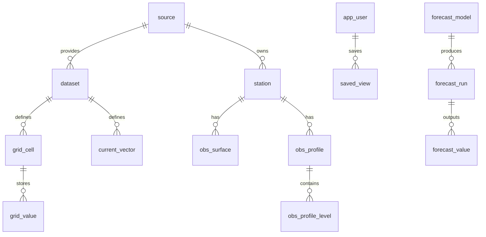

# BlueSphere PRD & Database Schema

## 🌊 Product Requirements Document (PRD)

**Product Name (working options):**
- BlueSphere
- Oceana
- AquaLens
- Currents
- TideNet
- EnviroSea

---

## 1. Vision
Build a **dynamic, interactive, web-based application** that allows researchers, environmentalists, policymakers, and the public to **explore global ocean temperature data, currents, and environmental trends**.

The app should provide:
- **Historical & real-time data** from buoys, floats, and gridded SST datasets.
- **Interactive maps** with zoom, pan, and heatmaps for temperature and current flows.
- **Environmental impact insights** for climate change, marine ecosystems, and human coastal activities.
- **Predictive modeling (Phase 2)** to forecast ocean temperature anomalies, currents, and climate-related risk signals (e.g., El Niño, coral bleaching).

---

## 2. Objectives
1. Provide **open, user-friendly access** to long-term ocean temperature data.
2. Enable **exploration of environmental impact** through visual maps and analytics.
3. Lay the foundation for **predictive modeling** (machine learning / statistical forecasting).
4. Support **educational, research, and policy-making communities**.

---

## 3. Core Features (Phase 1)

### 3.1 Data Access
- Integrate with **NOAA NDBC**, **TAO/TRITON**, **Argo floats**, **ICOADS**, and **ERSST** datasets.
- Use **ERDDAP servers** (CSV, JSON, netCDF endpoints).
- Support both **point observations** and **gridded data**.

### 3.2 Database Layer
- Free, cloud-hosted DB (for MVP):
  - **PostgreSQL (with PostGIS)** on free tiers (Supabase, Railway, ElephantSQL).
  - Alternative: **SQLite** (local/lightweight for demo).
- Schema:
  - `stations` (metadata: ID, lat, lon, type, source).
  - `observations` (station_id, time, SST, QC flags).
  - `gridded` (lat, lon, time, SST anomaly).

### 3.3 Web Application
- **Landing Dashboard:** Global view of ocean temperatures.
- **Interactive Map:**
  - World map with buoy/floats as clickable markers.
  - Heatmaps for SST and currents (color gradients).
  - Zoom in/out with smooth pan.
  - Toggle overlays: currents, anomalies, climatology baselines.
- **Time Slider:** Drag to move through historical years/decades.
- **Charts & Analytics:**
  - Time-series plots for selected locations.
  - Trend analysis (anomaly vs climatology).
- **Data Export:** CSV/JSON download of selected subsets.

---

## 4. Phase 2 (Predictive Modeling & Advanced Analytics)
- **Forecast Models:**
  - Statistical (ARIMA, state-space).
  - ML (LSTM, temporal CNNs).
- **Scenario Simulations:**
  - Predict hotspots for coral bleaching.
  - Forecast El Niño/La Niña indices.
- **Impact Dashboards:**
  - Risk to fisheries.
  - Coastal risk/sea level impacts.

---

## 5. Use Cases
1. **Researcher** – extract long-term buoy data to study ENSO impacts.
2. **Policy-maker** – visualize warming trends around national EEZs.
3. **Educator** – use time slider to show ocean warming to students.
4. **Environmental NGO** – track real-time anomalies to advocate for climate action.
5. **Citizen Scientist** – explore nearby buoys and currents interactively.

---

## 6. UI / UX Concept
- **Tech stack (frontend):** React + MapboxGL (or Leaflet).
- **Map UI:**
  - Buoy markers (click → popup with time series).
  - Heatmap overlay for SST (blue → red scale).
  - Flow lines for currents (animated).
- **Panel UI:**
  - Left panel = filters (dataset, variable, date range).
  - Bottom panel = charts of selected buoy or region.
- **Responsiveness:** Works on mobile, tablet, desktop.

---

## 7. Data Flow & Architecture
1. **Ingestion:** Python scripts (scheduled) pull from ERDDAP/NOAA APIs.
2. **Storage:** Store processed subsets in PostgreSQL/PostGIS.
3. **Backend API:** Node.js / FastAPI serving JSON endpoints.
4. **Frontend:** React/Next.js consuming backend + Mapbox layers.

---

## 8. Stretch Features / Future Enhancements
- **User Accounts:** Save map views, time series, alerts.
- **Alerting System:** Notify when anomalies exceed thresholds.
- **AI Narratives:** Automated summaries of trends (“Pacific is 0.5°C warmer than average this month”).
- **Environmental Impact Overlays:** Marine biodiversity, shipping lanes, protected areas.
- **Integration with Copernicus / CMIP6 climate projections.**

---

## 9. Non-Functional Requirements
- **Performance:** Map interaction < 1s response time.
- **Scalability:** Support global user base with free hosting (Vercel/Netlify + Supabase).
- **Accessibility:** WCAG compliant; intuitive for non-technical users.
- **Open Source:** Encourage collaboration and transparency.

---

## 10. Deliverables
- Phase 1 MVP:
  - Live web app with interactive map + buoy/SST data.
  - Basic DB schema + ingestion scripts.
- Phase 2:
  - Predictive modeling modules.
  - Extended dashboards with impact layers.

---

# Database Schema (Postgres + PostGIS)

```sql
-- See SQL DDL in the design document
-- Includes tables: source, dataset, station, obs_surface, obs_profile,
-- obs_profile_level, grid_cell, grid_value, current_vector, app_user,
-- saved_view, job_run, forecast_model, forecast_run, forecast_value
```

---

# ERD (Mermaid)



---

# Naming Suggestions
- BlueSphere
- AquaLens
- TideNet
- Currents
- Oceanium
- Pelagia
- Oceana
- OceanScope
- AquaFlux
- Marisphere

---

# 🔍 Enhanced PRD Dimensions

## 1. User Personas & Journeys
- **Marine Scientist** → needs raw QC’d data + anomaly calculations for research papers.  
- **Policy Maker / Regulator** → needs clear dashboards with simplified metrics & policy implications.  
- **Educator / Student** → needs engaging visualizations & storytelling features.  
- **NGO Advocate** → needs “download-ready” graphics to use in campaigns.  
- **Citizen Scientist / Enthusiast** → wants easy-to-use map with storytelling overlay.  

Each persona will have a journey: landing page → query → visualization → export/insight.

---

## 2. Data Governance & Provenance
- **Lineage:** record source, ingestion timestamp, and transformations for all datasets.  
- **QC Policy:** document which QC flags are included/excluded; expose toggle in UI.  
- **Versioning:** support multiple dataset versions (ERSST v5, v6, etc.) cleanly.  

---

## 3. Interoperability & APIs
- **REST API** (already designed).  
- **OGC standards**: WMS/WFS/WCS for GIS compatibility.  
- **Python/R client libraries** for scientists.  
- **Semantic layer (future):** align with marine biodiversity ontologies.  

---

## 4. Collaboration & Community
- **User-contributed annotations** on anomalies/events.  
- **Saved dashboards** with shareable URLs.  
- **Public Stories:** curated timelines (e.g., 1997-98 El Niño).  

---

## 5. Performance & Scale
- **Tile pre-generation** for heavy grids (monthly ERSST).  
- **Progressive loading**: low-res → refine on zoom.  
- **Data pruning**: summarize old hourly buoy data into monthly means.  

---

## 6. Security & Ethics
- **Open Data licensing** explicit in metadata & UI.  
- **Attribution overlays** for providers.  
- **Forecast disclaimers** to avoid overstating certainty.  

---

## 7. Accessibility & Inclusion
- **WCAG AA compliance** (keyboard nav, screen-reader support).  
- **Colorblind-friendly palettes** for heatmaps.  
- **Multilingual support** for global reach.  

---

## 8. Education & Outreach
- **Story mode**: walkthrough of climate events.  
- **Export to presentation (PNG/PPT)**.  
- **Gamification**: quizzes for students.  

---

## 9. Predictive & Prescriptive Analytics (Phase 2+)
- **Uncertainty visualization**: fan charts, confidence maps.  
- **Scenario simulation**: greenhouse gas pathways.  
- **Impact modeling**: link anomalies to fisheries, coral bleaching, economic risks.  

---

## 10. Sustainability & Ops
- **Cost optimization**: free tiers + caching strategies.  
- **Monitoring & alerts** for ingestion and API.  
- **Archiving** raw netCDF in object storage.  

---

## 11. Governance & Roadmap
- **Steering group** of scientists/engineers/NGOs.  
- **Quarterly roadmap**: ingestion → UI → predictions → dashboards.  
- **Open source governance**: Apache 2.0 or MIT license.  

---

## 12. Next-Level Ideas
- **AR/VR mode** for immersive exploration.  
- **Citizen science integration**: kayak sensors, divers.  
- **Alerting**: “Notify me when SST anomaly > +2°C in Coral Triangle.”  
- **Integration with biodiversity data** (GBIF, OBIS).  
- **Carbon footprint dashboard** linking emissions → ocean warming.  

---
