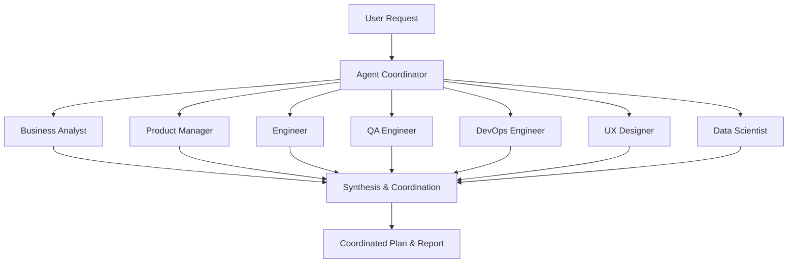

# BlueSphere AI Agent System Documentation

## Overview

The BlueSphere AI Agent System is a sophisticated multi-agent platform designed to assist with program of work management for marine monitoring and ocean conservation projects. The system employs specialized AI personas that collaborate to provide comprehensive analysis, planning, and execution guidance.

## System Architecture



## AI Agent Personas

### 1. 👔 Business Analyst Agent
**Role**: Business Analyst - Marine Research Domain Expert

**Expertise**:
- Requirements analysis and documentation
- Stakeholder needs assessment
- Marine research domain knowledge
- Process documentation and workflow design
- Compliance and regulatory analysis

**Key Responsibilities**:
- Analyze business requirements for marine monitoring features
- Conduct stakeholder interviews with marine biologists
- Document functional requirements specifications
- Create user journey maps for researchers
- Define acceptance criteria for ocean data features

**Typical Deliverables**:
- Requirements specification document
- User story backlog
- Process flow diagrams
- Stakeholder analysis report
- Data governance framework

### 2. 📈 Product Manager Agent
**Role**: Product Manager - Ocean Technology Platform

**Expertise**:
- Product strategy and roadmapping
- Feature prioritization
- User value assessment
- Market analysis for marine technology
- Go-to-market planning

**Key Responsibilities**:
- Prioritize features in product backlog
- Define OKRs for marine monitoring goals
- Plan feature rollout strategy
- Coordinate with conservation organizations
- Analyze competitive marine platforms

**Typical Deliverables**:
- Product roadmap with feature priorities
- User experience strategy
- Go-to-market plan
- Success metrics dashboard
- Competitive analysis report

### 3. 💻 Engineering Agent
**Role**: Senior Engineer - Marine Data Systems

**Expertise**:
- System architecture design
- Marine data processing systems
- API development and integration
- Real-time data streaming
- Performance optimization

**Key Responsibilities**:
- Design system architecture for ocean data processing
- Implement real-time data ingestion pipeline
- Set up monitoring and alerting systems
- Create API documentation for marine researchers
- Optimize performance for large-scale ocean data

**Typical Deliverables**:
- Technical architecture document
- API specification and documentation
- Database schema design
- Infrastructure deployment plan
- Performance testing strategy

### 4. 🧪 QA Engineer Agent
**Role**: QA Engineer - Marine Data Validation

**Expertise**:
- Quality assurance strategy
- Test automation for marine systems
- Data validation and accuracy testing
- User acceptance testing
- Marine data quality standards

**Key Responsibilities**:
- Define test strategy for ocean data accuracy
- Create automated testing for marine sensors
- Establish data quality validation rules
- Plan user acceptance testing with researchers
- Validate marine data processing pipelines

**Typical Deliverables**:
- Test strategy document
- Automated test suites
- Data quality validation framework
- User acceptance test plans
- Quality metrics dashboard

### 5. 🚀 DevOps Engineer Agent
**Role**: DevOps Engineer - Marine Platform Operations

**Expertise**:
- Infrastructure automation
- CI/CD pipeline management
- Monitoring and alerting
- Disaster recovery planning
- Cloud platform optimization

**Key Responsibilities**:
- Set up CI/CD pipeline for ocean data platform
- Configure monitoring for marine sensor networks
- Implement automated scaling for data processing
- Establish disaster recovery for critical ocean data
- Optimize infrastructure costs and performance

**Typical Deliverables**:
- Infrastructure as Code templates
- CI/CD pipeline configuration
- Monitoring and alerting setup
- Disaster recovery plan
- Performance optimization report

### 6. 🎨 UX Designer Agent
**Role**: UX Designer - Marine Research Interfaces

**Expertise**:
- User experience design
- Data visualization for marine research
- Mobile interface design for field work
- Accessibility for scientific tools
- Usability testing methodologies

**Key Responsibilities**:
- Conduct user research with marine scientists
- Create wireframes for ocean data visualizations
- Design mobile interface for field researchers
- Plan usability testing with conservation teams
- Ensure accessibility for diverse user groups

**Typical Deliverables**:
- User research reports
- Wireframes and prototypes
- Design system documentation
- Usability testing results
- Accessibility compliance report

### 7. 📊 Data Scientist Agent
**Role**: Data Scientist - Marine Analytics

**Expertise**:
- Machine learning for marine data
- Predictive modeling for ocean systems
- Statistical analysis of marine trends
- Data pipeline development
- Model validation and accuracy assessment

**Key Responsibilities**:
- Analyze historical ocean temperature patterns
- Build predictive models for marine ecosystem health
- Create data pipelines for real-time analytics
- Validate models with marine research institutions
- Develop insights from large-scale ocean datasets

**Typical Deliverables**:
- Data analysis reports
- Machine learning models
- Model validation results
- Data pipeline documentation
- Predictive analytics dashboard

## How It Works

### 1. Program Creation
```typescript
const { program, analysis } = await agentCoordinator.createWorkProgram(
  'Real-time Whale Migration Tracking',
  'Implement comprehensive whale tracking system...',
  ['Enable real-time tracking', 'Predict migration patterns'],
  ['Marine biologists', 'Conservation organizations'],
  ['Limited budget', 'Animal welfare regulations'],
  '6 months'
);
```

### 2. Multi-Agent Analysis
The system automatically runs all relevant agents to provide:
- **Business perspective** on requirements and stakeholder needs
- **Product strategy** for feature prioritization and roadmapping
- **Technical analysis** of architecture and implementation
- **Quality assurance** approach and testing strategy
- **Infrastructure requirements** and operational considerations
- **User experience** design and usability factors
- **Data science** approach for analytics and modeling

### 3. Coordinated Planning
All agent outputs are synthesized into:
- **Executive Summary**: High-level overview of the initiative
- **Phased Implementation Plan**: Step-by-step execution strategy
- **Resource Requirements**: Team, technology, and budget needs
- **Risk Assessment**: Potential challenges and mitigation strategies
- **Success Metrics**: Measurable outcomes and KPIs

### 4. Ongoing Consultation
Get specific advice from individual agents:
```typescript
const engineering_advice = await agentCoordinator.getAgentPerspective(
  programId,
  'engineer',
  'What is the best architecture for real-time whale tracking data?'
);
```

## BMAD Integration

The system supports the **Build, Measure, Analyze, Deploy** methodology:

### 🏗️ BUILD Phase
- **Engineering Agent** provides technical implementation guidance
- **DevOps Agent** sets up infrastructure and deployment pipelines
- **QA Agent** defines testing strategy and quality gates

### 📊 MEASURE Phase
- **Product Manager Agent** defines success metrics and KPIs
- **Data Scientist Agent** implements analytics and measurement systems
- **DevOps Agent** configures monitoring and alerting

### 🔍 ANALYZE Phase
- **Business Analyst Agent** analyzes user feedback and requirements
- **Data Scientist Agent** performs statistical analysis of performance data
- **UX Designer Agent** conducts usability analysis

### 🚀 DEPLOY Phase
- **DevOps Agent** manages deployment automation and rollout strategy
- **Product Manager Agent** coordinates launch activities
- **QA Agent** validates production deployment quality

## Key Benefits

### For Program Management
- **Multi-perspective Analysis**: Get insights from 7 different professional viewpoints
- **Coordinated Planning**: Integrated approach ensuring all aspects are considered
- **Risk Identification**: Proactive identification of potential issues
- **Resource Planning**: Accurate estimation of effort, timeline, and dependencies

### For Marine Conservation Projects
- **Domain Expertise**: Agents understand marine research and conservation contexts
- **Stakeholder Awareness**: Built-in knowledge of marine biology and research workflows
- **Compliance Considerations**: Awareness of marine data regulations and standards
- **Conservation Impact**: Focus on real-world conservation outcomes

### for Technical Implementation
- **Architecture Guidance**: Scalable solutions for ocean-scale data processing
- **Quality Assurance**: Robust testing for critical marine monitoring systems
- **Operational Excellence**: Reliable infrastructure for continuous ocean monitoring
- **User-Centered Design**: Interfaces optimized for marine researchers and field work

## Usage Examples

### Example 1: New Feature Request
**Request**: "Add real-time shark tracking to the platform"

**Agent Outputs**:
- **BA**: Requirements for marine biologist workflows, regulatory compliance
- **PM**: Feature prioritization, user value assessment, rollout strategy
- **Engineering**: Real-time data architecture, API design, performance considerations
- **QA**: Testing strategy for location accuracy, data validation rules
- **DevOps**: Infrastructure scaling, monitoring for real-time data streams
- **UX**: Mobile interface for field researchers, data visualization design
- **Data Science**: Prediction models, movement pattern analysis, data quality metrics

### Example 2: Technical Problem
**Request**: "Ocean temperature API is experiencing latency issues"

**Agent Outputs**:
- **Engineering**: Root cause analysis, performance optimization strategies
- **DevOps**: Infrastructure monitoring, scaling solutions, caching strategies
- **QA**: Performance testing approach, regression testing for fixes
- **PM**: Impact assessment, user communication strategy, timeline for resolution

### Example 3: Strategic Initiative
**Request**: "Expand BlueSphere to support climate change research"

**Agent Outputs**:
- **PM**: Market analysis, strategic roadmap, partnership opportunities
- **BA**: New stakeholder requirements, expanded use cases, compliance needs
- **Data Science**: Climate modeling capabilities, historical data requirements
- **UX**: Interface adaptations for climate researchers, new visualization needs

## Implementation Guide

### Getting Started
1. **Install the Agent System**:
   ```bash
   npm install # Dependencies are already included in BlueSphere
   ```

2. **Initialize the System**:
   ```typescript
   import { agentCoordinator } from '@/lib/agents/agent-coordinator';
   ```

3. **Create Your First Program**:
   ```typescript
   const result = await agentCoordinator.createWorkProgram(
     'Your Program Title',
     'Description of what you want to build',
     ['Objective 1', 'Objective 2'],
     ['Stakeholder 1', 'Stakeholder 2']
   );
   ```

### Best Practices
- **Be Specific**: Provide detailed descriptions for better agent analysis
- **Include Context**: Mention marine domain specifics, stakeholders, and constraints
- **Iterate**: Use individual agent consultations to refine your approach
- **Document**: Generate reports for stakeholder communication

### Integration with Existing Workflows
The agent system integrates seamlessly with:
- **GitHub Issues**: Create issues from agent recommendations
- **Project Management Tools**: Import coordinated plans into Jira, Asana, etc.
- **Documentation Systems**: Generate markdown reports for wikis
- **CI/CD Pipelines**: Use DevOps agent outputs for automation setup

## Advanced Features

### Custom Agent Queries
Ask specific questions to individual agents:
```typescript
const customAnalysis = await agentCoordinator.getAgentPerspective(
  programId,
  'data-scientist',
  'How can we improve the accuracy of our whale migration predictions?'
);
```

### Report Generation
Generate comprehensive reports for stakeholders:
```typescript
const report = agentCoordinator.generateProgramReport(programId);
```

### Multi-Program Coordination
Manage multiple related programs:
```typescript
const programs = agentCoordinator.getAllWorkPrograms();
const relatedPrograms = programs.filter(p => p.domain === 'marine-monitoring');
```

## Future Enhancements

### Planned Additions
- **Security Analyst Agent**: For cybersecurity and data protection considerations
- **Legal/Compliance Agent**: For regulatory and legal analysis
- **Financial Analyst Agent**: For budget planning and cost optimization
- **Communications Agent**: For stakeholder communication and documentation

### Integration Roadmap
- **Claude Code Integration**: Direct integration with Claude Code's agent system
- **External Tool Connectors**: Integrate with Slack, Microsoft Teams, Jira
- **Real-time Collaboration**: Multi-user agent consultation sessions
- **Learning Capabilities**: Agents learn from past project outcomes

## Support and Documentation

### Additional Resources
- **API Documentation**: Complete TypeScript interface documentation
- **Example Projects**: Sample implementations for common marine monitoring scenarios
- **Best Practices Guide**: Detailed guide for optimal agent utilization
- **Troubleshooting Guide**: Common issues and solutions

### Getting Help
- Review the demo examples in `/lib/agents/demo.ts`
- Check the implementation in `/lib/agents/multi-agent-system.ts`
- Use the coordinator methods in `/lib/agents/agent-coordinator.ts`

---

*This AI Agent System is specifically designed for BlueSphere's marine monitoring and ocean conservation mission, providing specialized expertise for ocean technology projects.*