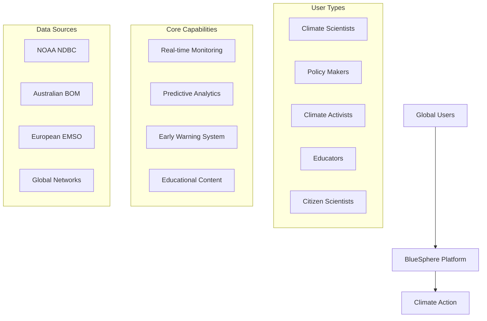
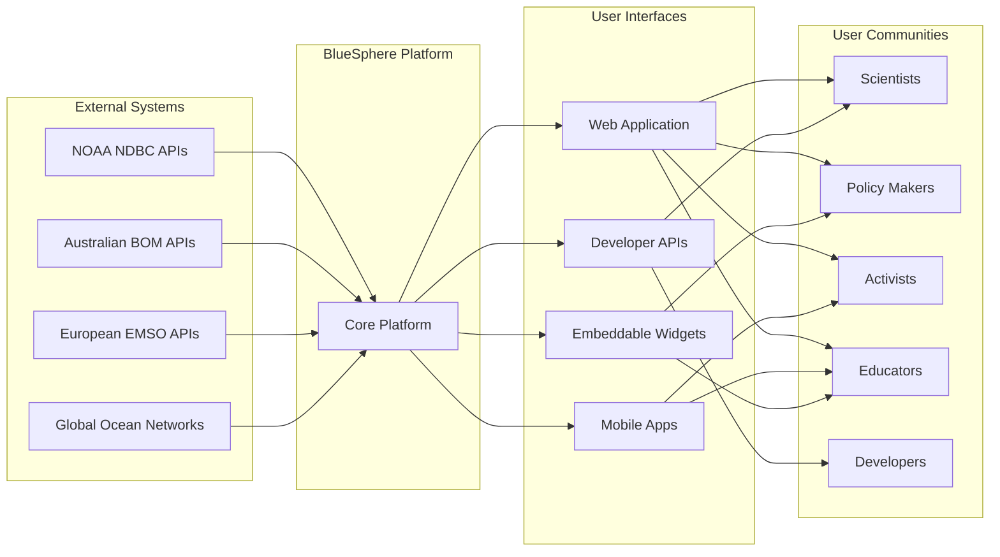
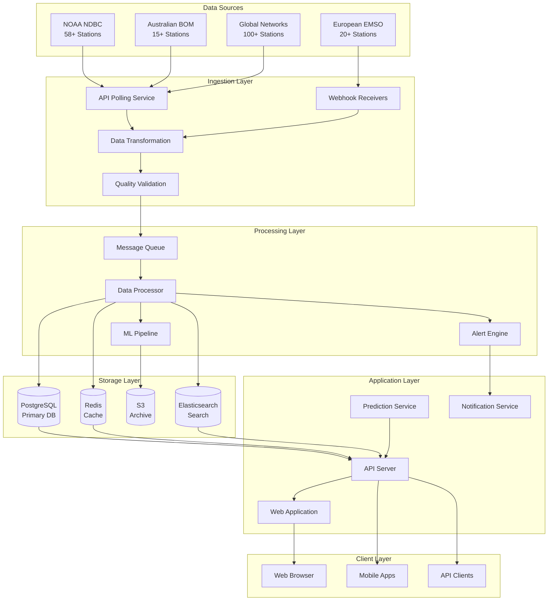

# 🏗️ BlueSphere Conceptual Architecture

## Overview

This document describes the high-level conceptual architecture of BlueSphere, a global ocean climate monitoring platform. The architecture is designed to handle real-time data ingestion from 200+ monitoring stations worldwide, provide advanced analytics and predictive capabilities, and deliver an exceptional user experience across all device types.

## System Vision



## Core Principles

### 1. **Data-Driven Climate Action**
Transform complex oceanographic data into actionable insights that drive immediate climate response across scientific, policy, and activist communities.

### 2. **Global Accessibility**
Ensure universal access to ocean monitoring data through intuitive interfaces, comprehensive APIs, and multi-device support.

### 3. **Scientific Rigor**
Maintain the highest standards of data quality, validation, and scientific accuracy while making complex data accessible to non-experts.

### 4. **Real-time Responsiveness**
Provide near real-time data updates (<15 minutes) with intelligent caching and performance optimization for global users.

### 5. **Predictive Intelligence**
Leverage machine learning to provide actionable forecasts and early warning systems for marine climate events.

## System Context Diagram



## Architectural Layers

### 1. **Presentation Layer**
The user-facing layer that delivers data visualization and interaction capabilities.

#### Components:
- **Web Application**: Next.js-based responsive web app
- **Mobile Applications**: Native iOS/Android apps (future)
- **API Gateway**: RESTful APIs for third-party integration
- **Embeddable Widgets**: Iframe-based widgets for external sites

#### Key Features:
- Responsive design with mobile-first approach
- Dark/light mode with accessibility compliance (WCAG 2.1 AA)
- Real-time data visualization with professional animations
- Interactive global map with 200+ monitoring stations
- Advanced search and filtering capabilities

### 2. **Application Layer**
The business logic layer that orchestrates data processing, analysis, and user interactions.

#### Components:
- **Data Orchestration Service**: Manages data flow between sources and consumers
- **Analytics Engine**: Processes historical data and generates insights
- **Prediction Service**: ML-powered forecasting and anomaly detection
- **Alert System**: Marine heatwave detection and notification management
- **User Management**: Authentication, authorization, and personalization

#### Key Features:
- Real-time data processing with <15 minute latency
- Advanced marine heatwave detection algorithms
- Machine learning temperature forecasting (1-14 days)
- Quality control and data validation pipelines
- Multi-source data integration and harmonization

### 3. **Data Layer**
The persistence and caching layer that manages data storage, retrieval, and optimization.

#### Components:
- **Primary Database**: PostgreSQL with time-series optimization
- **Caching Layer**: Redis for application and session caching
- **Data Warehouse**: Historical data storage with analytical capabilities
- **CDN**: Global content delivery network for static assets
- **Search Index**: Elasticsearch for full-text search capabilities

#### Key Features:
- 5-year historical data retention with gap analysis
- Real-time data ingestion from multiple sources
- Multi-layer caching strategy (browser, CDN, application)
- Automated backup and disaster recovery
- Performance optimization for large time-series datasets

### 4. **Integration Layer**
The connectivity layer that interfaces with external data sources and services.

#### Components:
- **API Connectors**: Source-specific data ingestion adapters
- **Data Transformation**: ETL pipelines for data normalization
- **External Services**: Third-party APIs and webhook integrations
- **Message Queue**: Async processing for data ingestion
- **Monitoring & Logging**: System health and performance tracking

#### Key Features:
- Multi-source data integration (NOAA, BOM, EMSO, etc.)
- Real-time API polling with intelligent retry mechanisms
- Data format standardization and quality validation
- Webhook support for real-time event notifications
- Comprehensive error handling and recovery

## Data Flow Architecture



## Core Domain Models

### 1. **Station Domain**
Represents ocean monitoring stations with their metadata and capabilities.

```yaml
Station:
  - station_id: Unique identifier
  - name: Human-readable name
  - location: Latitude/longitude coordinates
  - provider: Data source organization
  - station_type: Moored buoy, drifting buoy, etc.
  - instruments: Available measurement capabilities
  - operational_status: Active, inactive, maintenance
  - data_quality: Quality assessment metrics
```

### 2. **Observation Domain**
Represents individual measurements from monitoring stations.

```yaml
Observation:
  - station_id: Reference to monitoring station
  - timestamp: UTC timestamp of measurement
  - parameters: Temperature, pressure, wind, waves, etc.
  - values: Numerical measurement values
  - quality_flags: Data quality indicators
  - source: Original data provider
  - processing_metadata: Validation and processing info
```

### 3. **Prediction Domain**
Represents machine learning forecasts and predictions.

```yaml
Prediction:
  - station_id: Target monitoring station
  - prediction_time: When prediction was generated
  - target_time: Future time being predicted
  - parameter: What is being predicted
  - predicted_value: Forecast value
  - confidence_interval: Uncertainty bounds
  - model_info: Model type and version used
```

### 4. **Alert Domain**
Represents marine heatwave alerts and climate events.

```yaml
Alert:
  - alert_id: Unique alert identifier
  - alert_type: Marine heatwave, extreme temperature, etc.
  - severity_level: Moderate, strong, severe, extreme
  - affected_stations: List of impacted stations
  - geographic_extent: Spatial boundaries
  - start_time: When event began
  - duration: How long event has lasted
  - intensity_metrics: Temperature anomaly, etc.
```

## System Capabilities

### Real-time Monitoring
- **Data Ingestion**: Continuous polling of 200+ monitoring stations
- **Quality Control**: Automated validation and quality flag assignment
- **Gap Detection**: Identification and handling of missing data
- **Real-time Updates**: <15 minute data freshness guarantee

### Historical Analysis
- **5-Year Data Retention**: Complete historical record with gap analysis
- **Time-series Visualization**: Interactive charts and animations
- **Pattern Recognition**: Seasonal cycles and long-term trends
- **Comparative Analysis**: Multi-station and multi-year comparisons

### Predictive Analytics
- **Temperature Forecasting**: 1-14 day predictions with uncertainty
- **Marine Heatwave Prediction**: Early warning system
- **Seasonal Forecasting**: Long-term pattern prediction
- **Model Validation**: Continuous accuracy assessment and improvement

### User Experience
- **Interactive Visualization**: Professional maps and charts
- **Advanced Search**: Global search with intelligent filtering
- **Multi-device Support**: Responsive design for all screen sizes
- **Accessibility**: WCAG 2.1 AA compliance for inclusive access

### Developer Integration
- **RESTful APIs**: Comprehensive API for third-party integration
- **Real-time Webhooks**: Event-driven notifications
- **SDK Libraries**: Python, R, and JavaScript client libraries
- **Documentation**: Interactive API explorer with code examples

## Scalability & Performance

### Horizontal Scaling
- **Microservices Architecture**: Independent service scaling
- **Database Sharding**: Partition data by geographic regions
- **CDN Distribution**: Global content delivery optimization
- **Auto-scaling**: Dynamic resource allocation based on demand

### Performance Optimization
- **Multi-layer Caching**: Browser, CDN, application, and database caching
- **Data Compression**: Efficient storage and transmission
- **Query Optimization**: Database indexing and query tuning
- **Code Splitting**: Frontend optimization for fast loading

### Reliability & Availability
- **99.9% Uptime Target**: High availability with redundancy
- **Disaster Recovery**: Automated backup and recovery procedures
- **Health Monitoring**: Real-time system health and performance tracking
- **Graceful Degradation**: Fallback mechanisms for service failures

## Security & Compliance

### Data Security
- **Encryption**: TLS 1.3 for data in transit, AES-256 for data at rest
- **Authentication**: JWT-based API authentication
- **Authorization**: Role-based access control (RBAC)
- **Rate Limiting**: API protection against abuse

### Privacy & Compliance
- **GDPR Compliance**: European data protection requirements
- **CCPA Compliance**: California privacy law requirements
- **WCAG 2.1 AA**: Web accessibility standards
- **SOC 2 Type II**: Security and availability framework

## Technology Alignment

### Frontend Technologies
- **Next.js 14**: Modern React framework with SSR/SSG
- **TypeScript**: Type-safe development
- **Tailwind CSS**: Utility-first styling framework
- **React Leaflet**: Interactive mapping capabilities

### Backend Technologies
- **Node.js**: JavaScript runtime for APIs
- **PostgreSQL**: Primary database with time-series capabilities
- **Redis**: Caching and session management
- **Docker**: Containerization for deployment

### Cloud Infrastructure
- **Vercel**: Frontend hosting with global CDN
- **AWS**: Backend infrastructure and data services
- **CloudFlare**: Additional CDN and security services
- **GitHub Actions**: CI/CD pipeline automation

## Success Metrics & KPIs

### User Engagement
- **Monthly Active Users**: 50,000+ target within 12 months
- **Session Duration**: 12+ minutes average
- **API Usage**: 100,000+ daily calls
- **Global Reach**: 75+ countries

### Technical Performance
- **Uptime**: 99.9% availability
- **Response Time**: <3 seconds page load globally
- **Data Freshness**: <15 minutes from source
- **Core Web Vitals**: LCP <2.5s, CLS <0.1, FID <100ms

### Climate Impact
- **Scientific Citations**: 100+ peer-reviewed papers
- **Policy Influence**: 25+ government reports
- **Educational Reach**: 500+ institutions
- **Early Warning Success**: 85+ marine heatwave detection rate

This conceptual architecture provides the foundation for building a world-class ocean climate monitoring platform that drives meaningful climate action through data-driven insights and exceptional user experience.