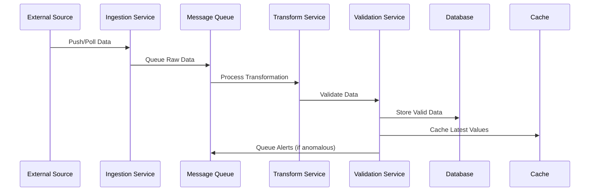
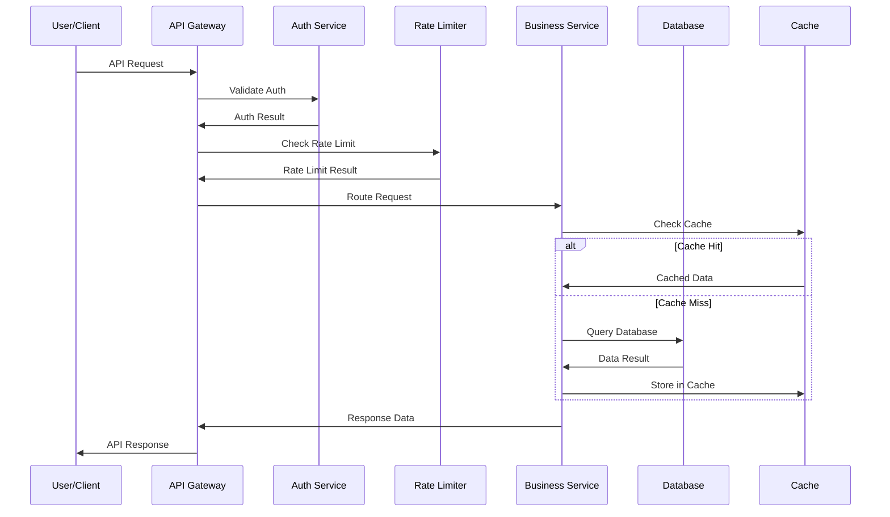
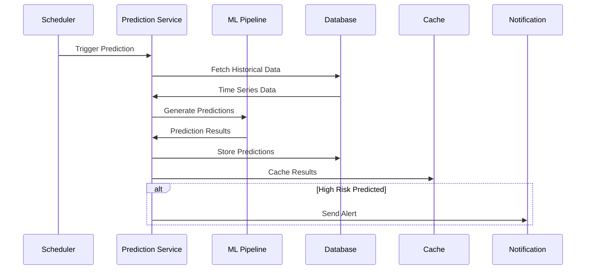

# 🔧 BlueSphere Logical Architecture

## Overview

This document describes the logical architecture of BlueSphere, detailing the component relationships, data flows, interfaces, and interactions between different parts of the system. The logical architecture bridges the conceptual design with the physical implementation, defining how components communicate and collaborate to deliver the platform's capabilities.

## System Components Diagram

```mermaid
graph TB
    subgraph "Frontend Layer"
        WEB[Web Application]
        MOBILE[Mobile Apps]
        WIDGETS[Embeddable Widgets]
    end
    
    subgraph "API Gateway Layer"
        GATEWAY[API Gateway]
        AUTH[Authentication Service]
        RATE[Rate Limiting]
        DOCS[API Documentation]
    end
    
    subgraph "Business Logic Layer"
        STATION[Station Service]
        DATA[Data Service]
        PREDICT[Prediction Service]
        ALERT[Alert Service]
        USER[User Service]
        EXPORT[Export Service]
    end
    
    subgraph "Data Processing Layer"
        INGEST[Data Ingestion]
        TRANSFORM[Data Transformation]
        VALIDATE[Data Validation]
        QUEUE[Message Queue]
        ML[ML Pipeline]
    end
    
    subgraph "Data Storage Layer"
        POSTGRES[(PostgreSQL)]
        REDIS[(Redis Cache)]
        ELASTIC[(Elasticsearch)]
        S3[(Object Storage)]
        TIMESERIES[(Time Series DB)]
    end
    
    subgraph "External Integrations"
        NOAA[NOAA NDBC]
        BOM[Australian BOM]
        EMSO[European EMSO]
        GLOBAL[Global Networks]
        NOTIFY[Notification Services]
    end
    
    WEB --> GATEWAY
    MOBILE --> GATEWAY
    WIDGETS --> GATEWAY
    
    GATEWAY --> AUTH
    GATEWAY --> RATE
    GATEWAY --> STATION
    GATEWAY --> DATA
    GATEWAY --> PREDICT
    GATEWAY --> ALERT
    GATEWAY --> USER
    GATEWAY --> EXPORT
    
    STATION --> POSTGRES
    DATA --> TIMESERIES
    DATA --> REDIS
    PREDICT --> ML
    ALERT --> NOTIFY
    USER --> POSTGRES
    EXPORT --> S3
    
    INGEST --> NOAA
    INGEST --> BOM
    INGEST --> EMSO
    INGEST --> GLOBAL
    INGEST --> QUEUE
    
    QUEUE --> TRANSFORM
    TRANSFORM --> VALIDATE
    VALIDATE --> POSTGRES
    VALIDATE --> TIMESERIES
    
    ML --> PREDICT
    ELASTIC --> DATA
```



## Component Specifications

### 1. Frontend Components

#### Web Application (Next.js)
```yaml
Purpose: Primary user interface for desktop and mobile browsers
Technology: Next.js 14, React 18, TypeScript
Key Features:
  - Server-side rendering (SSR) for SEO and performance
  - Static site generation (SSG) for marketing pages
  - Interactive map with Leaflet and custom overlays
  - Responsive design with Tailwind CSS
  - Dark/light mode with system preference detection
  - Real-time data updates via WebSocket connections
  - Progressive Web App (PWA) capabilities

Interfaces:
  - API Gateway: RESTful HTTP/HTTPS, WebSocket
  - CDN: Static assets delivery
  - Authentication: JWT token validation
  - Browser APIs: LocalStorage, Geolocation, Notifications

Performance Requirements:
  - First Contentful Paint: <1.5s
  - Largest Contentful Paint: <2.5s
  - Cumulative Layout Shift: <0.1
  - Time to Interactive: <3.5s
```

#### Mobile Applications (Future)
```yaml
Purpose: Native mobile experience for iOS and Android
Technology: React Native or Flutter
Key Features:
  - Offline-first architecture with sync capabilities
  - Push notifications for marine heatwave alerts
  - GPS integration for location-based features
  - Touch-optimized interactions
  - Native performance with platform-specific optimizations

Interfaces:
  - API Gateway: RESTful HTTP/HTTPS
  - Push Services: APNs (iOS), FCM (Android)
  - Device APIs: GPS, Camera, Notifications
  - Biometric Authentication: TouchID, FaceID
```

#### Embeddable Widgets
```yaml
Purpose: Iframe-based widgets for external websites
Technology: Vanilla JavaScript, Web Components
Key Features:
  - Lightweight and fast-loading
  - Customizable themes and dimensions
  - Real-time data display
  - Cross-origin communication
  - Responsive design adaptation

Interfaces:
  - API Gateway: Public endpoints only
  - Parent Window: PostMessage API
  - CDN: Asset delivery
```

### 2. API Gateway Layer

#### API Gateway
```yaml
Purpose: Central entry point for all client requests
Technology: Node.js, Express.js, or Next.js API Routes
Key Features:
  - Request routing to appropriate services
  - Response aggregation and transformation
  - API versioning and backward compatibility
  - Request/response logging and monitoring
  - CORS handling for cross-origin requests
  - OpenAPI specification generation

Interfaces:
  - Frontend: HTTP/HTTPS, WebSocket
  - Business Services: Internal HTTP, RPC
  - Authentication: JWT validation
  - Monitoring: Metrics and logging aggregation

Rate Limiting:
  - Per-IP: 1000 requests/hour (anonymous)
  - Per-API-Key: 10,000 requests/hour (authenticated)
  - Burst allowance: 200 requests/5 minutes
  - Premium tiers with higher limits
```

#### Authentication Service
```yaml
Purpose: User authentication and authorization management
Technology: Node.js with JWT, OAuth2, OpenID Connect
Key Features:
  - JWT token generation and validation
  - OAuth2 integration (Google, GitHub, ORCID)
  - Role-based access control (RBAC)
  - API key management for developers
  - Session management with Redis storage
  - Password reset and email verification

User Roles:
  - Anonymous: Read-only access to public data
  - Researcher: Enhanced API limits, data export
  - Institution: Bulk access, custom integrations
  - Administrator: System configuration, user management

Security Features:
  - Bcrypt password hashing
  - Rate limiting for auth endpoints
  - Account lockout after failed attempts
  - Audit logging for security events
```

### 3. Business Logic Layer

#### Station Service
```yaml
Purpose: Monitoring station metadata and status management
Technology: Node.js with TypeScript
Key Features:
  - Station registration and metadata management
  - Real-time status monitoring and health checks
  - Geographic search and proximity queries
  - Provider integration and data source mapping
  - Station grouping and categorization
  - Quality metrics calculation and tracking

Data Model:
  Station:
    - station_id: string (primary key)
    - name: string
    - location: { lat: number, lon: number }
    - provider: string
    - station_type: enum
    - instruments: array
    - operational_status: enum
    - last_observation: datetime
    - quality_score: number (0-1)

Interfaces:
  - Database: PostgreSQL with PostGIS
  - Cache: Redis for frequently accessed data
  - External APIs: Provider-specific connectors
  - Search: Elasticsearch for geographic queries
```

#### Data Service
```yaml
Purpose: Observation data retrieval and time-series analysis
Technology: Node.js with time-series optimization
Key Features:
  - Time-series data retrieval with range queries
  - Data aggregation and statistical calculations
  - Real-time data streaming via WebSocket
  - Data export in multiple formats (CSV, JSON, NetCDF)
  - Quality flag filtering and interpretation
  - Gap detection and interpolation algorithms

Query Capabilities:
  - Single station time series
  - Multi-station comparisons
  - Geographic region aggregations
  - Statistical summaries (min, max, mean, std)
  - Seasonal pattern extraction
  - Anomaly detection scoring

Performance Optimizations:
  - Time-based partitioning
  - Compression algorithms
  - Caching strategies for common queries
  - Parallel processing for large datasets
```

#### Prediction Service
```yaml
Purpose: Machine learning predictions and forecasting
Technology: Python/TensorFlow with Node.js API wrapper
Key Features:
  - Temperature forecasting (1-14 days)
  - Marine heatwave probability prediction
  - Seasonal pattern forecasting
  - Ensemble model coordination
  - Uncertainty quantification
  - Model performance tracking and validation

ML Models:
  - ARIMA: Short-term linear trends
  - LSTM: Long-term pattern learning
  - Prophet: Seasonal decomposition
  - Ensemble: Weighted combination of models
  - Transfer Learning: New station adaptation

Model Management:
  - Automated retraining schedules
  - A/B testing for model improvements
  - Version control and rollback capabilities
  - Performance metric tracking
  - Bias detection and mitigation
```

#### Alert Service
```yaml
Purpose: Marine heatwave detection and notification system
Technology: Node.js with real-time processing
Key Features:
  - Real-time temperature anomaly detection
  - Marine heatwave classification (moderate to extreme)
  - Geographic extent calculation
  - Alert escalation and notification routing
  - Historical alert analysis and reporting
  - Webhook integration for third-party systems

Detection Algorithm:
  - Temperature threshold analysis (90th, 95th, 99th percentiles)
  - Duration-based classification
  - Spatial coherence validation
  - False positive reduction algorithms
  - Severity scoring based on intensity and duration

Notification Channels:
  - Email: Immediate alerts for registered users
  - WebSocket: Real-time browser notifications
  - Webhooks: API integration for external systems
  - Mobile Push: Future mobile app integration
```

### 4. Data Processing Layer

#### Data Ingestion Service
```yaml
Purpose: Real-time data collection from multiple sources
Technology: Node.js with scheduling and queue management
Key Features:
  - Multi-source API polling with configurable intervals
  - Webhook receivers for push-based data sources
  - Error handling and retry mechanisms with exponential backoff
  - Data format detection and parsing
  - Duplicate detection and deduplication
  - Ingestion rate monitoring and throttling

Source Connectors:
  - NOAA NDBC: XML/JSON format, 10-minute intervals
  - Australian BOM: JSON format, 30-minute intervals
  - European EMSO: Multiple formats, variable intervals
  - Global Networks: Standardized JSON, hourly intervals

Error Handling:
  - Circuit breaker pattern for failing sources
  - Dead letter queue for processing failures
  - Automatic retry with exponential backoff
  - Alert notifications for sustained failures
```

#### Data Transformation Service
```yaml
Purpose: Data normalization and standardization
Technology: Node.js with data validation libraries
Key Features:
  - Format standardization across data sources
  - Unit conversion and normalization
  - Timestamp standardization to UTC
  - Data structure harmonization
  - Metadata enrichment and tagging
  - Schema validation and enforcement

Transformations:
  - Temperature: Celsius standardization
  - Coordinates: Decimal degrees normalization
  - Timestamps: ISO 8601 UTC format
  - Quality Flags: Standardized 1-5 scale
  - Measurement Units: SI unit conversions

Validation Rules:
  - Range checks for physical parameters
  - Temporal consistency validation
  - Spatial coherence checks
  - Cross-parameter relationship validation
```

#### Message Queue System
```yaml
Purpose: Asynchronous processing and system decoupling
Technology: Redis with Bull queue library
Key Features:
  - Job scheduling and prioritization
  - Failed job retry with exponential backoff
  - Dead letter queue for permanent failures
  - Job progress tracking and monitoring
  - Concurrent processing with worker pools
  - Queue metrics and performance monitoring

Queue Types:
  - High Priority: Real-time data ingestion
  - Medium Priority: Data validation and processing
  - Low Priority: Historical data backfill
  - Scheduled: ML model training and maintenance

Processing Guarantees:
  - At-least-once delivery
  - Job deduplication for idempotency
  - Graceful shutdown with job completion
  - Monitoring and alerting for queue health
```

### 5. Data Storage Layer

#### PostgreSQL Database
```yaml
Purpose: Primary relational data storage
Technology: PostgreSQL 14+ with PostGIS extension
Key Features:
  - ACID compliance for data integrity
  - Full-text search capabilities
  - Geographic queries with PostGIS
  - JSON/JSONB support for flexible schemas
  - Partitioning for large time-series data
  - Streaming replication for high availability

Schema Design:
  Tables:
    - stations: Monitoring station metadata
    - observations: Time-series measurement data
    - predictions: ML forecast results
    - alerts: Marine heatwave events
    - users: User accounts and preferences
    - api_keys: Developer authentication

Optimization:
  - Time-based partitioning for observations
  - Composite indexes for common query patterns
  - Connection pooling for performance
  - Regular vacuum and analyze operations
```

#### Redis Cache
```yaml
Purpose: High-performance caching and session storage
Technology: Redis 7+ with clustering support
Key Features:
  - In-memory key-value storage
  - Data structure support (strings, lists, sets, hashes)
  - Pub/Sub messaging for real-time features
  - Expiration policies for automatic cleanup
  - Persistence options for durability
  - Master-slave replication for availability

Cache Strategies:
  - API Response Caching: 15-minute TTL for data endpoints
  - Session Storage: User authentication and preferences
  - Rate Limiting: Request counting and throttling
  - Real-time Data: Latest observations for immediate access
  - Computed Results: Expensive calculations and aggregations

Memory Management:
  - LRU eviction policy
  - Memory usage monitoring
  - Automatic failover to disk storage
  - Compression for large values
```

#### Elasticsearch
```yaml
Purpose: Full-text search and analytics
Technology: Elasticsearch 8+ with security features
Key Features:
  - Full-text search across station metadata
  - Aggregations for statistical analysis
  - Geographic search with geo-spatial queries
  - Real-time indexing for immediate search
  - Distributed search across multiple nodes
  - RESTful API for flexible queries

Index Structure:
  - stations: Station metadata with geographic data
  - observations: Recent observations for search
  - alerts: Historical marine heatwave events
  - logs: System logs and audit trails

Search Capabilities:
  - Fuzzy matching for station names
  - Geographic proximity search
  - Time-range filtering
  - Multi-field search with boosting
  - Auto-completion and suggestions
```

#### Time Series Database
```yaml
Purpose: Optimized storage for observation data
Technology: TimescaleDB (PostgreSQL extension) or InfluxDB
Key Features:
  - Time-series optimized storage and queries
  - Automatic data retention policies
  - Compression for long-term storage
  - Continuous aggregates for performance
  - Parallel query processing
  - Built-in time-series functions

Data Organization:
  - Hypertables partitioned by time
  - Chunk intervals optimized for query patterns
  - Compression after data maturity
  - Retention policies for old data
  - Materialized views for common aggregations

Performance Features:
  - Time-based indexing
  - Vectorized query execution
  - Parallel aggregation processing
  - Query planning optimization
```

## Component Interactions

### 1. Data Ingestion Flow


### 2. API Request Flow


### 3. Prediction Generation Flow


## Interface Specifications

### 1. Internal Service APIs
```yaml
Station Service API:
  GET /internal/stations: List all stations
  GET /internal/stations/{id}: Get station details
  POST /internal/stations: Create new station
  PUT /internal/stations/{id}: Update station
  DELETE /internal/stations/{id}: Remove station

Data Service API:
  GET /internal/data/{station_id}: Get observations
  GET /internal/data/range: Get multi-station data
  POST /internal/data: Store new observations
  DELETE /internal/data: Remove old data

Prediction Service API:
  GET /internal/predictions/{station_id}: Get predictions
  POST /internal/predictions/generate: Create predictions
  PUT /internal/predictions/{id}: Update prediction
  GET /internal/models/status: Model health check
```

### 2. External Integration APIs
```yaml
NOAA NDBC Integration:
  Endpoint: https://www.ndbc.noaa.gov/data/realtime2/
  Format: Fixed-width text files
  Frequency: 10-minute updates
  Authentication: None required
  Rate Limit: No explicit limit

Australian BOM Integration:
  Endpoint: http://www.bom.gov.au/oceanography/
  Format: JSON API responses
  Frequency: 30-minute updates
  Authentication: API key required
  Rate Limit: 1000 requests/hour

European EMSO Integration:
  Endpoint: Various endpoints per network
  Format: Multiple formats (JSON, XML, CSV)
  Frequency: Variable by network
  Authentication: OAuth2 or API key
  Rate Limit: Variable by network
```

### 3. Database Schemas
```sql
-- Stations table
CREATE TABLE stations (
    station_id VARCHAR(50) PRIMARY KEY,
    name VARCHAR(200) NOT NULL,
    latitude DECIMAL(10,8) NOT NULL,
    longitude DECIMAL(11,8) NOT NULL,
    provider VARCHAR(100) NOT NULL,
    station_type VARCHAR(50),
    water_depth INTEGER,
    operational_status VARCHAR(20) DEFAULT 'active',
    last_observation TIMESTAMP,
    created_at TIMESTAMP DEFAULT NOW(),
    updated_at TIMESTAMP DEFAULT NOW()
);

-- Observations table (time-series)
CREATE TABLE observations (
    id BIGSERIAL PRIMARY KEY,
    station_id VARCHAR(50) REFERENCES stations(station_id),
    observation_time TIMESTAMP NOT NULL,
    sea_surface_temperature DECIMAL(5,2),
    air_temperature DECIMAL(5,2),
    barometric_pressure DECIMAL(7,2),
    wind_speed DECIMAL(5,2),
    wind_direction INTEGER,
    wave_height DECIMAL(5,2),
    quality_flags JSONB,
    raw_data JSONB,
    created_at TIMESTAMP DEFAULT NOW()
);

-- Predictions table
CREATE TABLE predictions (
    id BIGSERIAL PRIMARY KEY,
    station_id VARCHAR(50) REFERENCES stations(station_id),
    prediction_time TIMESTAMP NOT NULL,
    target_time TIMESTAMP NOT NULL,
    parameter VARCHAR(50) NOT NULL,
    predicted_value DECIMAL(10,4),
    confidence_lower DECIMAL(10,4),
    confidence_upper DECIMAL(10,4),
    model_version VARCHAR(50),
    created_at TIMESTAMP DEFAULT NOW()
);
```

## Error Handling and Recovery

### 1. Service-Level Error Handling
```yaml
API Gateway:
  - Request validation with detailed error responses
  - Circuit breaker pattern for downstream services
  - Graceful degradation with cached responses
  - Error logging with correlation IDs
  - Rate limiting with informative headers

Business Services:
  - Input validation with schema enforcement
  - Database transaction rollback on failures
  - Retry logic with exponential backoff
  - Dead letter queues for failed operations
  - Health check endpoints for monitoring
```

### 2. Data Quality and Validation
```yaml
Validation Pipeline:
  - Schema validation for data structure
  - Range checks for physical parameters
  - Temporal consistency validation
  - Cross-parameter relationship checks
  - Quality flag assignment based on validation results

Error Recovery:
  - Automatic data correction for known issues
  - Manual review queue for questionable data
  - Data versioning for correction tracking
  - Audit logs for all data modifications
  - Rollback capabilities for batch corrections
```

### 3. System Monitoring and Alerting
```yaml
Monitoring Stack:
  - Application metrics (response times, error rates)
  - Infrastructure metrics (CPU, memory, disk, network)
  - Business metrics (data freshness, prediction accuracy)
  - Custom dashboards for operational insights
  - Automated alerting for threshold breaches

Alert Categories:
  - Critical: System down, data corruption
  - High: Performance degradation, API errors
  - Medium: Data delays, quality issues
  - Low: Capacity warnings, optimization opportunities
```

This logical architecture provides a comprehensive view of how BlueSphere components interact to deliver a robust, scalable, and maintainable ocean climate monitoring platform.