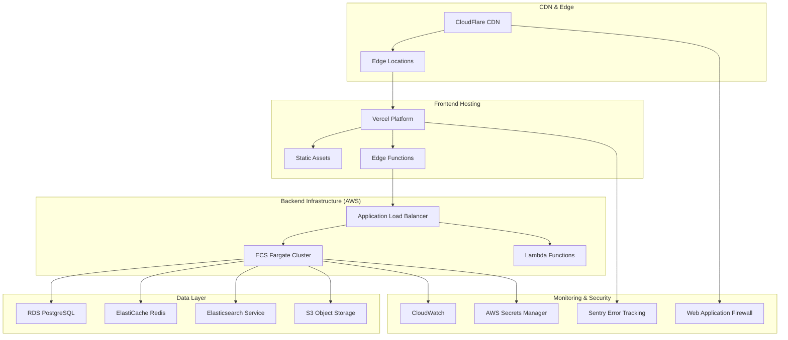

# 🏢 BlueSphere Physical Architecture

## Overview

This document describes the physical architecture of BlueSphere, detailing the infrastructure components, deployment patterns, scalability mechanisms, and operational considerations. The physical architecture defines how the logical components are deployed, configured, and managed in production environments.

## Infrastructure Overview



## Deployment Environments

### Development Environment
```yaml
Purpose: Local development and feature testing
Infrastructure:
  Frontend: Local Next.js development server (localhost:4000)
  Backend: Docker Compose with local services
  Database: PostgreSQL container
  Cache: Redis container
  External APIs: Mock services and sandbox endpoints

Configuration:
  Domain: localhost:4000
  SSL: Self-signed certificates
  Authentication: Development JWT secrets
  Logging: Console output
  Monitoring: Local debugging tools

Resources:
  CPU: Developer workstation
  Memory: 8-16 GB allocated
  Storage: Local SSD storage
  Network: Local network only
```

### Staging Environment
```yaml
Purpose: Pre-production testing and validation
Infrastructure:
  Frontend: Vercel preview deployment
  Backend: AWS ECS with reduced capacity
  Database: RDS t3.medium instance
  Cache: ElastiCache t3.micro nodes
  CDN: CloudFlare with staging configuration

Configuration:
  Domain: staging.bluesphere.org
  SSL: Let's Encrypt certificates
  Authentication: Staging JWT secrets
  Logging: CloudWatch with basic retention
  Monitoring: Basic health checks

Resources:
  CPU: 2 vCPUs per service
  Memory: 4 GB per service
  Storage: 100 GB database, 10 GB cache
  Network: Single AZ deployment
```

### Production Environment
```yaml
Purpose: Live production system serving end users
Infrastructure:
  Frontend: Vercel production with global edge
  Backend: AWS ECS with auto-scaling
  Database: RDS r5.xlarge with Multi-AZ
  Cache: ElastiCache r5.large cluster
  CDN: CloudFlare with global distribution

Configuration:
  Domain: bluesphere.org
  SSL: CloudFlare SSL with HTTPS strict
  Authentication: Production JWT secrets
  Logging: CloudWatch with extended retention
  Monitoring: Comprehensive monitoring stack

Resources:
  CPU: 4+ vCPUs per service, auto-scaling
  Memory: 8+ GB per service, auto-scaling
  Storage: 1+ TB database, 32+ GB cache
  Network: Multi-AZ with redundancy
```

## Frontend Infrastructure

### Vercel Platform
```yaml
Hosting Configuration:
  Platform: Vercel Pro plan
  Framework: Next.js 14 with App Router
  Build Process: Automated on git push
  Deployment: Immutable deployments with rollback
  Edge Network: Global distribution with 40+ regions

Performance Features:
  - Automatic code splitting and optimization
  - Image optimization with WebP/AVIF
  - Edge functions for dynamic content
  - Static site generation (SSG) where possible
  - Incremental static regeneration (ISR)

Scaling:
  - Automatic scaling based on traffic
  - Edge cache with intelligent purging
  - Serverless functions with cold start optimization
  - Global load balancing with health checks
```

### Content Delivery Network
```yaml
CloudFlare Configuration:
  Plan: Pro plan with advanced features
  DNS: Authoritative DNS with DNSSEC
  Security: WAF, DDoS protection, bot management
  Performance: Argo smart routing, Polish optimization
  Analytics: Real user monitoring and analytics

Caching Strategy:
  - Static assets: 1 year cache with versioning
  - API responses: 15 minutes cache with purge triggers
  - HTML pages: 5 minutes cache with edge-side includes
  - Images: Aggressive caching with progressive loading

Geographic Distribution:
  - Primary regions: US, Europe, Asia-Pacific
  - Edge locations: 200+ cities worldwide
  - Regional failover: Automatic traffic routing
  - Latency optimization: <100ms global response times
```

## Backend Infrastructure

### Container Orchestration (AWS ECS)
```yaml
Cluster Configuration:
  Platform: AWS Fargate for serverless containers
  Service Discovery: AWS Cloud Map integration
  Load Balancing: Application Load Balancer (ALB)
  Auto Scaling: Target tracking and step scaling
  Health Checks: Multi-layer health monitoring

Service Definitions:
  API Gateway Service:
    - CPU: 0.5 vCPU, Memory: 1 GB
    - Desired Count: 3, Max: 10
    - Health Check: /health endpoint
    
  Data Processing Service:
    - CPU: 1 vCPU, Memory: 2 GB
    - Desired Count: 2, Max: 8
    - Health Check: Queue depth monitoring
    
  ML Prediction Service:
    - CPU: 2 vCPU, Memory: 4 GB
    - Desired Count: 1, Max: 4
    - Health Check: Model loading status

Networking:
  VPC: Custom VPC with private and public subnets
  Security Groups: Least privilege access rules
  NAT Gateways: Multi-AZ for high availability
  VPC Endpoints: S3, ECR, CloudWatch endpoints
```

### Serverless Functions (AWS Lambda)
```yaml
Function Configuration:
  Runtime: Node.js 18.x
  Memory: 512 MB - 3008 MB (auto-optimized)
  Timeout: 15 seconds - 15 minutes
  Cold Start Optimization: Provisioned concurrency
  Dead Letter Queues: Failed invocation handling

Use Cases:
  Scheduled Tasks:
    - Data ingestion triggers (every 10 minutes)
    - ML model retraining (daily)
    - Database maintenance (weekly)
    
  Event Processing:
    - Webhook handlers for external APIs
    - Alert processing and notification
    - Data transformation and validation
    
  API Endpoints:
    - Lightweight API operations
    - Authentication and authorization
    - Data export and report generation
```

## Data Infrastructure

### Primary Database (Amazon RDS)
```yaml
Database Configuration:
  Engine: PostgreSQL 14.x
  Instance Class: db.r5.xlarge (production)
  Storage: GP2 SSD with auto-scaling
  Multi-AZ: Enabled for high availability
  Encryption: At rest and in transit

Performance Optimization:
  Connection Pooling: PgBouncer for connection management
  Read Replicas: 2 read replicas for read-heavy operations
  Partitioning: Time-based partitioning for observations
  Indexing: Optimized indexes for common query patterns
  Monitoring: Performance Insights with detailed metrics

Backup Strategy:
  Automated Backups: 7-day retention period
  Manual Snapshots: Before major deployments
  Point-in-time Recovery: Up to 35 days
  Cross-region Replication: Disaster recovery
```

### Caching Layer (Amazon ElastiCache)
```yaml
Cache Configuration:
  Engine: Redis 7.x
  Node Type: cache.r5.large (production)
  Cluster Mode: Enabled with 3 shards
  Replication: 1 replica per shard
  Encryption: At rest and in transit

Cache Strategies:
  Application Cache:
    - API responses: 15-minute TTL
    - Database query results: 1-hour TTL
    - User sessions: 24-hour TTL
    
  Rate Limiting:
    - API key tracking with sliding windows
    - IP-based rate limiting
    - Burst allowance management
    
  Real-time Data:
    - Latest station observations
    - Marine heatwave alerts
    - System status information

Memory Management:
  Eviction Policy: LRU (Least Recently Used)
  Memory Monitoring: CloudWatch alerts at 80%
  Failover: Automatic failover to primary
  Backup: Daily snapshots to S3
```

### Search Infrastructure (Amazon Elasticsearch)
```yaml
Elasticsearch Configuration:
  Version: 7.10
  Instance Type: t3.medium.elasticsearch
  Master Nodes: 3 dedicated master nodes
  Data Nodes: 2 data nodes with auto-scaling
  Storage: EBS GP2 with encryption

Index Management:
  Station Index:
    - Size: ~50 MB
    - Shards: 1 primary, 1 replica
    - Refresh: 30 seconds
    
  Logs Index:
    - Size: ~10 GB/month
    - Shards: 5 primary, 1 replica
    - Retention: 90 days with lifecycle policies

Security:
  Fine-grained Access Control: Role-based permissions
  VPC Access: Private subnet deployment
  Encryption: Domain encryption enabled
  Monitoring: CloudWatch integration
```

### Object Storage (Amazon S3)
```yaml
Storage Configuration:
  Buckets:
    Static Assets: bluesphere-assets
    Data Exports: bluesphere-exports
    ML Models: bluesphere-models
    Backups: bluesphere-backups
    
  Storage Classes:
    Hot Data: S3 Standard
    Warm Data: S3 Standard-IA
    Cold Data: S3 Glacier
    Archive: S3 Glacier Deep Archive

Lifecycle Policies:
  Exports: Delete after 90 days
  Logs: Standard -> IA (30 days) -> Glacier (365 days)
  Models: Versioning with 10 version retention
  Backups: Cross-region replication

Security:
  Encryption: AES-256 server-side encryption
  Access Control: IAM roles and bucket policies
  Versioning: Enabled for critical buckets
  Monitoring: CloudTrail and Access Logging
```

## Network Architecture

### Virtual Private Cloud (VPC)
```yaml
VPC Configuration:
  CIDR Block: 10.0.0.0/16
  Availability Zones: 3 AZs for high availability
  
Subnet Design:
  Public Subnets (10.0.1.0/24, 10.0.2.0/24, 10.0.3.0/24):
    - Load balancers
    - NAT gateways
    - Bastion hosts
    
  Private Subnets (10.0.10.0/24, 10.0.20.0/24, 10.0.30.0/24):
    - ECS containers
    - RDS instances
    - ElastiCache clusters
    
  Database Subnets (10.0.100.0/24, 10.0.200.0/24, 10.0.300.0/24):
    - RDS database instances
    - Isolated from application traffic

Security Groups:
  Web Tier: HTTP/HTTPS from CloudFlare IPs only
  App Tier: Internal traffic and specific ports
  Database Tier: Database ports from app tier only
```

### Load Balancing and Auto Scaling
```yaml
Application Load Balancer:
  Type: Application Load Balancer (Layer 7)
  Scheme: Internet-facing with SSL termination
  Listeners: HTTPS (443) with HTTP -> HTTPS redirect
  Health Checks: Deep health checks on /health endpoints
  Stickiness: None (stateless design)

Auto Scaling Configuration:
  Target Groups: Service-based routing
  Health Checks: ELB and ECS health checks
  Scaling Policies:
    - CPU utilization > 70% (scale out)
    - Request count > 1000/minute (scale out)
    - CloudWatch custom metrics

Traffic Routing:
  Path-based: /api/* -> API services
  Header-based: API version routing
  Weighted: Blue/green deployments
  Geographic: Regional traffic distribution
```

## Security Architecture

### Identity and Access Management
```yaml
AWS IAM Configuration:
  Service Roles: Least privilege principles
  Cross-account Access: Specific roles for CI/CD
  MFA Enforcement: Required for human access
  Access Keys: Rotated every 90 days

Security Policies:
  ECS Task Role: Access to required AWS services only
  Lambda Execution Role: Specific function permissions
  RDS Access: Database-specific credentials
  S3 Access: Bucket and object-level permissions
```

### Secrets Management
```yaml
AWS Secrets Manager:
  Database Credentials: Automatic rotation enabled
  API Keys: External service authentication
  JWT Secrets: Application signing keys
  Encryption Keys: KMS integration

Configuration:
  Rotation: Automatic every 90 days
  Encryption: AWS KMS customer-managed keys
  Access Logging: CloudTrail integration
  Version Control: Previous versions retained
```

### Network Security
```yaml
Web Application Firewall (WAF):
  Rules: OWASP Top 10 protection
  Rate Limiting: Per-IP and per-API-key
  Geographic Filtering: Block known bad actors
  Custom Rules: Application-specific protection

DDoS Protection:
  CloudFlare: Layer 3/4 and 7 protection
  AWS Shield: Advanced DDoS mitigation
  Auto-scaling: Absorb traffic spikes
  Rate Limiting: Protect backend services
```

## Monitoring and Observability

### Application Monitoring
```yaml
CloudWatch Configuration:
  Metrics: Custom application metrics
  Logs: Centralized logging with retention
  Alarms: Threshold and anomaly detection
  Dashboards: Operational and business metrics

Sentry Integration:
  Error Tracking: Real-time error monitoring
  Performance: Application performance monitoring
  Releases: Deployment tracking and comparison
  Alerts: Critical error notifications

Custom Metrics:
  Business Metrics:
    - API requests per minute
    - Data ingestion rate
    - Prediction accuracy
    
  Technical Metrics:
    - Response times
    - Error rates
    - Database performance
```

### Infrastructure Monitoring
```yaml
CloudWatch Infrastructure:
  EC2 Metrics: CPU, memory, disk, network
  RDS Metrics: Connections, queries, performance
  ELB Metrics: Request count, latency, errors
  Custom Metrics: Application-specific monitoring

Third-party Monitoring:
  Datadog: Infrastructure and APM monitoring
  PagerDuty: Incident management and alerting
  StatusPage: Public status communication
  Pingdom: External service monitoring
```

## Disaster Recovery and Business Continuity

### Backup Strategy
```yaml
Database Backups:
  Automated: Daily snapshots with 7-day retention
  Manual: Pre-deployment snapshots
  Cross-region: Disaster recovery replicas
  Testing: Monthly restore testing

Application Backups:
  Code: Git repository with multiple remotes
  Configuration: Infrastructure as Code (Terraform)
  Secrets: Encrypted backups in separate AWS account
  Documentation: Version controlled and distributed
```

### Recovery Procedures
```yaml
Recovery Time Objectives (RTO):
  Critical Services: 15 minutes
  Core Platform: 1 hour
  Full System: 4 hours
  Historical Data: 24 hours

Recovery Point Objectives (RPO):
  Real-time Data: 15 minutes
  User Data: 1 hour
  Historical Data: 24 hours
  System Configuration: 1 week

Disaster Scenarios:
  Single AZ Failure: Automatic failover
  Region Failure: Manual failover to backup region
  Data Corruption: Point-in-time recovery
  Security Breach: Incident response procedures
```

## Performance and Scalability

### Horizontal Scaling
```yaml
Auto Scaling Triggers:
  CPU Utilization: Scale out at 70%
  Memory Utilization: Scale out at 80%
  Request Rate: Scale out at 1000 req/min
  Queue Depth: Scale out at 100 messages

Scaling Limits:
  API Services: Min 2, Max 20 instances
  Data Processing: Min 1, Max 10 instances
  ML Services: Min 1, Max 5 instances
  Database: Read replicas up to 5
```

### Performance Optimization
```yaml
Caching Strategy:
  Browser Cache: 1 year for static assets
  CDN Cache: 1 hour for API responses
  Application Cache: 15 minutes for data
  Database Cache: Query result caching

Code Optimization:
  Bundle Splitting: Route-based code splitting
  Lazy Loading: Component and data lazy loading
  Compression: Gzip and Brotli compression
  Minification: CSS and JavaScript minification
```

## Cost Optimization

### Resource Management
```yaml
Right-sizing:
  ECS Tasks: CPU and memory optimization
  RDS Instances: Performance monitoring-based sizing
  ElastiCache: Memory utilization optimization
  Lambda: Memory and timeout optimization

Reserved Capacity:
  RDS: 1-year reserved instances for baseline
  ElastiCache: Reserved nodes for core capacity
  S3: Intelligent tiering for cost optimization
  CloudFront: Savings plans for predictable traffic
```

### Cost Monitoring
```yaml
AWS Cost Explorer:
  Daily Cost Monitoring: Automated reporting
  Budget Alerts: Threshold-based notifications
  Resource Tagging: Cost allocation by service
  Optimization Recommendations: Regular reviews

Cost Allocation:
  By Environment: Development, staging, production
  By Service: Frontend, backend, data, monitoring
  By Team: Engineering, operations, business
  By Feature: Core platform, ML, analytics
```

This physical architecture ensures BlueSphere can scale to serve millions of users while maintaining high availability, security, and performance standards.